## 核对与使用边界

本文已按保存的全文审阅记录进行文字校订；本轮仅静态核对，未运行 PoC、请求目标或逐图验证。

适用条件与版本记录（来源主张，未列为明确更正的部分仍待权威资料核对）：1.7Release20220822 admin; new_path rename plus upload; separate admin show_name XSS also1.6Release20220216

- **事实待核（1）**：Separate XSS not automatically assigned CVE7917。该项尚不能从转载本身确定外部事实；下文相应编号、版本或修复说法只作为来源记录，不能据此判定部署受影响或已修复。明确更正另列于本节。

- **适用与权限边界（2）**：RCE requires upload then rename, not unrestricted ico upload alone; rename endpoint/request missing in text。按此限制解释本文结论，版本相同不足以证明所需角色、入口、配置、依赖或可控参数均已满足；原操作和失败记录一并保留。

- **结论使用边界（3）**：XSS is display-name stored content rather than file-content upload XSS as introduction says。此项限制直接适用于下文对应结论；现有正文不足以作更宽泛推论，所列方法和原始证据均保留。

- **结论使用边界（4）**：Lab URLs use a vendor domain as the target; the historical example does not establish current authorization。此项限制直接适用于下文对应结论；现有正文不足以作更宽泛推论，所列方法和原始证据均保留。

- **证据待核（5）**：Primary advisory/source article URL absent; ads and many image-only steps。保留原引用、截图位置和实验叙述；本项所缺材料未被补造，截图存在或作者宣称成功都不等于已核验其内容。

历史原文标识：下文原技术材料按来源保留；仅本节明确确认的更正替代相应旧说法，标为待核的观察仍不是事实确认。

#  DouPHP（CVE-2024-7917、代码分析xss）漏洞复现   
原创 LULU  红队蓝军   2024-08-23 18:01  
  
## 漏洞介绍   
  
**漏洞**：CVE-2024-7917  
  
**介绍**：DouPHP 1.7_Release_20220822版本中存在一个远程代码执行（RCE）漏洞。拥有管理员权限的攻击者可以通过该漏洞在服务器上执行任意命令。漏洞通过上传恶意ico文件、修改文件扩展名来执行PHP代码  
  
该漏洞影响了组件Favicon Handler中的未知功能文件/admin/system.php。通过操作参数site_favicon，攻击者可以执行**无限制上传**操作。攻击可能远程发起。该漏洞已被公开披露并可能被利用。  
  
**影响版本**：DouPHP v1.7 Release 20220822  
  
  
  
**下载地址**：https://www.douphp.com/history  
  
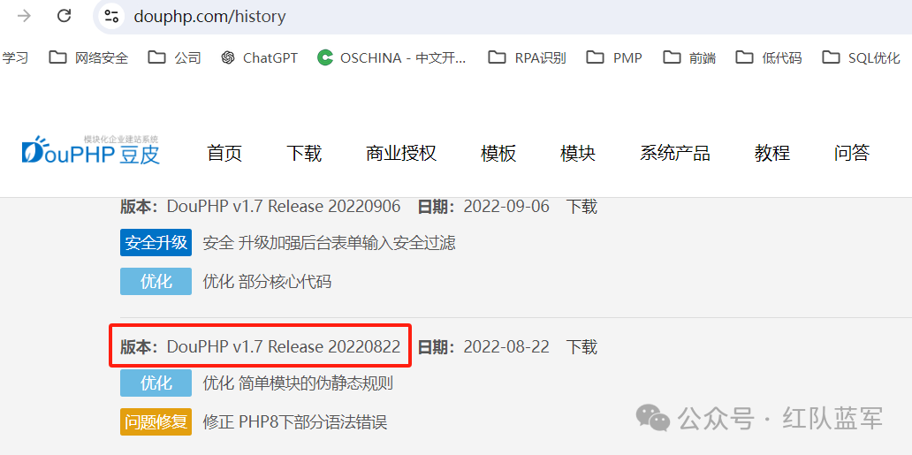  
  
**环境搭建**  
  
使用phpstudy,搭建网站即可。  
  
推荐配置：php7以上 + MySQL5.7以上  
  
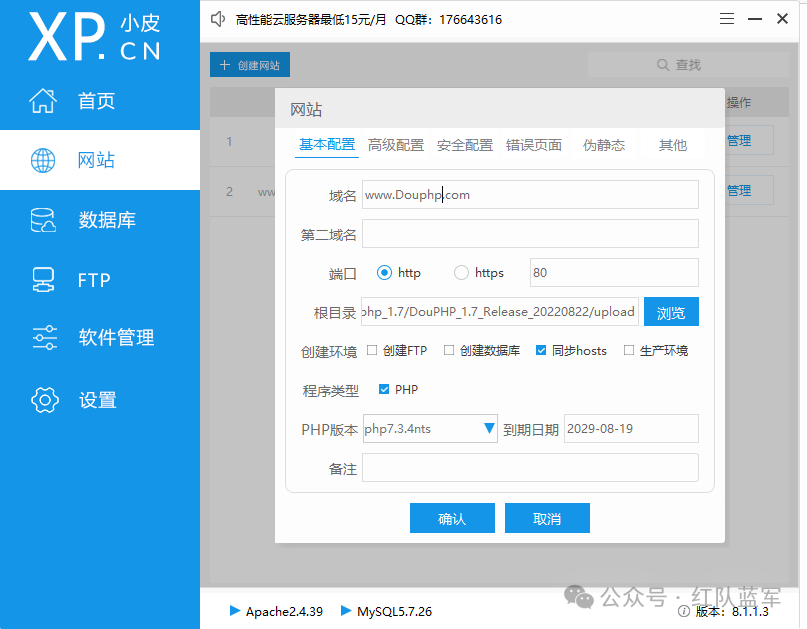  
## 漏洞复现   
  
1、登录后台  
  
http://域名/admin/login.php  
  
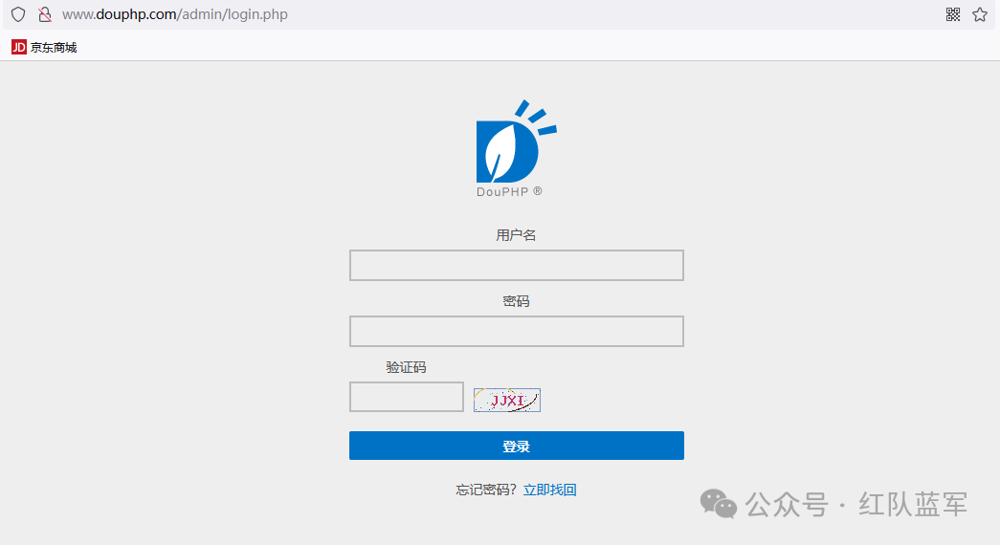  
  
2、点击系统设置---上传shell文件  
  
查看源码，白名单限制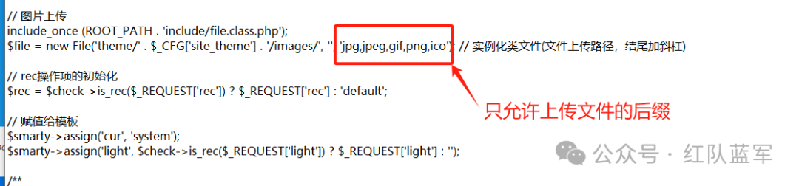  
  
  
上传后缀为ico的木马文件  
```
文件内容：<?php phpinfo();?>

```  
  
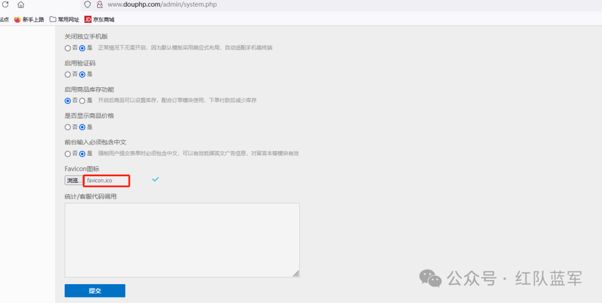  
  
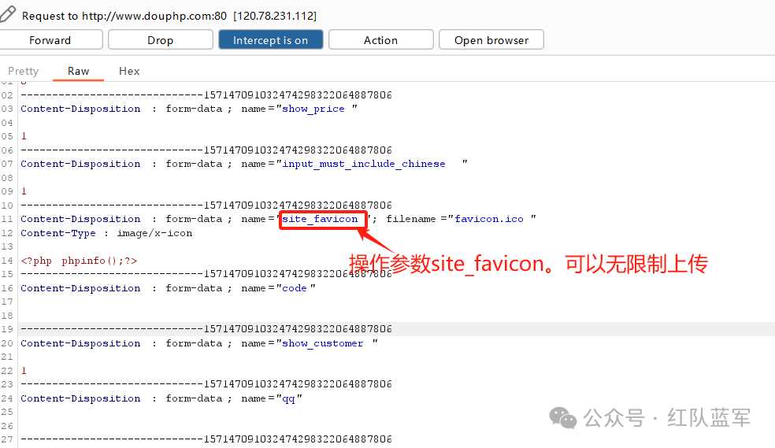  
  
上传成功  
  
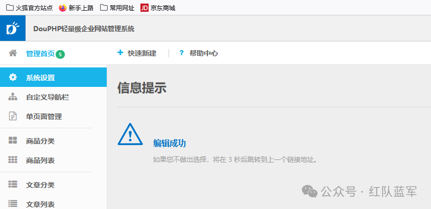  
  
3、修改文件后缀为php  
  
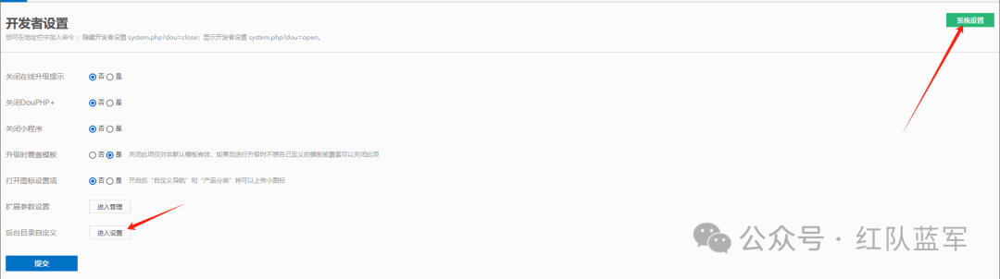  
  
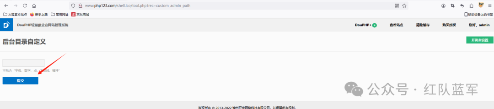  
  
burp抓包，我这里在虚拟机搭建的网站，如果要用物理机抓虚拟机的包，需要修改代理IP为物理机的IP地址，无法使用127.0.0.1。  
  
修改new_path =favicon.php  
  
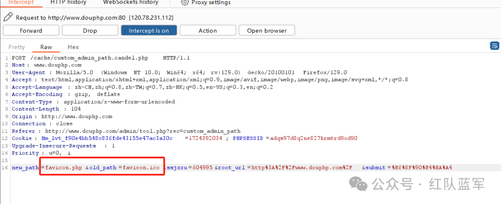  
  
  
  
访问www.douphp.com/favicon.php  
  
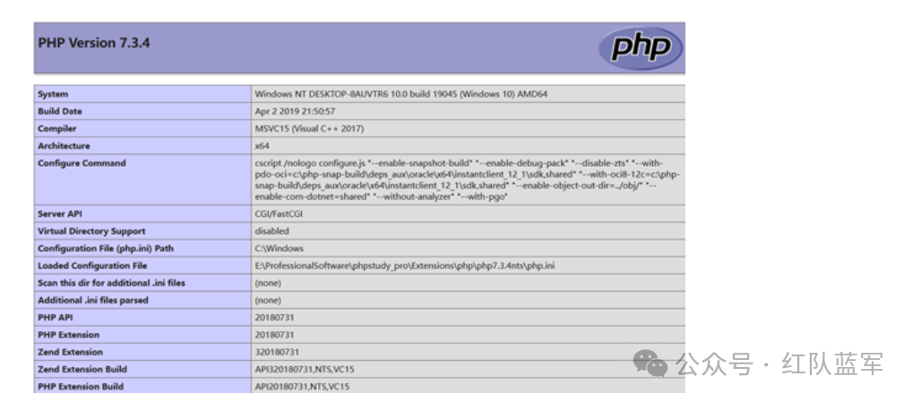  
## 漏洞介绍   
  
**漏洞**：xss漏洞  
  
**介绍**：文件上传导致的XSS  
  
**影响版本**：DouPHP v1.7 Release 20220822  、DouPHP v1.6 Release 20220216  
  
使用上述已经搭建好的环境  
## xss漏洞介绍   
  
**概念**：攻击者利用网站漏洞把**恶意的脚本代码**（通常包括HTML代码和客户端Javascript脚本）注入到**网页之中**，当其他用户浏览这些网页时，就会执行其中的恶意代码。  
  
**条件**：  
```
- 用户能够控制输入
- 拼接恶意的JS代码

```  
  
**xss可利用的脚本攻击**  
```
利用标签<>构造HTML/js语句      <script>alert(document.cookie)</script>   双写  大小写 等等绕过姿势
利用javascript伪协议构造       <a href="javascript:alert(1)">点我</a>   
事件驱动                    
<input type="text" onmouseover="alert(1)">  鼠标悬停
<input type="button" onclick="alert(1)">    点击事件
            报错  等等事件

```  
## 漏洞探测   
  
翻阅各个模块  
  
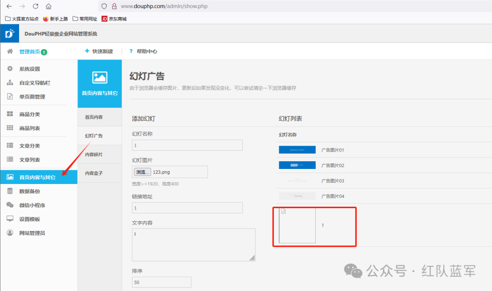  
  
上传的页面在前端展示  
  
  
  
**代码分析**  
  
分析admin/show.php,找到功能点  
  
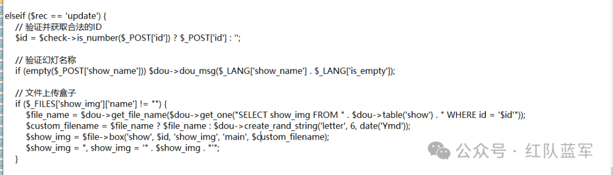  
  
分析代码。判断幻灯名称show_name是否为空，若为空则报出“名称为空的”错误提示  
```
if (empty($_POST['show_name'])) $dou->dou_msg($_LANG['show_name'] . $_LANG['is_empty']);

```  
  
这里可以发现，没有对上传文件的名称做限制，只判断是否为空，会想到是否是文件上传漏洞，使用box函数对上传的文件做了限制，没法绕过。这里可以想到将上传的图片名称写为xss的payload。继续往下分析。  
  
使用Token验证，验证成功，将上传的信息 show_name 、show_link 、show_img、show_text写入数据库中,这里没有二次校验，上传的名称，使用insert注入，没有成功。他这里直接将语句插入到数据库中。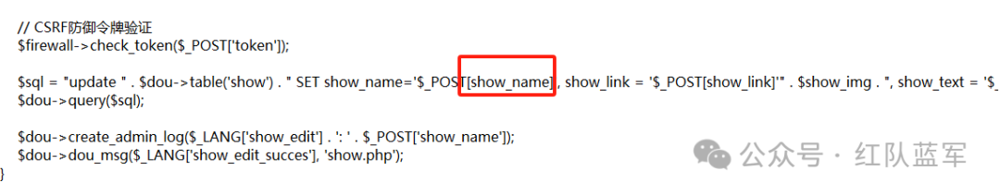  
  
  
以上分析：猜测在/admin/show.php中存在存储型xss漏洞  
## 漏洞复现   
  
**第一处xss**  
  
访问：http://www.douphp.com/admin/show.php  
```
插入xss_payload :<script>alert(1)</script>

```  
  
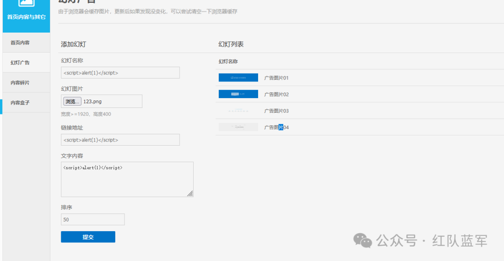  
  
  
  
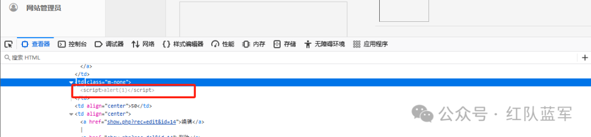  
  
  
加下方wx，拉你一起进群学习  
  
  
  


---

> 来源：gelusus/wxvl（微信公众号漏洞文章自动归档，原文见文首链接）
