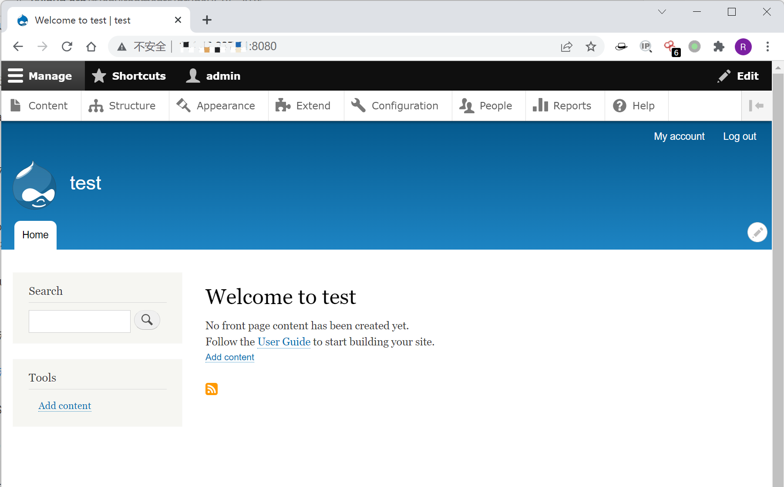
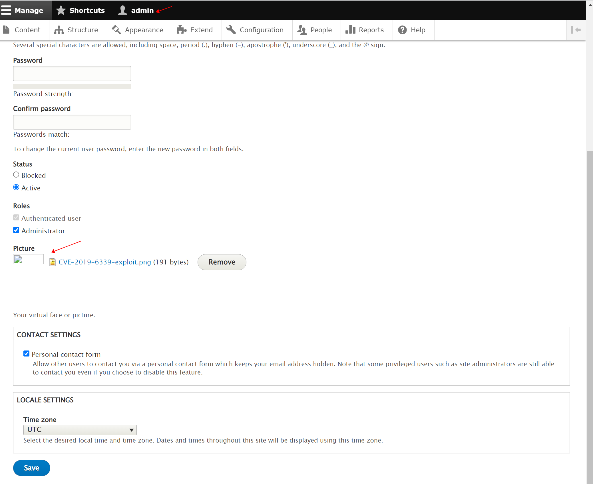
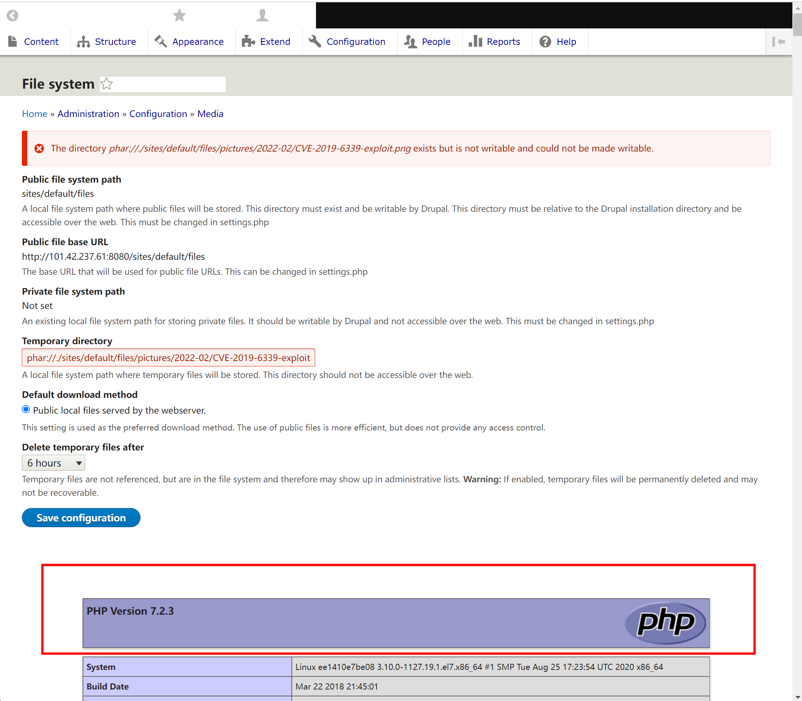

## 核对与使用边界

本文已按保存的全文审阅记录进行文字校订；本轮仅静态核对，未运行 PoC、请求目标或逐图验证。

适用条件与版本记录（来源主张，未列为明确更正的部分仍待权威资料核对）：Test8.5.0; admin file-system configuration; uploaded valid phar image; legacy PHP metadata auto-deserialization/gadget availability

- **适用与权限边界（1）**：Headline/overview omit admin configuration requirement。按此限制解释本文结论，版本相同不足以证明所需角色、入口、配置、依赖或可控参数均已满足；原操作和失败记录一并保留。

- **证据待核（2）**：External PoC binary/source needed, not included or pinned; no affected/fixed ranges。保留原引用、截图位置和实验叙述；本项所缺材料未被补造，截图存在或作者宣称成功都不等于已核验其内容。

- **证据待核（3）**：Filename/date example lab-specific; source repo/research provided but no primary advisory。保留原引用、截图位置和实验叙述；本项所缺材料未被补造，截图存在或作者宣称成功都不等于已核验其内容。

- **适用与权限边界（4）**：Related1-click research doesn't make this demonstrated admin path unauthenticated。按此限制解释本文结论，版本相同不足以证明所需角色、入口、配置、依赖或可控参数均已满足；原操作和失败记录一并保留。

历史原文标识：下文原技术材料按来源保留；仅本节明确确认的更正替代相应旧说法，标为待核的观察仍不是事实确认。

# Drupal 远程代码执行漏洞 CVE-2019-6339

## 漏洞描述

影响软件：Drupal

方式：phar反序列化RCE

参考链接：[Drupal 1-click to RCE 分析](https://paper.seebug.org/897/)

效果：任意命令执行

## 环境搭建

Vulhub执行如下命令启动drupal 8.5.0的环境：

```bash
docker-compose up -d
```

环境启动后，访问 `http://your-ip:8080/` 将会看到drupal的安装页面，一路默认配置下一步安装。因为没有mysql环境，所以安装的时候可以选择sqlite数据库。



## 漏洞复现

如下图所示，先使用管理员用户上传头像，头像图片为构造好的 PoC，参考[Vulnmachines](https://github.com/Vulnmachines/drupal-cve-2019-6339/blob/main/)的PoC，命令为`phpinfo()`。



Drupal 的图片默认存储位置为 `/sites/default/files/pictures/<YYYY-MM>/`，默认存储名称为其原来的名称，所以之后在利用漏洞时，可以知道上传后的图片的具体位置。

访问 `http://127.0.0.1:8080/admin/config/media/file-system`，在 `Temporary directory` 处输入之前上传的图片路径，示例为 `phar://./sites/default/files/pictures/2022-02/CVE-2019-6339-exploit.png`，保存后将触发该漏洞。如下图所示，触发成功。




---

> 来源：Threekiii/Awesome-POC
