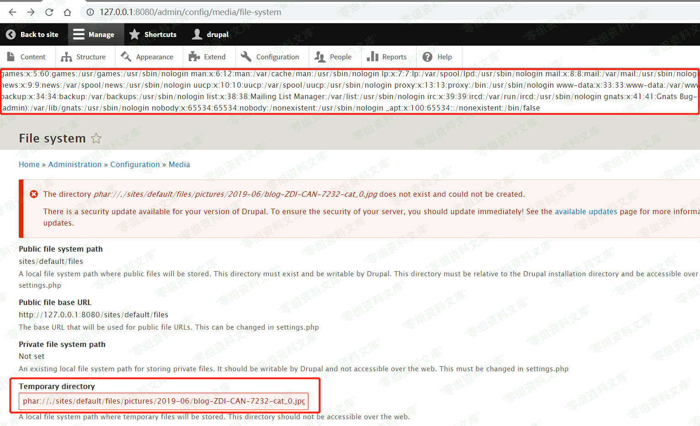

## 核对与使用边界

本文已按保存的全文审阅记录进行文字校订；本轮仅静态核对，未运行 PoC、请求目标或逐图验证。

适用条件与版本记录（来源主张，未列为明确更正的部分仍待权威资料核对）：7&lt;7.62;8.6&lt;8.6.6;8.5&lt;8.5.9 stated; admin configuration, phar upload, legacy PHP/gadget

- **结论使用边界（1）**：Same flow as117, adds branch ranges。此项限制直接适用于下文对应结论；现有正文不足以作更宽泛推论，所列方法和原始证据均保留。

- **适用与权限边界（2）**：Default image path loses YYYY-MM placeholder giving pictures//。按此限制解释本文结论，版本相同不足以证明所需角色、入口、配置、依赖或可控参数均已满足；原操作和失败记录一并保留。

- **代码与转录边界（3）**：First evidence image incorrectly references6920 article resource; malformed suffixes。相应原代码作为存在此问题的历史样本保留，不能直接当作可运行、成功复现的 PoC；缺失内容需回原稿核对，不据此补造可执行攻击链。

- **结论使用边界（4）**：Broad PoC repo link unpinned; original Vulhub link supplied。此项限制直接适用于下文对应结论；现有正文不足以作更宽泛推论，所列方法和原始证据均保留。

历史原文标识：下文原技术材料按来源保留；仅本节明确确认的更正替代相应旧说法，标为待核的观察仍不是事实确认。

（CVE-2019-6339）Drupal 远程代码执行漏洞
========================================

一、漏洞简介
------------

Drupal
core是Drupal社区所维护的一套用PHP语言开发的免费、开源的内容管理系统。
Drupal core
7.62之前的7.x版本、8.6.6之前的8.6.x版本和8.5.9之前的8.5.x版本中的内置phar
stream
wrapper（PHP）存在远程代码执行漏洞。远程攻击者可利用该漏洞执行任意的php代码。

二、漏洞影响
------------

Drupal core
7.62之前的7.x版本、8.6.6之前的8.6.x版本和8.5.9之前的8.5.x版本

三、复现过程
------------

### 漏洞环境

执行如下命令启动drupal 8.5.0的环境：

    docker-compose up -d

环境启动后，访问 `http://your-ip:8080/`
将会看到drupal的安装页面，一路默认配置下一步安装。因为没有mysql环境，所以安装的时候可以选择sqlite数据库。

### 漏洞复现

如下图所示，先使用管理员用户上传头像，头像图片为构造好的
PoC，参考[ianxtianxt/PoC](https://github.com/ianxtianxt/PoC)的PoC

Drupal远程代码执行漏洞/media/rId27.png)

Drupal 的图片默认存储位置为
`/sites/default/files/pictures//`，默认存储名称为其原来的名称，所以之后在利用漏洞时，可以知道上传后的图片的具体位置。

访问 `http://127.0.0.1:8080/admin/config/media/file-system`，在
`Temporary directory` 处输入之前上传的图片路径，示例为
`phar://./sites/default/files/pictures/2019-06/blog-ZDI-CAN-7232-cat_0.jpg`，保存后将触发该漏洞。如下图所示，触发成功。

Drupal远程代码执行漏洞/media/rId28.png)

参考链接
--------

> https://vulhub.org/\#/environments/drupal/CVE-2019-6339/
