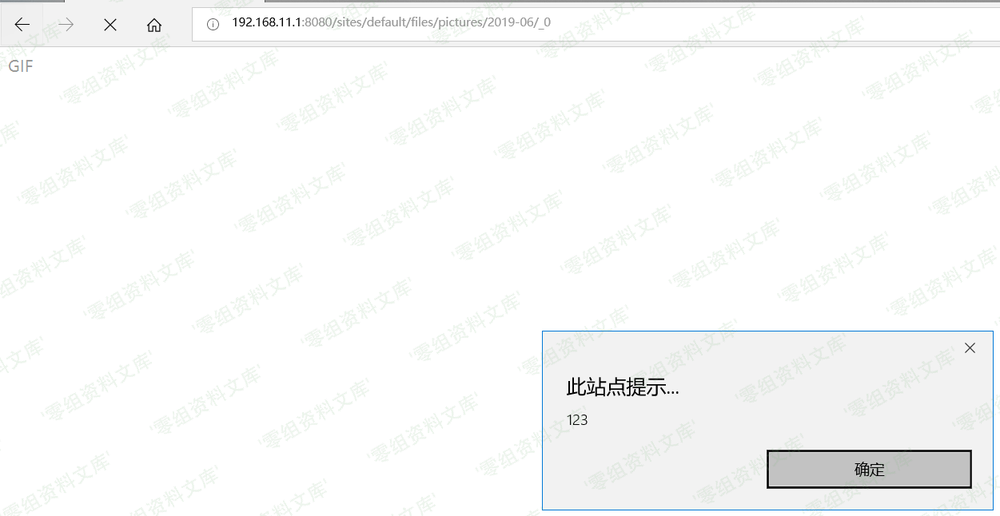

## 核对与使用边界

本文已按保存的全文审阅记录进行文字校订；本轮仅静态核对，未运行 PoC、请求目标或逐图验证。

适用条件与版本记录（来源主张，未列为明确更正的部分仍待权威资料核对）：7&lt;7.65;8.6&lt;8.6.13;8.5&lt;8.5.14 stated; user-image upload; filesystem invalid-byte handling; legacy browser MIME behavior

- **结论使用边界（1）**：Same base content as115 but omits full PoC and its reported failure; cannot merge away failed-browser caveat。此项限制直接适用于下文对应结论；现有正文不足以作更宽泛推论，所列方法和原始证据均保留。

- **代码与转录边界（2）**：Image path loses YYYY-MM; evidence image references6920 article and malformed suffix。相应原代码作为存在此问题的历史样本保留，不能直接当作可运行、成功复现的 PoC；缺失内容需回原稿核对，不据此补造可执行攻击链。

- **事实待核（3）**：Browser explanation oversimplifies sniffing as XSS filtering; Edge version unspecified。该项尚不能从转载本身确定外部事实；下文相应编号、版本或修复说法只作为来源记录，不能据此判定部署受影响或已修复。明确更正另列于本节。

- **结论使用边界（4）**：Adds complete branch ranges and original Vulhub link。此项限制直接适用于下文对应结论；现有正文不足以作更宽泛推论，所列方法和原始证据均保留。

历史原文标识：下文原技术材料按来源保留；仅本节明确确认的更正替代相应旧说法，标为待核的观察仍不是事实确认。

（CVE-2019-6341）Drupal xss漏洞
===============================

一、漏洞简介
------------

Drupal是Drupal社区的一套使用PHP语言开发的开源内容管理系统。

Drupal
7.65之前的7版本、8.6.13之前的8.6版本和8.5.14之前的8.5版本中存在跨站脚本漏洞。该漏洞源于WEB应用缺少对客户端数据的正确验证。攻击者可利用该漏洞执行客户端代码。

二、漏洞影响
------------

Drupal 7.65之前的7版本、8.6.13之前的8.6版本和8.5.14之前的8.5版本

三、复现过程
------------

漏洞环境
--------

执行如下命令启动drupal 8.5.0的环境：

    docker-compose up -d

环境启动后，访问 `http://your-ip:8080/`
将会看到drupal的安装页面，一路默认配置下一步安装。因为没有mysql环境，所以安装的时候可以选择sqlite数据库。

漏洞复现
--------

该漏洞需要利用drupal文件模块上传文件的漏洞，伪造一个图片文件，上传，文件的内容实际是一段HTML代码，内嵌JS，这样其他用户在访问这个链接时，就可能触发XSS漏洞。

Drupal 的图片默认存储位置为
`/sites/default/files/pictures//`，默认存储名称为其原来的名称，所以之后在利用漏洞时，可以知道上传后的图片的具体位置。

使用PoC上传构造好的伪造GIF文件，PoC参考[ianxtianxt/PoC](https://github.com/ianxtianxt/PoC/tree/master/Drupal)的PoC。

如图，输入如下命令，即可使用PoC构造样本并完成上传功能，第一个参数为目标IP
第二个参数为目标端口。

    php cve-2019-6341-exp.php 192.168.11.1 8080

Drupalxss漏洞/media/rId27.png)

上传成功后，访问图片位置，即可触发 XSS 漏洞，如下图所示。

Tips:

1.  因为 Chrome 和 FireFox 浏览器自带部分过滤 XSS
    功能，所以验证存在时可使用 Edge 浏览器或者 IE 浏览器。

2.  访问的图片名称为\_0的原因是因为 Drupal 的规则机制，具体原理见[Drupal
    1-click to RCE 分析](https://paper.seebug.org/897/)

Drupalxss漏洞/media/rId29.png)

参考链接
--------

> https://vulhub.org/\#/environments/drupal/CVE-2019-6341/
