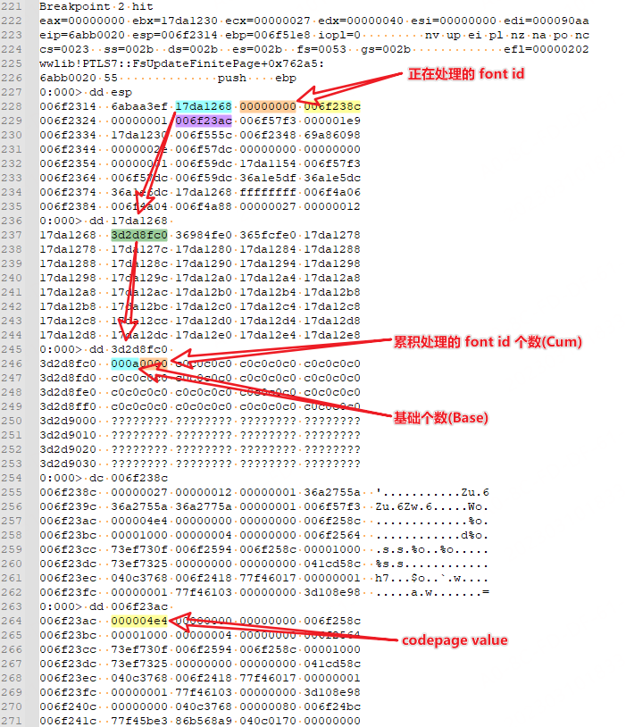

## 核对与使用边界

本文已按保存的全文审阅记录进行文字校订；本轮仅静态核对，未运行 PoC、请求目标或逐图验证。

适用条件与版本记录（来源主张，未列为明确更正的部分仍待权威资料核对）：&lt;=4.1.0 asserted/fixed4.1.1; delete_cart_goods preauth; session forgery additionally ROOT_PATH/IP; API requires admin hash; template edit admin

- **证据待核（1）**：Every differently captioned screenshot references identical media/640.png, losing ability to distinguish claimed evidence; content needs original comparison。保留原引用、截图位置和实验叙述；本项所缺材料未被补造，截图存在或作者宣称成功都不等于已核验其内容。

- **结论使用边界（2）**：Primary SQLi parameter/payload absent text despite title。此项限制直接适用于下文对应结论；现有正文不足以作更宽泛推论，所列方法和原始证据均保留。

- **代码与转录边界（3）**：AddBrand JSON malformed: Data string lacks closing quote。相应原代码作为存在此问题的历史样本保留，不能直接当作可运行、成功复现的 PoC；缺失内容需回原稿核对，不据此补造可执行攻击链。

- **适用与权限边界（4）**：Session/API/template stages are conditional separate chains; don't label all unauthenticated。按此限制解释本文结论，版本相同不足以证明所需角色、入口、配置、依赖或可控参数均已满足；原操作和失败记录一并保留。

- **事实待核（5）**：Precise CNVD link plus researcher summary, not precise original article URL; PHP assert version dependency omitted。该项尚不能从转载本身确定外部事实；下文相应编号、版本或修复说法只作为来源记录，不能据此判定部署受影响或已修复。明确更正另列于本节。

历史原文标识：下文原技术材料按来源保留；仅本节明确确认的更正替代相应旧说法，标为待核的观察仍不是事实确认。

# ECShop4.1.0前台免登录SQL注入

## **0x00 漏洞概述**

影响版本：**ecshop4.1.0及以下**
是否需要身份认证：**否，前台漏洞**
漏洞类型：**SQL注入**
CNVD编号：**CNVD-2020-58823，***https://www.cnvd.org.cn/flaw/show/2454613*
源码获取：*https://www.ecshop.com/*，登录注册下载，最新版本为4.1.1(**已修复**)。

## **0x01 漏洞详情**

**漏洞代码**：/source/ecshop/delete_cart_goods.php,16行

漏洞代码

$_POST变量直接传入sql语句进行拼接，再进入数据库查询，触发漏洞。

如果有对ecshop进行过代码审计的话，应该会知道在includes/safety.php存在个waf，**但是在这个版本并没有生效，这里漏洞触发可以不进入这里的过滤防护逻辑**。

includes/safety.php

本地搭建验证如下，配置默认是开了报错，线上的测试环境也是，不存在报错的话可以通过盲注验证。报错注入的截图证明如下。

本地漏洞验证

漏洞修复：对请求参数进行过滤。

漏洞修复

## **0x02 注入漏洞利用分析**

### 思路一：获取注入获取管理员密码md5

ecshop默认密码不加盐，所以可以直接注入找到ecs_admin_user表获取管理员密码的md5.

### 思路二：获取管理员session

如果管理员使用了较为复杂的密码，md5解不出来时，可以考虑获取session。即cookie中ECSCP_ID的值。
登录用户的session存在ecs_sessions表，但是只有sesskey。

ecs_sessions表

代码中登录成功后cookie设置：`setcookie($this->session_name, $this->session_id . $this->gen_session_key($this->session_id), 0, $this->session_cookie_path, $this->session_cookie_domain,  $this->session_cookie_secure, TRUE);`.

其中`$this->session_name` 就是ECSCP_ID， `$this->session_id . $this->gen_session_key($this→session_id)`就是最终cookie的值，数据库中sesskey对应的是`$this->session_id`，至于后半部分是通过gen_session_key这个函数生成。

```
function gen_session_key($session_id)
    {
        static $ip = '';
        if ($ip == '')
        {
            $ip = substr($this->_ip, 0, strrpos($this->_ip, '.'));
        } 
        return sprintf('%08x', crc32(ROOT_PATH . $ip . $session_id));
    }
```

后半部分gen_session_key通过ip和ROOT_PATH来确认，ip也在session表中可以找到，至于ROOT_PATH，可以通过猜测或者部分路径的报错拿到。最后拼凑到的，就是最终的cookie。

### 思路三: ecshop/api/client/includes/lib_api.php 写入shell

api/client 的访问需要登录，位于ecshop/api/client/includes/lib_api.php的API_UserLogin接口。这里登录是直接校验密码md5，也就是说当思路一解不出来时，这里也能用上密码的md5。

api登录

登录成功后访问api接口，可以利用一个任意写入漏洞。触发点为upload_image函数，在API_AddBrand函数中被调用。

upload_image函数

调用upload_image函数

最后登录成功后写入文件的payload为：

```
URL: http://localhost/ecshop/api/client/api.php

POST: Json= {"Action":"AddBrand","brand_name":"test","brand_logo":{"Data":"xx,"Type":"xx"}}
```

### 最后getshell

ecshop后台能读写文件的地方，大多做了限制。现在找到能shell的地方，就是在利用smarty模板渲染来执行代码，可参考ecshop原来爆过的一个任意代码执行漏洞，这里简要概述下。

1. 首先插入代码，在模板管理里找到邮件模板，修改为`{str:{\$asd'];assert(base64_decode('ZmlsZV9wdXRfY29udGVudHMoJ3hjaGVjay5waHAnLCc8P3BocCBwaHBpbmZvKCk7Jyk7IA=='));//}x`

payload

1. 再回到管理密码找回页面，点击确定，即可触发。

触发页面

分析如下：`$template['template_content']`为我们插入的数据。

触发入口

跟进fetch函数，进入eval函数前还有个fetch_str函数，会对payload进行一些过滤，这里不展开细节。

fetch函数

`_eval`函数将过滤后的字符串拿过来进行执行。由于是无回显，所以payload采用的是写文件的方式。

eval执行

## **0x03 结束语**

这个前台SQL注入较为简单，但是危害较高，只通过一些简单字符匹配规则去找类似这种漏洞的话，整个项目大概有三百多个，其中前台的风险大多被单双引号包裹且开了GPC防护

## **0x04 参考**

*Ecshop 2.x/3.x SQL注入/任意代码执行漏洞分析：https://www.secrss.com/articles/4965*


---

> 来源：白阁文库 BaizeSec/bylibrary
