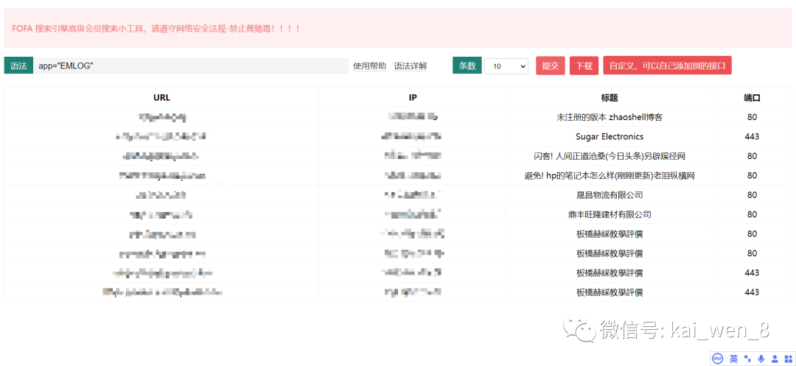
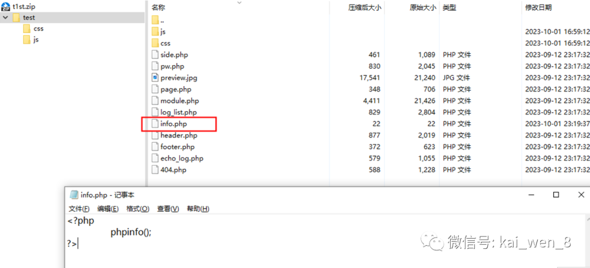
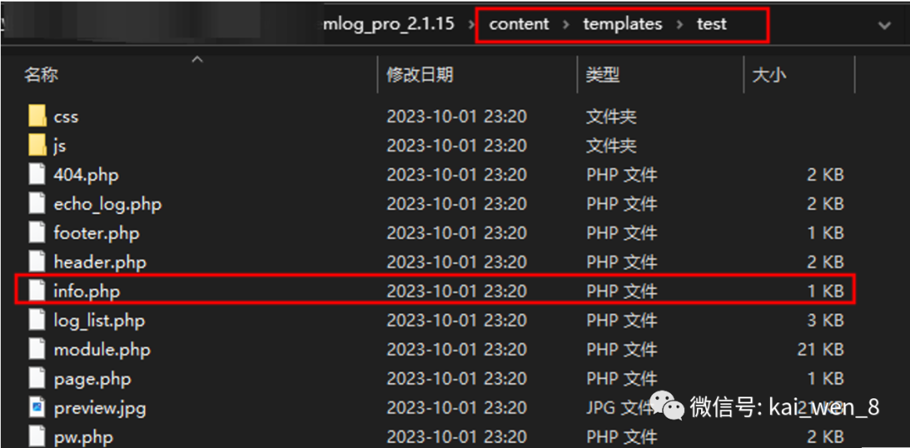
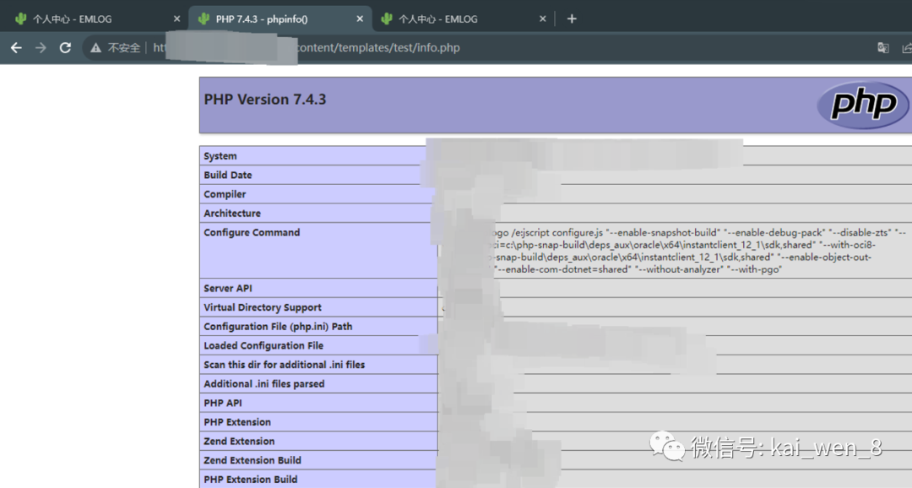

## 核对与使用边界

本文已按保存的全文审阅记录进行文字校订；本轮仅静态核对，未运行 PoC、请求目标或逐图验证。

适用条件与版本记录（来源主张，未列为明确更正的部分仍待权威资料核对）：管理员外观模板上传权限、PHP模板执行

- **适用与权限边界（1）**：标题仅产品/CVE未体现后台权限；目录/content/templates不是上传接口。按此限制解释本文结论，版本相同不足以证明所需角色、入口、配置、依赖或可控参数均已满足；原操作和失败记录一并保留。

- **适用与权限边界（2）**：宣称提供exploit.zip但没有附件链接；payload/请求在截图，需明确模板合法功能与安全边界。按此限制解释本文结论，版本相同不足以证明所需角色、入口、配置、依赖或可控参数均已满足；原操作和失败记录一并保留。

- **来源与引用处置（3）**：大段付费星球/课程/微信广告应剥离，CVE映射与设计预期需官方核验。保留这部分来源材料并与技术结论分开；其引用或宣传内容不能补足本文漏洞的证据。

历史原文标识：下文原技术材料按来源保留；仅本节明确确认的更正替代相应旧说法，标为待核的观察仍不是事实确认。

#  emlog | CVE-2023-44973   
WK安全  湘安无事   2023-10-13 00:00  
  
```
免责声明
  由于传播、利用WK安全所提供的信息而造成的任何直接或者间接的后果及损失，均由使用者本人负
责，WK安全及作者不为此承担任何责任，一旦造成后果请自行承担！如有侵权烦请告知，我们会立即删除
并致歉。谢谢！
```  
  
  
  
| 0x01 漏洞介绍  
  
      
Emlog 是一款基于 PHP 语言和 MySQL 数据库的开源、免费、功能强大的个人或多人联合撰写的博客系统。它致力于提供快速、稳定，且在使用上又及其简单、舒适的博客服务。安装和使用都非常方便。   
emlog pro /content/templates/存在任意文件上传漏洞  
  
| 0x02 影响版本  
```
emlog 2.2.0 Pro
```  
  
| 0x03 语法特征  
```
app="EMLOG"
```  
  
  
  
| 0x04 漏洞分析  
  
后端->外观->获取 shell 模板  
  
链接：https://github.com/emlog/emlog/releases/tag/pro-2.2.0  
  
  
  
创建一个包含恶意php文件的压缩文件。我提供模板exploit.zip。  
  
  
  
在网站后台上传我们创建的恶意压缩包。  
  
  
  
它将在wwwroot/content/templates/test/目录下解压缩。test是我们在压缩包中创建的文件夹的名称，info.php是我们的恶意php文件。  
  
  
  
访问  
  
  
  
参考链接  
```
https://github.com/yangliukk/emlog/blob/main/Template-getshell.md
```  
  
**|**  
**知识星球的介绍**  
  
不好意思，兄弟们，这里给湘安无事星球打个广告，不喜欢的可以直接滑走哦。  
  
1.群主为什么要建知识星球？  
```
很简单为了恰饭哈哈哈，然后也是为了建立一个圈子进行交流学习和共享资源嘛
相应的也收取费用嘛，毕竟维持星球也需要精力
```  
  
2.知识星球有哪些资源？  
```
群里面联系群主是可以要一些免费的学习资料的，因为群里面大部分是大学生嘛
大学生不就是喜欢白嫖，所以大家会共享一些资料
没有的群主wk也有,wk除了不会pc,其他都能嫖hhh
```  
  
一些实战报告，截的部分  
  
  
  
  
  
  
  
  
一些1day的poc,这些也就是信息差，不想找可以让wk帮你们嫖,群主也会经常发  
  
  
  
  
  
  
  
一些共享的资源  
```
1.刀客源码的会员
2.fofa 360高级会员
3.专属漏洞库
5.专属内部it免费课程
6.不定期直播分享（星球有录屏）
```  
  
技术交流可加下方wx  
  
  
  
  
  
  
  
  
  


---

> 来源：gelusus/wxvl（微信公众号漏洞文章自动归档，原文见文首链接）
