## 核对与使用边界

本文已按保存的全文审阅记录进行文字校订；本轮仅静态核对，未运行 PoC、请求目标或逐图验证。

适用条件与版本记录（来源主张，未列为明确更正的部分仍待权威资料核对）：后台数据库备份权限及有效会话/令牌；备份config.php可访问和执行

- **适用与权限边界（1）**：开头强调HTML短标签赋值易混淆，实际所述sink为生成PHP配置时数组键未引用。按此限制解释本文结论，版本相同不足以证明所需角色、入口、配置、依赖或可控参数均已满足；原操作和失败记录一并保留。

- **事实待核（2）**：tablename实际payload、请求、生成config代码全在截图，无文本版本。该项尚不能从转载本身确定外部事实；下文相应编号、版本或修复说法只作为来源记录，不能据此判定部署受影响或已修复。明确更正另列于本节。

- **适用与权限边界（3）**：备份目录位置及权限条件缺，来源转载站。按此限制解释本文结论，版本相同不足以证明所需角色、入口、配置、依赖或可控参数均已满足；原操作和失败记录一并保留。

历史原文标识：下文原技术材料按来源保留；仅本节明确确认的更正替代相应旧说法，标为待核的观察仍不是事实确认。

# EmpireCMS 7.5 后台任意代码执行漏洞

一、漏洞简介
------------

二、漏洞影响
------------

EmpireCMS 7.5

三、复现过程
------------

### 漏洞分析

漏洞代码发生在后台数据备份处代码/e/admin/ebak/ChangeTable.php
44行附近，通过审计发现执行备份时，对表名的处理程序是value=""
通过php短标签形式直接赋值给tablename\[\]。

进行备份时未对数据库表名做验证，导致任意代码执行。

### 漏洞复现

1、查看代码e/admin/ebak/phome.php接收备份数据库传递的参数,然后传递给Ebak_DoEbak函数中。

　　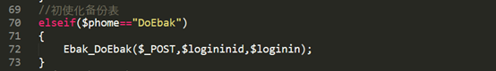

2、跟进Ebak_DoEbak函数所在的位置,可以看到将数据库表名传递给变量$tablename。

　　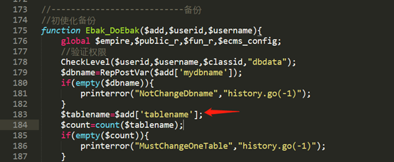

3、继续浏览代码,可以看到如下代码,遍历表名并赋值给$b_table、$d_table,使用RepPostVar函数对表名进行处理,其中$d_table拼接成$tb数组时没有对键值名添加双引号。

　　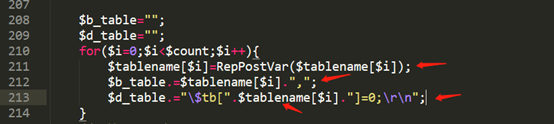

4、在生成config.php文件的过程中,对于$d_table没有进行处理,直接拼接到生成文件的字符串中,导致任意代码执行漏洞。

　　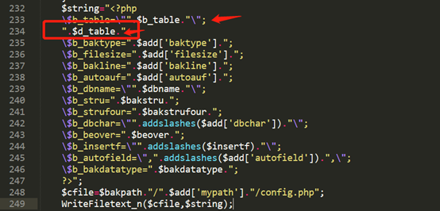

5、访问后台

　　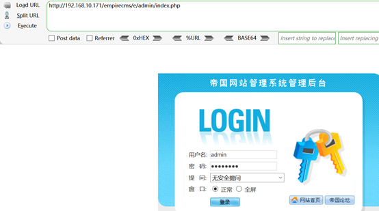

6、按下图依次点击,要备份的数据表选一个就好

　　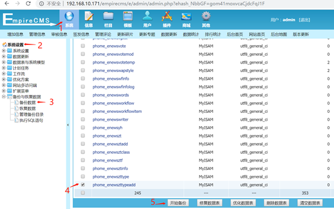

7、点击”开始备份”,burp抓包,修改tablename参数的值

　　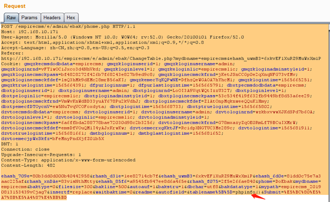

8、可以看到响应的数据包,成功备份

　　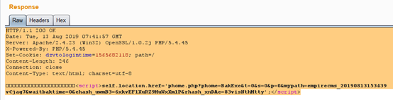

9.查看备份的文件

　　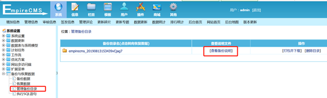

10.访问备份目录下的config.php,可以看到成功执行phpinfo

　　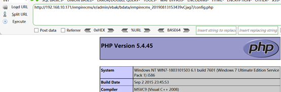

11、这时查看config.php文件

　　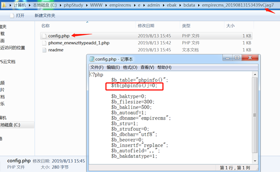

参考链接
--------

> https://www.shuzhiduo.com/A/pRdBPopGJn/
