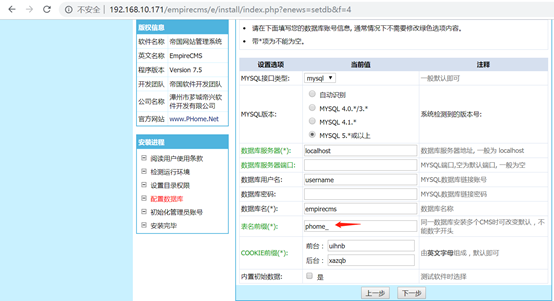
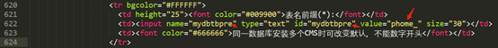
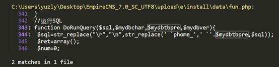
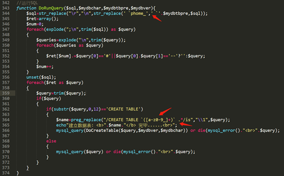
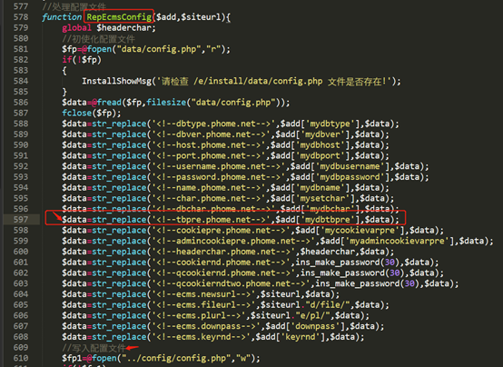
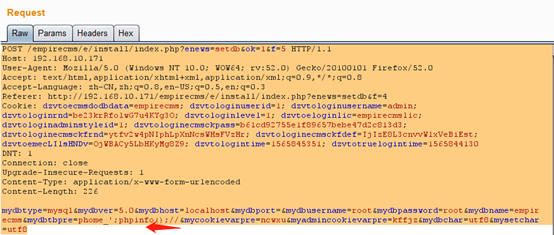
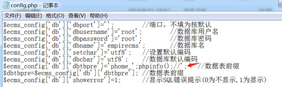
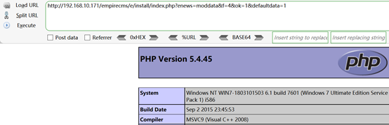
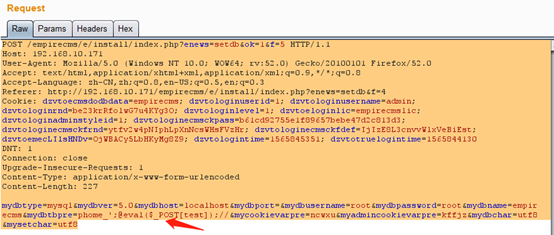
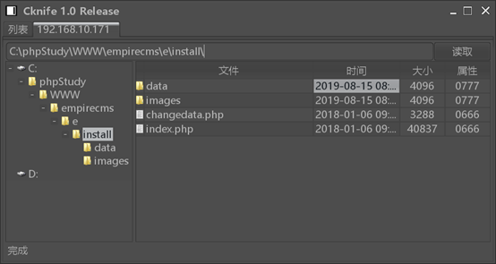

## 核对与使用边界

本文已按保存的全文审阅记录进行文字校订；本轮仅静态核对，未运行 PoC、请求目标或逐图验证。

适用条件与版本记录（来源主张，未列为明确更正的部分仍待权威资料核对）：安装入口可用且能完成数据库配置，配置文件可写；安装锁状态未说明

- **结论使用边界（1）**：前文说mydbtbpre但步骤改phome，参数命名冲突须按原请求核对。此项限制直接适用于下文对应结论；现有正文不足以作更宽泛推论，所列方法和原始证据均保留。

- **结论使用边界（2）**：唯一文本payload使用弯引号‘，不能原样等同PHP单引号。此项限制直接适用于下文对应结论；现有正文不足以作更宽泛推论，所列方法和原始证据均保留。

- **证据待核（3）**：未说明已安装站点是否可达安装步骤；源码/完整请求依赖图片。保留原引用、截图位置和实验叙述；本项所缺材料未被补造，截图存在或作者宣称成功都不等于已核验其内容。

历史原文标识：下文原技术材料按来源保留；仅本节明确确认的更正替代相应旧说法，标为待核的观察仍不是事实确认。

# EmpireCMS 7.5 配置文件写入漏洞

一、漏洞简介
------------

该漏洞是由于安装程序时没有对用户的输入做严格过滤,导致用户输入的可控参数被写入配置文件,造成任意代码执行漏洞。

二、漏洞影响
------------

EmpireCMS 7.5

三、复现过程
------------

### 漏洞分析

1、漏洞出现位置如下图,phome_表前缀没有被严格过滤导致攻击者构造恶意的代码

　　

2、定位漏洞出现的位置,发现在/e/install/index.php,下图可以看到表名前缀phome_,将获取表名前缀交给了mydbtbpre参数。

　　

3、全文搜索,$mydbtbpre,然后跟进参数传递,发现将用户前端输入的表前缀替换掉后带入了sql语句进行表的创建,期间并没有对前端传入的数据做严格的过滤

　　

　　

4、创建表的同时将配置数据和可以由用户控制的表前缀一起写入到config.php配置文件

　　

5、通过对整个install过程的代码分析,可以发现没有对用户数据进行过滤,导致配置文件代码写入。

5.1、burp对漏洞存在页面进行抓包,修改phome参数的值,构造payload,payload如下:

‘;phpinfo();//

5.2、在burp中的phome参数的值中输入特殊构造的payload

　　

6、查看config.php配置文件,发现成功写入配置文件

　　

7、再次访问安装结束的页面, http://192.168.10.171/empirecms/e/install/index.php?enews=moddata&f=4&ok=1&defaultdata=1

　　

8、构造特殊的payload getshell

　　

9、菜刀连接,成功getshell

　　

 

参考链接
--------

> http://qclover.cn/2018/10/10/EmpireCMS\_V7.5%E7%9A%84%E4%B8%80%E6%AC%A1%E5%AE%A1%E8%AE%A1.html
