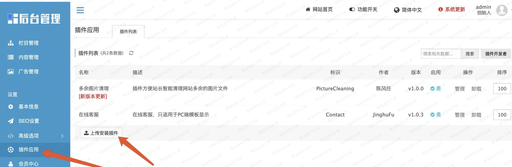
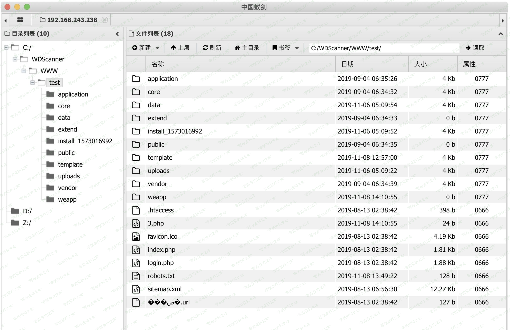

## 核对与使用边界

本文已按保存的全文审阅记录进行文字校订；本轮仅静态核对，未运行 PoC、请求目标或逐图验证。

适用条件与版本记录（来源主张，未列为明确更正的部分仍待权威资料核对）：后台开启插件并允许上传ZIP；图片管理能列出解压目录；PHP可执行

- **代码与转录边界（1）**：简介截断并写v1.3.7，与标题1.3.9冲突。相应原代码作为存在此问题的历史样本保留，不能直接当作可运行、成功复现的 PoC；缺失内容需回原稿核对，不据此补造可执行攻击链。

- **适用与权限边界（2）**：影响章节描述create配置写代码，但复现是upload解压/目录披露两机制混贴。按此限制解释本文结论，版本相同不足以证明所需角色、入口、配置、依赖或可控参数均已满足；原操作和失败记录一并保留。

- **事实待核（3）**：没有完整请求/插件ZIP结构及原始来源，需拆分并核对版本。该项尚不能从转载本身确定外部事实；下文相应编号、版本或修复说法只作为来源记录，不能据此判定部署受影响或已修复。明确更正另列于本节。

历史原文标识：下文原技术材料按来源保留；仅本节明确确认的更正替代相应旧说法，标为待核的观察仍不是事实确认。

# Eyoucms 1.3.9 上传漏洞

一、漏洞简介
------------

EyouCms是基于TP5.0框架为核心开发的免费+开源的企业内容管理系统，专注企业建站用户需求提供海量各行业模板，降低中小企业网站建设、网络营销成本，致力于打造用户舒适的建站体验。易优cms
v1.3.7后台插件模块存在代码执

二、漏洞影响
------------

Weapp.php文件中的create()方法接收了请求中的参数，过滤后直接存入php配置文件中，但是由于过滤不严，导致可以直接写入代码进去并执行。

三、复现过程
------------

### 1、登陆后台

在后台\-\-\-\--》插件应用\-\-\-\--》上传插件这里可以上传zip文件

在Weapp.php文件中的upload()方法中可以上传zip文件，并会自动解压到一个文件夹名是随机md5值的文件夹下

在后台开启插件功能，上传zip文件，zip中有php一句话木马以及一个任意图片(图片内容无所谓，正常图片即可，但是必须得有)

上传后，虽然会返回错误信息，但是实际上后台已经解压了zip文件

访问内容管理模块，任意选择一个产品进行编辑，再图片集处可以上传图片，选择在线管理，可以在左侧看到该文件夹名

直接访问该文件夹下的php一句话木马文件即可

