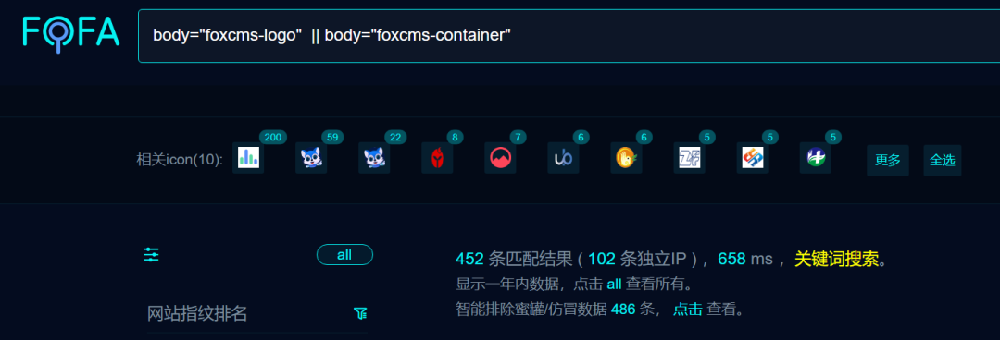
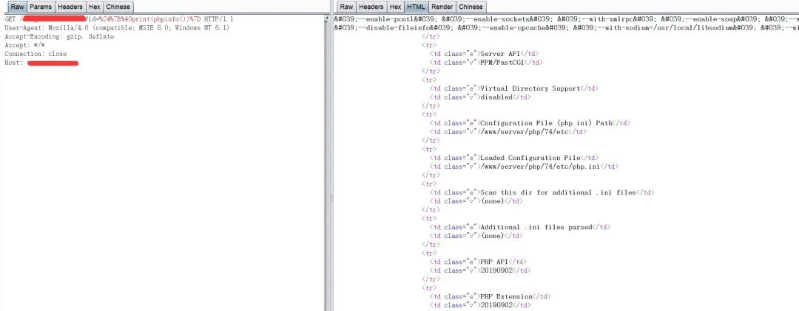
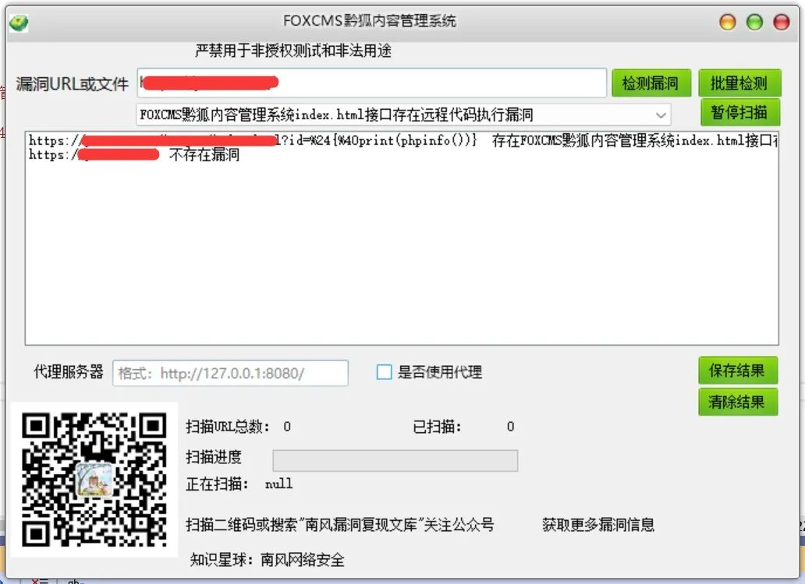

## 核对与使用边界

本文已按保存的全文审阅记录进行文字校订；本轮仅静态核对，未运行 PoC、请求目标或逐图验证。

适用条件与版本记录（来源主张，未列为明确更正的部分仍待权威资料核对）：未列版本/鉴权/路由配置

- **事实待核（1）**：复现全为外链图片，没有文本请求；CVE与端点映射无官方出处。该项尚不能从转载本身确定外部事实；下文相应编号、版本或修复说法只作为来源记录，不能据此判定部署受影响或已修复。明确更正另列于本节。

- **事实待核（2）**：影响版本重复产品名，修复仅打补丁无版本/链接。该项尚不能从转载本身确定外部事实；下文相应编号、版本或修复说法只作为来源记录，不能据此判定部署受影响或已修复。明确更正另列于本节。

- **来源与引用处置（3）**：POC&amp;EXP节主要付费星球与工具广告，应剥离；与168候选关联不能按标题强并。保留这部分来源材料并与技术结论分开；其引用或宣传内容不能补足本文漏洞的证据。

历史原文标识：下文原技术材料按来源保留；仅本节明确确认的更正替代相应旧说法，标为待核的观察仍不是事实确认。

#  FOXCMS黔狐内容管理系统index.html接口存在远程代码执行漏洞CVE-2025-29306 漏洞预警   
2025-3-26更新  南风漏洞复现文库   2025-03-26 21:22  
  
免责声明：请勿利用文章内的相关技术从事非法测试，由于传播、利用此文所提供的信息或者工具而造成的任何直接或者间接的后果及损失，均由使用者本人负责，所产生的一切不良后果与文章作者无关。该文章仅供学习用途使用。  
## 1. FOXCMS黔狐内容管理系统简介  
  
微信公众号搜索：南风漏洞复现文库 该文章 南风漏洞复现文库 公众号首发  
  
FOXCMS黔狐内容管理系统  
## 2.漏洞描述  
  
FoxCMS是一套可免费商用开源的内容管理系统，采用PHP+MySQL架构。内置企业常用的内容模型，如单页、文章、产品、图集、视频、反馈、下载等，并配备丰富的模板标签及强大的SEO和伪静态优化机制。无需复杂编程技能，仅需掌握HTML即可快速构建出多元化的应用场景，实现内容的高效管理。  
  
CVE编号:CVE-2025-29306  
  
CNNVD编号:  
  
CNVD编号:  
## 3.影响版本  
  
FOXCMS黔狐内容管理系统  
  
  
  
FOXCMS黔狐内容管理系统index.html接口存在远程代码执行漏洞  
## 4.fofa查询语句  
  
body="foxcms-logo"|| body="foxcms-container"  
## 5.漏洞复现  
  
  
  
  
  
## 6.POC&EXP  
  
本期漏洞及往期漏洞的批量扫描POC及POC工具箱已经上传知识星球：南风网络安全  
1: 更新poc批量扫描软件，承诺，一周更新8-14个插件吧，我会优先写使用量比较大程序漏洞。  
2: 免登录，免费fofa查询。  
3: 更新其他实用网络安全工具项目。  
4: 免费指纹识别，持续更新指纹库。  
  
  
  
  
  
  
  
  
  
  
## 7.整改意见  
  
打补丁  
## 8.往期回顾  
  
  
  

---

> 来源：gelusus/wxvl（微信公众号漏洞文章自动归档，原文见文首链接）
