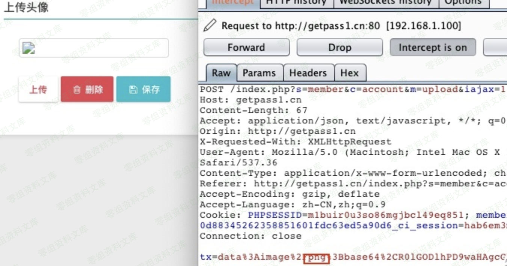

## 核对与使用边界

本文已按保存的全文审阅记录进行文字校订；本轮仅静态核对，未运行 PoC、请求目标或逐图验证。

适用条件与版本记录（来源主张，未列为明确更正的部分仍待权威资料核对）：注册会员登录、头像上传目录可执行PHP

- **证据待核（1）**：正文只说改jepg为php，无端点/字段/数据URI说明，关键请求依赖图片。保留原引用、截图位置和实验叙述；本项所缺材料未被补造，截图存在或作者宣称成功都不等于已核验其内容。

- **事实待核（2）**：与5.0.8会员头像上传同候选机制但版本差异应保留；无修复/来源。该项尚不能从转载本身确定外部事实；下文相应编号、版本或修复说法只作为来源记录，不能据此判定部署受影响或已修复。明确更正另列于本节。

历史原文标识：下文原技术材料按来源保留；仅本节明确确认的更正替代相应旧说法，标为待核的观察仍不是事实确认。

# Finecms 5.0.10 任意文件上传漏洞

一、漏洞简介
------------

二、漏洞影响
------------

Finecms 5.0.10

三、复现过程
------------

用十六进制编辑器写一个有一句话的图片
去网站注册一个账号，然后到上传头像的地方。 抓包，把jepg的改成php发包。

可以看到文件已经上传到到`/uploadfile/member/用户ID/0x0.php`

