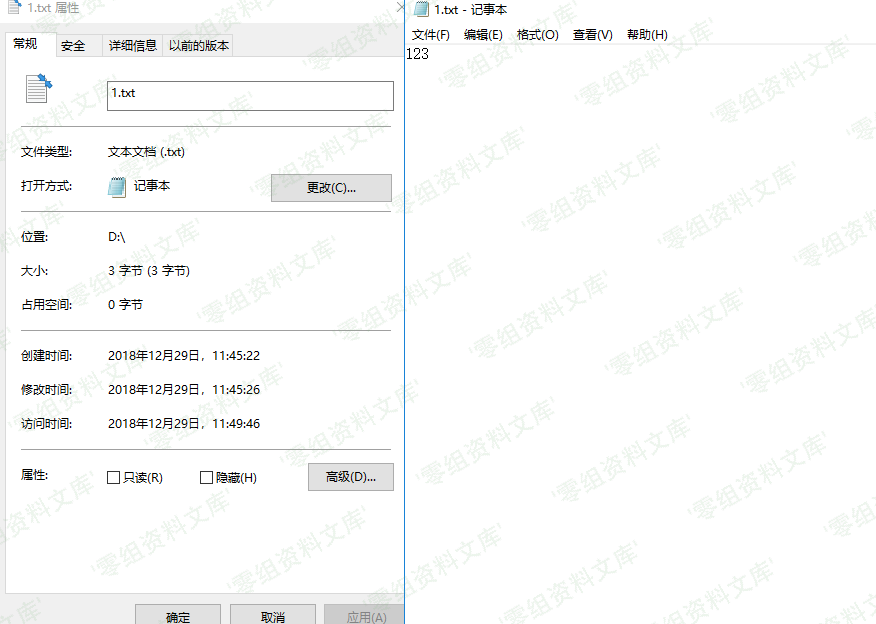

## 核对与使用边界

本文已按保存的全文审阅记录进行文字校订；本轮仅静态核对，未运行 PoC、请求目标或逐图验证。

适用条件与版本记录（来源主张，未列为明确更正的部分仍待权威资料核对）：binfo.php?phpinfo1公开可达

- **适用与权限边界（1）**：只端点无返回内容/鉴权/部署说明，需与20607默认binfo响应区分。按此限制解释本文结论，版本相同不足以证明所需角色、入口、配置、依赖或可控参数均已满足；原操作和失败记录一并保留。

- **证据待核（2）**：同20610截图资源及残片，不能把图当本漏洞证明。保留原引用、截图位置和实验叙述；本项所缺材料未被补造，截图存在或作者宣称成功都不等于已核验其内容。

历史原文标识：下文原技术材料按来源保留；仅本节明确确认的更正替代相应旧说法，标为待核的观察仍不是事实确认。

（CVE-2018-20608）Imcat 4.4 敏感信息泄露
========================================

一、漏洞简介
------------

imcat是一套基于PHP的开源建站系统。 imcat
4.4版本中存在安全漏洞。远程攻击者可借助root/tools/adbug/binfo.php?phpinfo1
URI利用该漏洞获取信息。

二、漏洞影响
------------

imcat 4.4

三、复现过程
------------

    http://www.0-sec.org/root/tools/adbug/binfo.php?phpinfo1

Imcat4.4敏感信息泄露/media/rId24.png)

参考链接
--------

> <https://github.com/AvaterXXX/CVEs/blob/master/imcat.md>
