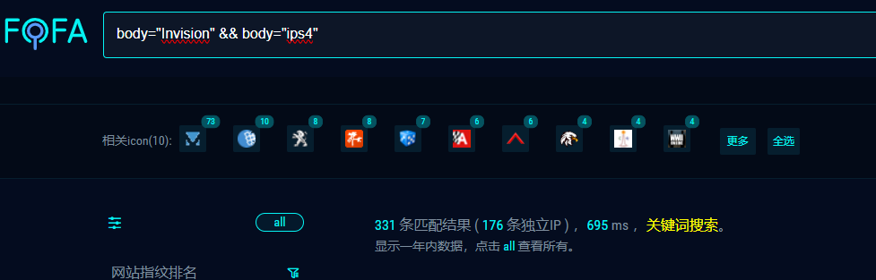
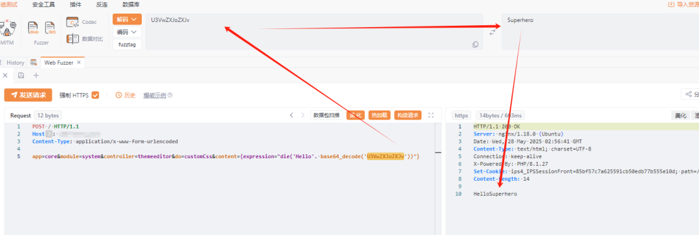
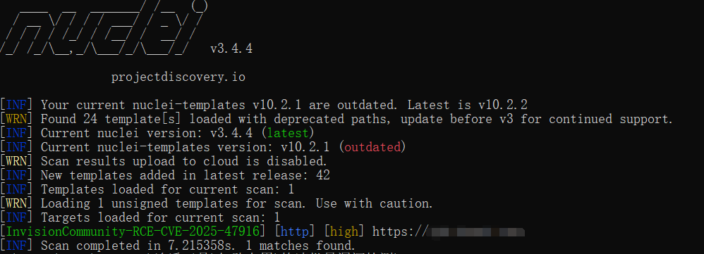
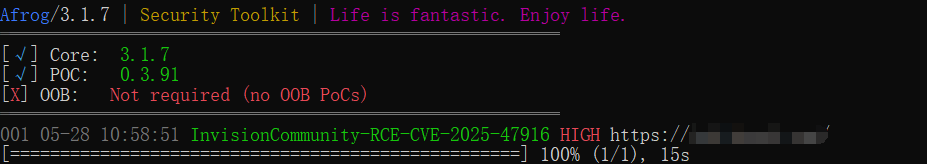
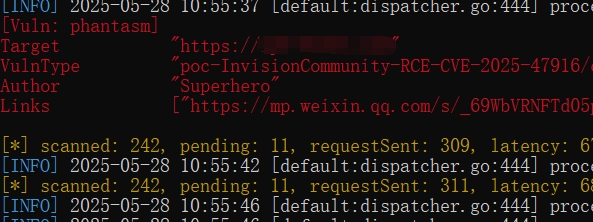

## 核对与使用边界

本文已按保存的全文审阅记录进行文字校订；本轮仅静态核对，未运行 PoC、请求目标或逐图验证。

适用条件与版本记录（来源主张，未列为明确更正的部分仍待权威资料核对）：版本、认证、配置均未说明

- **事实待核（1）**：CVE仅标题；技术内容只有泛化RCE描述与指纹，复现和nuclei/afrog/xray仅截图。该项尚不能从转载本身确定外部事实；下文相应编号、版本或修复说法只作为来源记录，不能据此判定部署受影响或已修复。明确更正另列于本节。

- **来源与引用处置（2）**：修复安全版无版本/链接，内部圈子广告占较多；无官方或原始披露出处。保留这部分来源材料并与技术结论分开；其引用或宣传内容不能补足本文漏洞的证据。

历史原文标识：下文原技术材料按来源保留；仅本节明确确认的更正替代相应旧说法，标为待核的观察仍不是事实确认。

#  InvisionCommunity 远程代码执行漏洞 (CVE-2025-47916)   
Superhero  Nday Poc   2025-05-28 03:02  
  
  
  
  
  
  
  
内容仅用于学习交流自查使用，由于传播、利用本公众号所提供的  
POC  
信息及  
POC对应脚本  
而造成的任何直接或者间接的后果及损失，均由使用者本人负责，公众号Nday Poc及作者不为此承担任何责任，一旦造成后果请自行承担！  
  
  
**01**  
  
**漏洞概述**  
  
  
InvisionCommunity存在远程代码执行漏洞。攻击者可以通过漏洞执行任意命令从而获取服务器权限，可能导致内网进一步被攻击。  
**02******  
  
**搜索引擎**  
  
  
FOFA:  
```
body="Invision" && body="ips4"
```  
  
  
  
  
**03******  
  
**漏洞复现**  
  
  
  
  
**04**  
  
**自查工具**  
  
  
nuclei  
  
  
  
afrog  
  
  
  
xray  
  
  
  
  
**05******  
  
**修复建议**  
  
  
1、关闭互联网暴露面或接口设置访问权限  
  
2、升级至安全版本  
  
  
**06******  
  
**内部圈子介绍**  
  
  
【Nday漏洞实战圈】🛠️   
  
专注公开1day/Nday漏洞复现  
 · 工具链适配支持  
  
 ✧━━━━━━━━━━━━━━━━✧   
  
🔍 资源内容  
  
 ▫️ 整合全网公开  
1day/Nday  
漏洞POC详情  
  
 ▫️ 适配Xray/Afrog/Nuclei检测脚本  
  
 ▫️ 支持内置与自定义POC目录混合扫描   
  
🔄 更新计划   
  
▫️ 每周新增7-10个实用POC（来源公开平台）   
  
▫️ 所有脚本经过基础测试，降低调试成本   
  
🎯 适用场景   
  
▫️ 企业漏洞自查 ▫️ 渗透测试 ▫️ 红蓝对抗   
▫️ 安全运维  
  
✧━━━━━━━━━━━━━━━━✧   
  
⚠️ 声明：仅限合法授权测试，严禁违规使用！  
  
  
  


---

> 来源：gelusus/wxvl（微信公众号漏洞文章自动归档，原文见文首链接）
