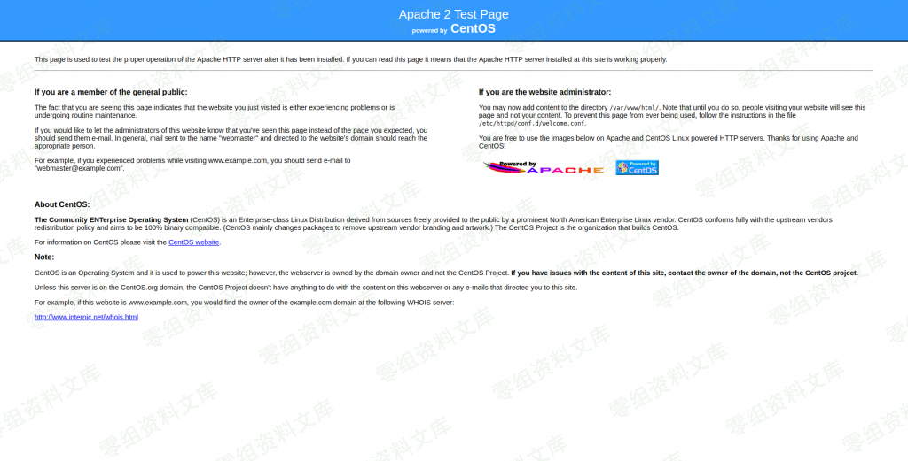

## 核对与使用边界

本文已按保存的全文审阅记录进行文字校订；本轮仅静态核对，未运行 PoC、请求目标或逐图验证。

适用条件与版本记录（来源主张，未列为明确更正的部分仍待权威资料核对）：注册并登录会员，头像目录支持PHP执行

- **适用与权限边界（1）**：1.x范围过宽；前台getshell需认证不可漏。按此限制解释本文结论，版本相同不足以证明所需角色、入口、配置、依赖或可控参数均已满足；原操作和失败记录一并保留。

- **代码与转录边界（2）**：抓包改后缀的请求/参数和payload只图；参考链接章节空白，注册一个用句子截断。相应原代码作为存在此问题的历史样本保留，不能直接当作可运行、成功复现的 PoC；缺失内容需回原稿核对，不据此补造可执行攻击链。

历史原文标识：下文原技术材料按来源保留；仅本节明确确认的更正替代相应旧说法，标为待核的观察仍不是事实确认。

# JYmusic 1.x 版本 前台getshell

一、漏洞简介
------------

二、漏洞影响
------------

1.x版本

三、复现过程
------------

访问前台，注册一个用

注册成功后点击右上角设置，个人资料，头像设置

抓包，修改文件后缀为.php

上传成功后访问个人中心，这里头像已经换了，审查元素查看头像的文件路径

访问<http://0-sec.org/Uploads/Avatars/uid_2/128.php>

成功解析，通过这种办法上传一个phpinfo

访问文件

四、参考链接
------------
