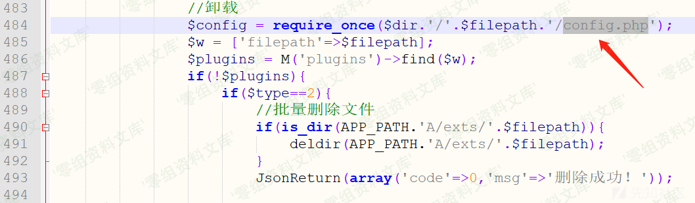
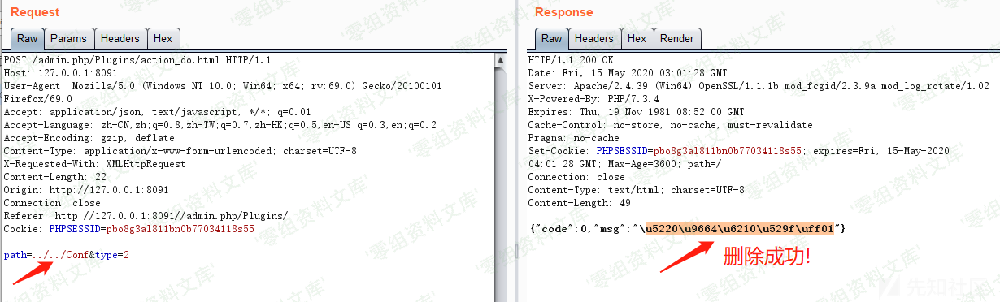

## 核对与使用边界

本文已按保存的全文审阅记录进行文字校订；本轮仅静态核对，未运行 PoC、请求目标或逐图验证。

适用条件与版本记录（来源主张，未列为明确更正的部分仍待权威资料核对）：后台插件操作权限、目录含config.php、服务账号可删除

- **操作与副作用边界（1）**：标题配置文件删除实际递归删除含config.php的整个目录，危害范围更广；不可写成无限制任意文件删除。保留原步骤及请求方法。执行条件包括隔离且获授权的可恢复环境、预先记录相关文件/账号/配置/业务记录状态；响应完成不能等同无副作用，恢复时须核对该操作涉及的实际对象。

- **操作与副作用边界（2）**：缺完整请求/参数路径；deldir源码末尾不完整且只展示删目录内文件，删除目录本身需补尾段。保留原步骤及请求方法。执行条件包括隔离且获授权的可恢复环境、预先记录相关文件/账号/配置/业务记录状态；响应完成不能等同无副作用，恢复时须核对该操作涉及的实际对象。

历史原文标识：下文原技术材料按来源保留；仅本节明确确认的更正替代相应旧说法，标为待核的观察仍不是事实确认。

# Jizhicms 1.7.1 后台配置文件删除

一、漏洞简介
------------

二、漏洞影响
------------

三、复现过程
------------

该漏洞的触发同样也是源于frparam函数没有对传入的文件路径进行必要的过滤在
/A/c/PluginsController.php中的action\_do函数中的483到494行中由于未对目录进行限制导致的目录穿越漏洞，只要文件中包含config.php文件即可触发deldir函数进行文件删除操作Conf文件夹中包含config.php，该文件夹为网站配置信息储存的地方，一旦被删除，网站将无法正常运行deldir函数的功能是遍历目标文件下的所有文件进行删除操作

    function deldir($dir) {
        //先删除目录下的文件：
        $dh=opendir($dir);
        while ($file=readdir($dh)) {
            if($file!="." && $file!="..") {
                $fullpath=$dir."/".$file;
                if(!is_dir($fullpath)) {
                    unlink($fullpath);
                } else {
                    deldir($fullpath);
                }
            }
        }
        closedir($dh);

成功删除了Conf文件夹

四、参考链接
------------

> https://xz.aliyun.com/t/7775\#toc-3
