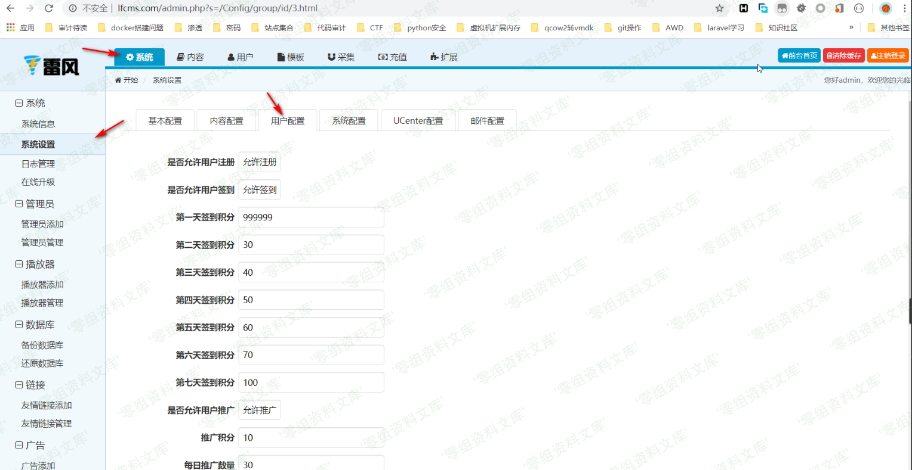
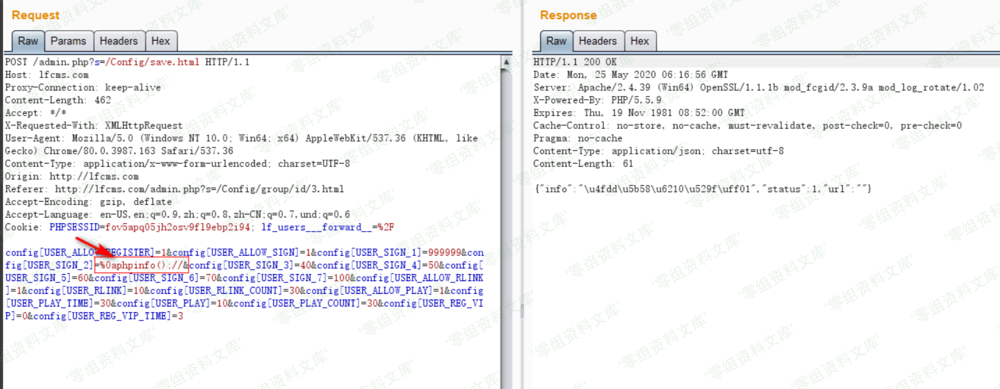
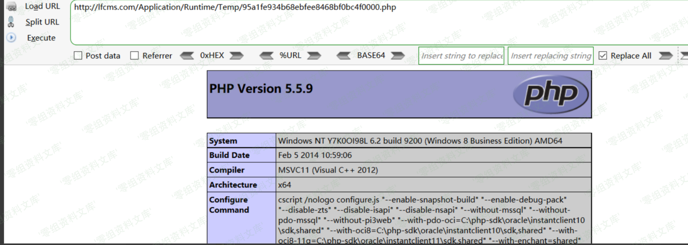

## 核对与使用边界

本文已按保存的全文审阅记录进行文字校订；本轮仅静态核对，未运行 PoC、请求目标或逐图验证。

适用条件与版本记录（来源主张，未列为明确更正的部分仍待权威资料核对）：后台配置权限，缓存重建且Runtime/Temp PHP可Web执行

- **实验改动边界（1）**：版本缺，关键换行逃注释payload只截图，无完整请求。以下步骤按原实验条件保留；人工改动后的行为只支持该修改环境，不用于证明未修改发行版默认可利用。

- **证据待核（2）**：首两图指任意文件读取另一条目，核对对应；缓存存在时需失效/清除才重建，正文仅第一次访问。保留原引用、截图位置和实验叙述；本项所缺材料未被补造，截图存在或作者宣称成功都不等于已核验其内容。

- **结论使用边界（3）**：应关联ThinkPHP缓存注入机制，不能直接泛化所有TP3.2。此项限制直接适用于下文对应结论；现有正文不足以作更宽泛推论，所列方法和原始证据均保留。

历史原文标识：下文原技术材料按来源保留；仅本节明确确认的更正替代相应旧说法，标为待核的观察仍不是事实确认。

# LFCMS 后台getshell

一、漏洞简介
------------

二、漏洞影响
------------

三、复现过程
------------

该漏洞可以利用的原因一是在于后台对于站点配置数据没有做好过滤，二是利用了tp3.2版本下本身存在的缓存漏洞，漏洞起始利用点位于`/Application/Admin/Controller/ConfigController.class.php`中的`save`方法，代码如下

该处将后台设置的配置项直接存储在数据库中，接着当用户访问站点前台页面时，会调用`/Application/Home/Controller/HomeController.class.php`中的`_initialize`方法，部分代码如图

当第一次访问时，会调用第二十一行的缓存函数写缓存文件，在这里如果在设置配置数据的时候写入恶意的`PHP`代码，就可以在缓存文件中写入我们想要执行的代码，进而`getshell`，首先我们来到后台用户配置设置处

提交数据抓取数据包，在其中一个设置项中填入`php`代码，由于缓存文件对于配置项进行了注释，为了逃逸注释我们需要另起一行写入`PHP`代码并将后面的无用数据注释掉，如图

然后访问前台页面生成缓存文件，缓存文件在`/Application/Runtime/Temp/`目录下，文件名为缓存数据名称的`MD5`值，在这里也就是`DB_CONFIG_DATA`的`MD5`值，我们直接访问缓存文件

    http://www.0-sec.org/Application/Runtime/Temp/95a1fe934b68ebfee8468bf0bc4f0000.php

成功的写入了`PHP`代码

参考链接
--------

> https://xz.aliyun.com/t/7844\#toc-4
