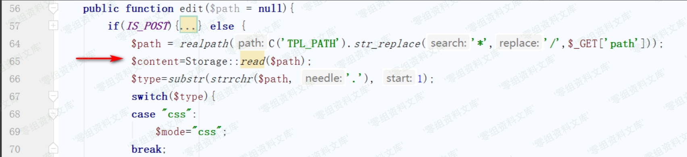
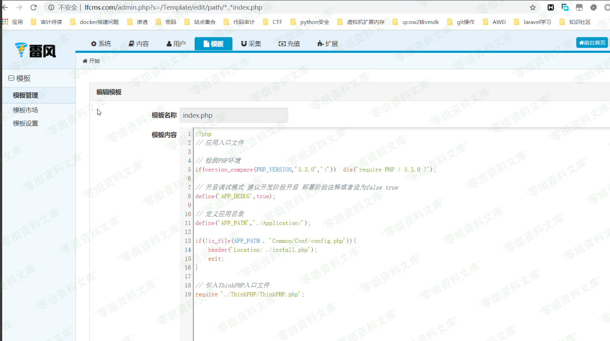

## 核对与使用边界

本文已按保存的全文审阅记录进行文字校订；本轮仅静态核对，未运行 PoC、请求目标或逐图验证。

适用条件与版本记录（来源主张，未列为明确更正的部分仍待权威资料核对）：后台模板编辑权限、服务账户可读文件；路径*转/

- **事实待核（1）**：版本/修复缺，具体path转义逻辑只图，read/get源码清晰。该项尚不能从转载本身确定外部事实；下文相应编号、版本或修复说法只作为来源记录，不能据此判定部署受影响或已修复。明确更正另列于本节。

- **结论使用边界（2）**：示例读取站点入口不能单独证明越出网站目录无限制读；多余闭括号。此项限制直接适用于下文对应结论；现有正文不足以作更宽泛推论，所列方法和原始证据均保留。

- **证据待核（3）**：与248同文仅主机格式/图片差异，本篇标题正确保留后台。保留原引用、截图位置和实验叙述；本项所缺材料未被补造，截图存在或作者宣称成功都不等于已核验其内容。

历史原文标识：下文原技术材料按来源保留；仅本节明确确认的更正替代相应旧说法，标为待核的观察仍不是事实确认。

# LFCMS 后台任意文件读取漏洞

一、漏洞简介
------------

二、漏洞影响
------------

三、复现过程
------------

漏洞起始点位于`/Application/Admin/Controller/TemplateController.class.php`中的`edit`方法，该方法用作后台模板编辑，关键代码如下

我们传入的路径需要将`/`替换为`*`接着调用了`read`方法，跟进该方法

    public function read($filename,$type=''){
          return $this->get($filename,'content',$type);
    }

继续跟进get方法

    public function get($filename,$name,$type='') {
        if(!isset($this->contents[$filename])) {
            if(!is_file($filename)) return false;
            $this->contents[$filename]=file_get_contents($filename);
        }
        $content=$this->contents[$filename];
        $info   =   array(
                    'mtime'     =>  filemtime($filename),
                    'content'   =>  $content
                );
        return $info[$name];
    }
    }

该方法中返回了要读取的文件内容，可以看到在整个流程中没有对传入参数`path`的过滤，导致我们可以跨目录读文件，下面来验证一下，尝试读取一下跟目录`index.php`文件，测试链接如下

    http://www.0-sec.org/admin.php?s=/Template/edit/path/*..*index.php

成功的读到了`CMS`的入口文件

参考链接
--------

> https://xz.aliyun.com/t/7844\#toc-4
