## 核对与使用边界

本文已按保存的全文审阅记录进行文字校订；本轮仅静态核对，未运行 PoC、请求目标或逐图验证。

适用条件与版本记录（来源主张，未列为明确更正的部分仍待权威资料核对）：管理员模板加载权限、出网下载、templates/portal支持JSP执行

- **事实待核（1）**：标题/影响6.5与源码路径6.3.0不一致，需版本证据。该项尚不能从转载本身确定外部事实；下文相应编号、版本或修复说法只作为来源记录，不能据此判定部署受影响或已修复。明确更正另列于本节。

- **适用与权限边界（2）**：管理员指定远程模板本来进行URL请求，未证明内部地址/协议绕过就泛称SSRF应明确越过限制边界。按此限制解释本文结论，版本相同不足以证明所需角色、入口、配置、依赖或可控参数均已满足；原操作和失败记录一并保留。

- **凭据与会话边界（3）**：默认凭据示例不能当普遍有效；ZIP及完整请求/源码均图像依赖。抓包中的会话不能视为未认证访问证明；可识别的真实会话值按中段星号遮罩处理，默认演示值和攻击语法保留。需重新取得授权测试会话，不能复用文中值。

历史原文标识：下文原技术材料按来源保留；仅本节明确确认的更正替代相应旧说法，标为待核的观察仍不是事实确认。

# LerxCMS 6.5 后台ssrf getshell

一、漏洞简介
------------

LerxCMS 6.5
版本后台在加载模板时存在SSRF漏洞，通过深入利用该漏洞可以通过远程加载指定的模板文件来Getshell\~

二、漏洞影响
------------

LerxCMS 6.5

三、复现过程
------------

### 漏洞分析

文件位置：`lerx_v6.3.0\WebContent\WEB-INF\views\jsp\templet\portal\remote.jsp`

漏洞描述：下载时未对来源做检查，只要URL非空即可，故而存在SSRF：

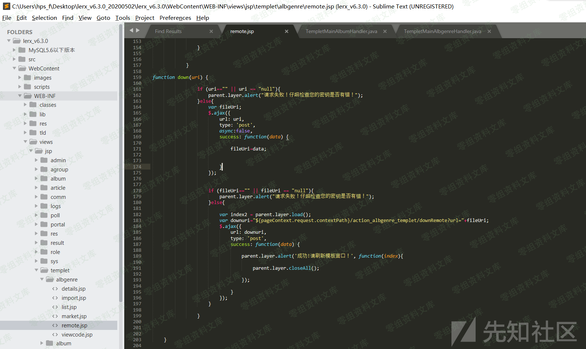

`lerx_v6.3.0\src\com\lerx\handlers\TempletMainPortalHandler.java`

之后初始化相关设置，并连接提供的URL下载文件,此处的template的路径被初始化为：templates/portal

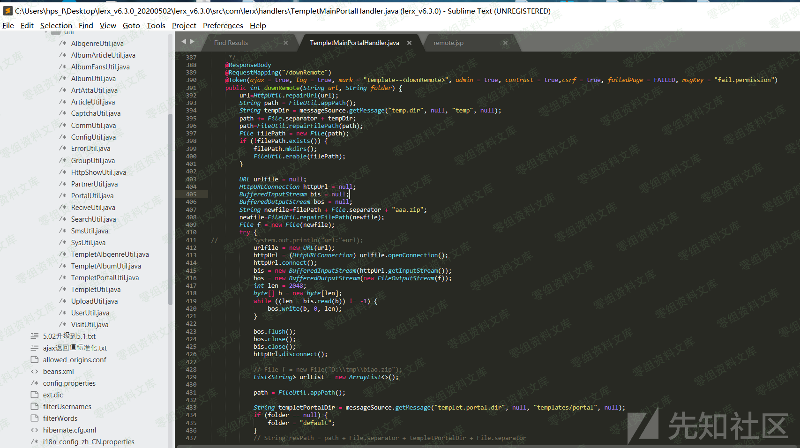

之后对zip压缩包进行解压，并通过for循环遍历读取zip中的文件并赋值到templetPortalDir目录下，也就是templates/portal目录，之后还会进行一次可读权限赋予操作：

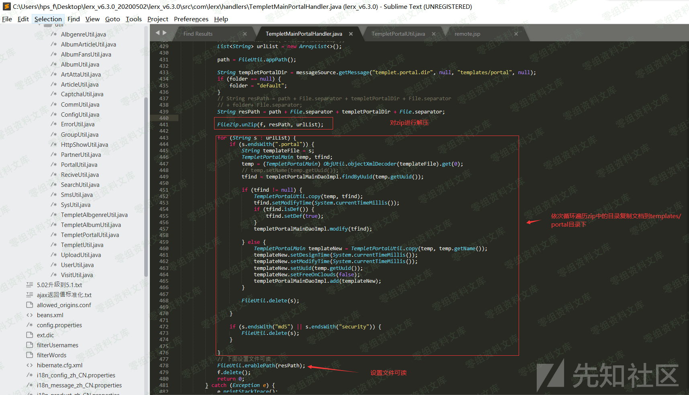

在以上整个过程中，未对url的请求源做安全检查存在SSRF，同时由于模板如果是zip文件则会对其进行一次解压缩操作，故而攻击者可以伪造模板下载服务，之后下载存在shell.jsp文件的压缩包并解压到templates/portal目录，从而成功写入shell到目标站点\~

### 漏洞复现

首先，在本地将冰蝎提供的shell.jsp打包为zip文件，同时使用python开启一个simpleHTTP服务，来模拟攻击者远程主机提供模板下载服务：

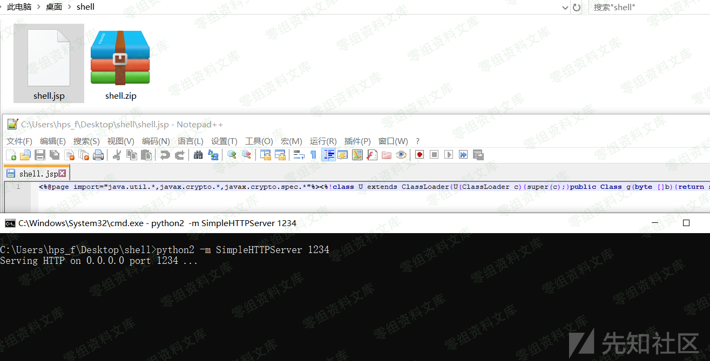

之后使用管理账号lerx/ilovelerx登陆后台，进入到模板页面，选择模板加载：

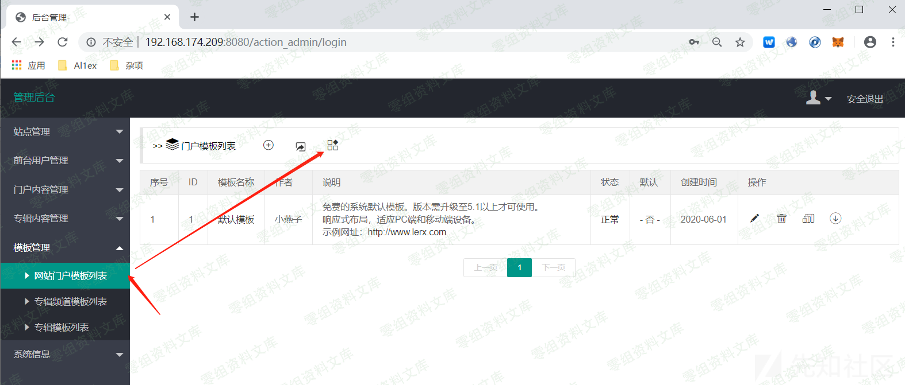

之后选择默认模板

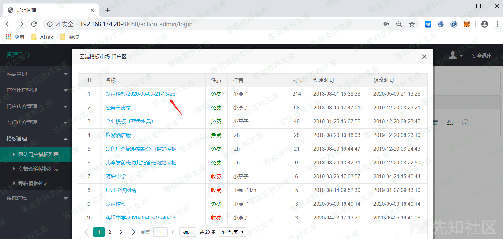

之后点击获取，同时使用burpsuite抓包：

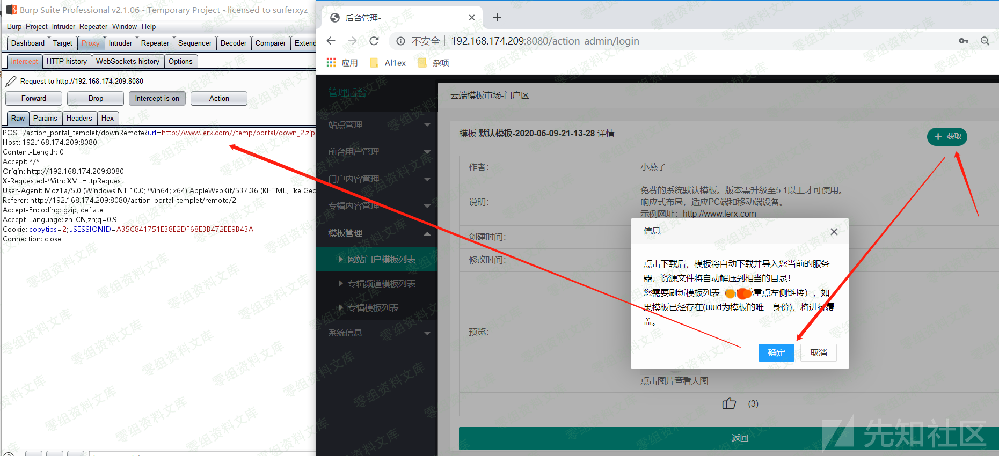

之后修改url为攻击者主机提供的下载服务对应的地址：

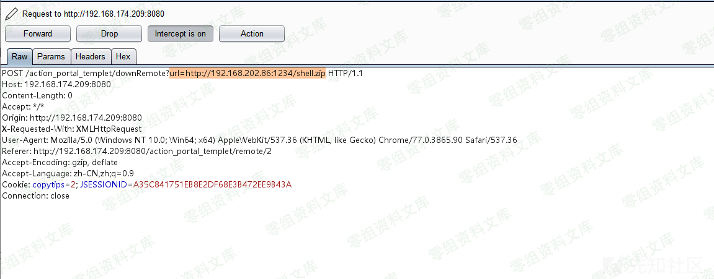

之后释放请求数据包，在攻击者提供的下载服务端成功接受到请求，可见存在SSRF：

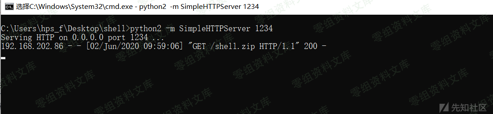

之后在服务器端成功上载shell.jsp文件(我们的模板为shell.zip，上载过程中会进行解压缩操作将我们的shell.jsp木马文件解压到templates/portal目录目录下面)：

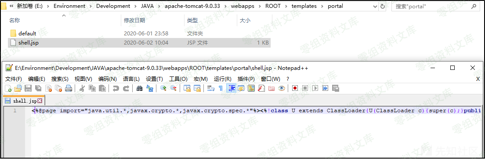

之后使用冰蝎进行连接：

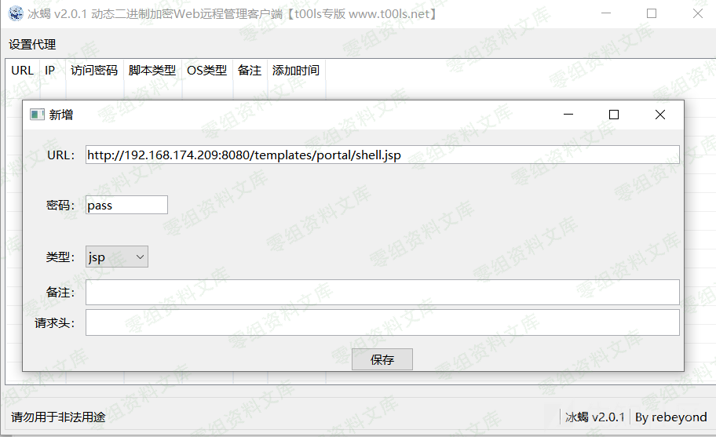

连接成功：

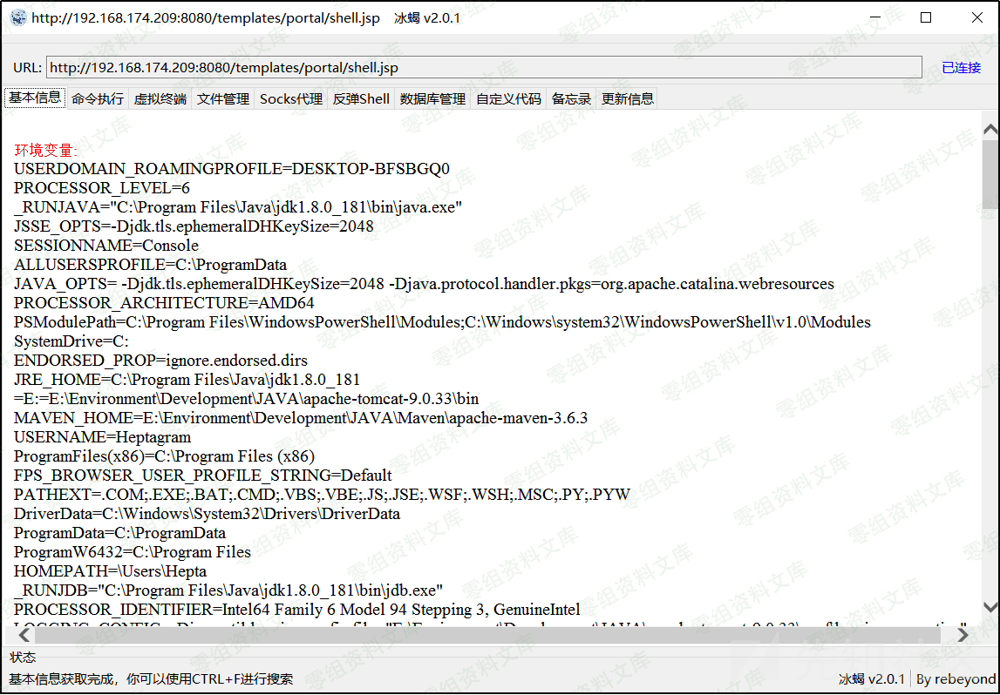

执行命令：

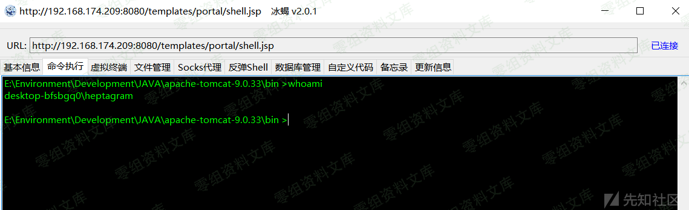

参考链接
--------

> https://xz.aliyun.com/t/8179\#toc-2
