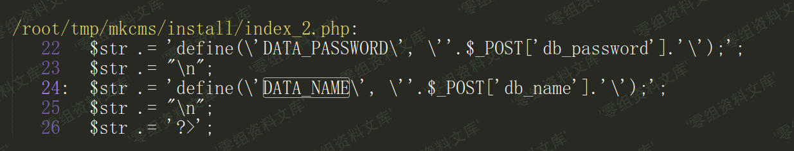
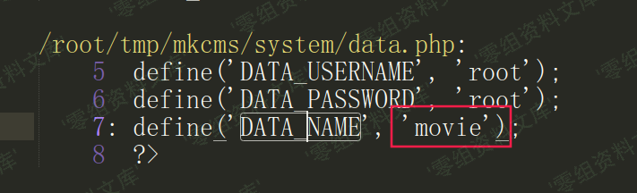

## 核对与使用边界

本文已按保存的全文审阅记录进行文字校订；本轮仅静态核对，未运行 PoC、请求目标或逐图验证。

适用条件与版本记录（来源主张，未列为明确更正的部分仍待权威资料核对）：管理员先生成备份；backupdata公开可读，数据库名已知/默认movie

- **结论使用边界（1）**：代码支持按DATA_NAME命名，但仅路径可猜不等于备份必定存在。此项限制直接适用于下文对应结论；现有正文不足以作更宽泛推论，所列方法和原始证据均保留。

- **证据待核（2）**：缺HTTP返回证据与访问限制，数据库名安装可变；应区分后台生成与前台读取。保留原引用、截图位置和实验叙述；本项所缺材料未被补造，截图存在或作者宣称成功都不等于已核验其内容。

历史原文标识：下文原技术材料按来源保留；仅本节明确确认的更正替代相应旧说法，标为待核的观察仍不是事实确认。

# MKCMS v6.2 备份文件路径可猜解

一、漏洞简介
------------

二、漏洞影响
------------

MKCMS v6.2

三、复现过程
------------

/backupdata/movie.sql

    /admin/cms_backup.php
    <?php
    $filename="../backupdata/".DATA_NAME.".sql"; //存放路径，默认存放到项目最外层
    $fp = fopen($filename,'w');
    fputs($fp,$mysql);
    fclose($fp);
    alert_href('备份成功!','cms_data.php');
    ?>

全局搜`DATA_NAME`变量，是安装时候设置的数据库名

默认的`DATA_NAME`值是`movie`

参考链接
--------

> https://xz.aliyun.com/t/7580\#toc-4
