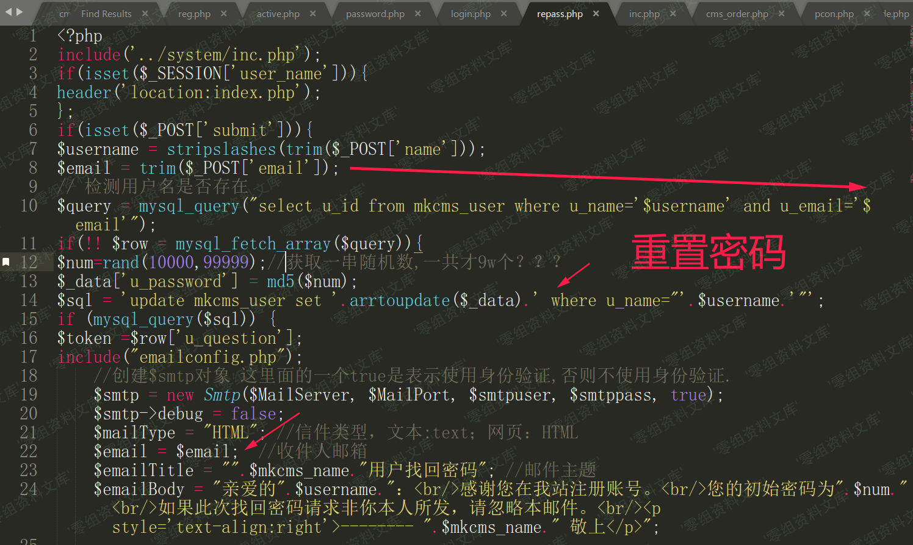
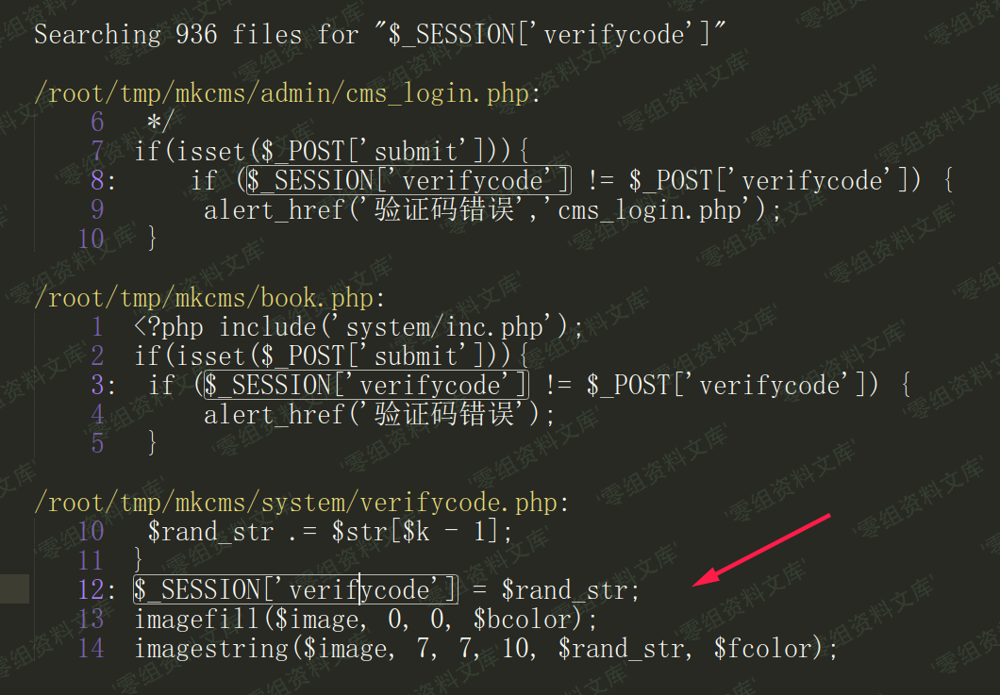

## 核对与使用边界

本文已按保存的全文审阅记录进行文字校订；本轮仅静态核对，未运行 PoC、请求目标或逐图验证。

适用条件与版本记录（来源主张，未列为明确更正的部分仍待权威资料核对）：已有有效验证码会话，不触发verifycode.php刷新；其他速率限制未知

- **结论使用边界（1）**：不跟随JS刷新解释有因果性，但后台验证码复用不能自动证明所有登录入口同问题。此项限制直接适用于下文对应结论；现有正文不足以作更宽泛推论，所列方法和原始证据均保留。

- **证据待核（2）**：第一图引用密码找回文章资源需核对；没有完整请求/多次不同密码实验文本。保留原引用、截图位置和实验叙述；本项所缺材料未被补造，截图存在或作者宣称成功都不等于已核验其内容。

- **结论使用边界（3）**：未说明alert_href是否exit，验证码错误是否继续执行另问题不能推断。此项限制直接适用于下文对应结论；现有正文不足以作更宽泛推论，所列方法和原始证据均保留。

历史原文标识：下文原技术材料按来源保留；仅本节明确确认的更正替代相应旧说法，标为待核的观察仍不是事实确认。

# MKCMS v6.2 验证码重用

一、漏洞简介
------------

二、漏洞影响
------------

MKCMS v6.2

三、复现过程
------------

`/admin/cms_login.php`验证码处的逻辑如下，比较session中的验证码和输入的是否一致，不一致就进入`alert_href`，这个`js`跳转，实际是在刷新页面

    /admin/cms_login.php:
    <?php 
     6   ...
     7  if(isset($_POST['submit'])){
     8:     if ($_SESSION['verifycode'] != $_POST['verifycode']) {
     9          alert_href('验证码错误','cms_login.php');
    10      }

跳转后就会刷新验证码，然而我用的是burp，默认是不解析js的

全局搜索这个`$_SESSION['verifycode']`，发现只在`/system/verifycode.php`有赋值，也就是说，如果使用验证码后，我们不跟随`js`跳转，就不会重置验证码，**验证码也就能被重复使用**了

参考链接
--------

> https://xz.aliyun.com/t/7580\#toc-4
