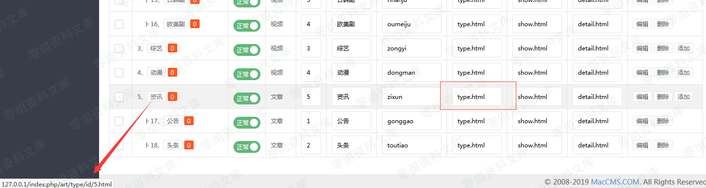
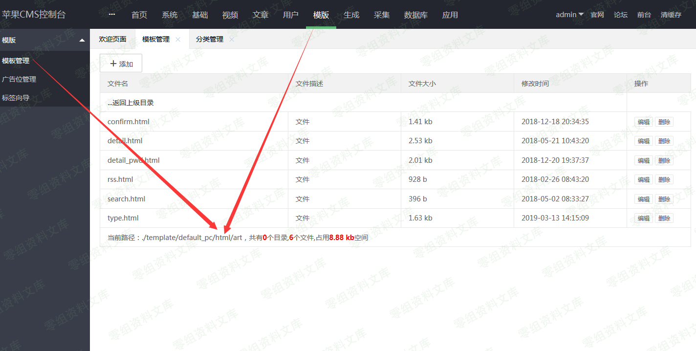
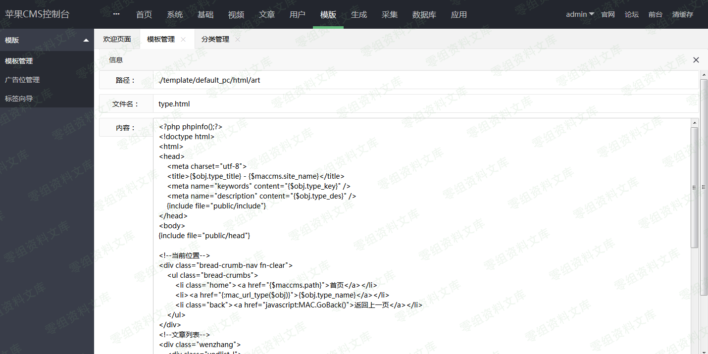
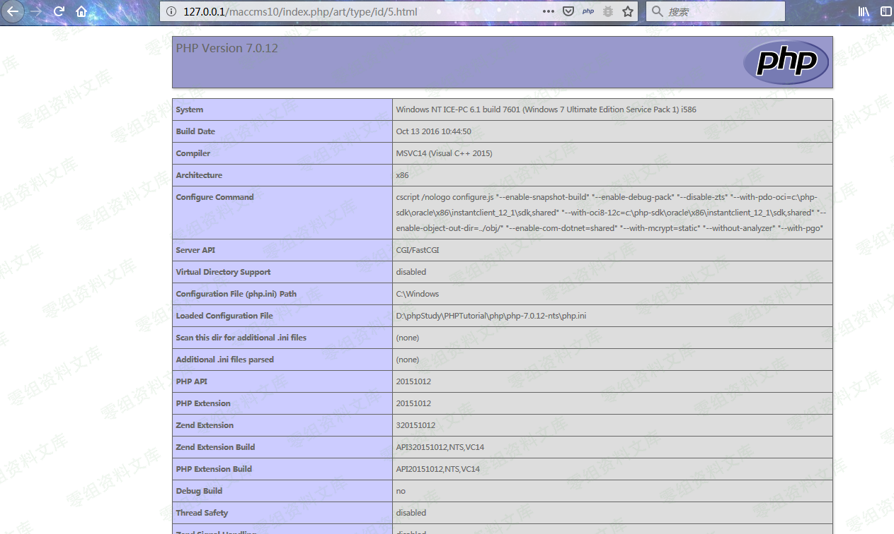
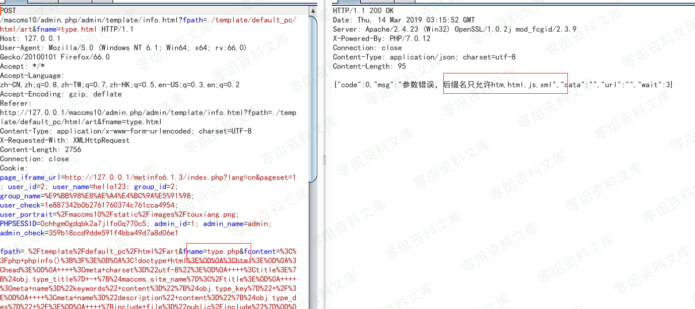
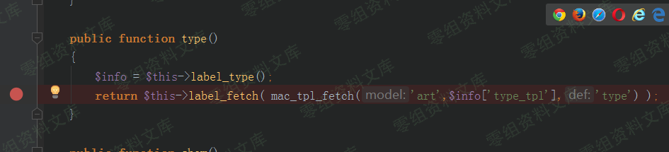
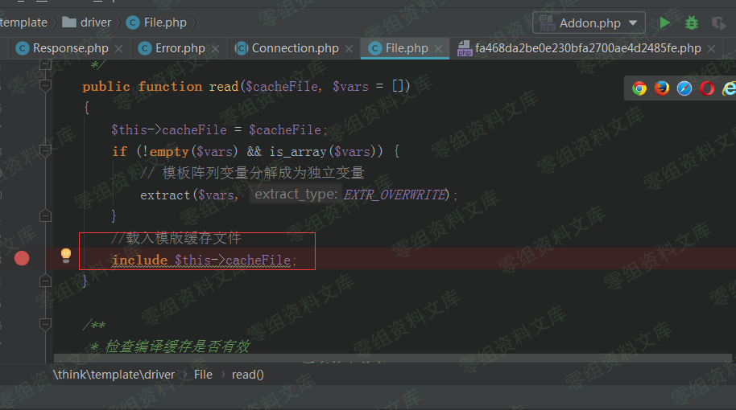

## 核对与使用边界

本文已按保存的全文审阅记录进行文字校订；本轮仅静态核对，未运行 PoC、请求目标或逐图验证。

适用条件与版本记录（来源主张，未列为明确更正的部分仍待权威资料核对）：后台模板管理编辑权限，模板缓存PHP可执行

- **事实待核（1）**：与264同CVE但不相同漏洞情景，需核验primary映射。该项尚不能从转载本身确定外部事实；下文相应编号、版本或修复说法只作为来源记录，不能据此判定部署受影响或已修复。明确更正另列于本节。

- **证据待核（2）**：禁止.php扩展但.htm模板编译include仍执行的机制叙述清楚，不过关键源码/payload仅图。保留原引用、截图位置和实验叙述；本项所缺材料未被补造，截图存在或作者宣称成功都不等于已核验其内容。

- **操作与副作用边界（3）**：标题背景误译后台；文件写入是模板允许编辑范围不是任意文件路径；图片残片和image占位。保留原步骤及请求方法。执行条件包括隔离且获授权的可恢复环境、预先记录相关文件/账号/配置/业务记录状态；响应完成不能等同无副作用，恢复时须核对该操作涉及的实际对象。

历史原文标识：下文原技术材料按来源保留；仅本节明确确认的更正替代相应旧说法，标为待核的观察仍不是事实确认。

（CVE-2019-9829）Maccms背景任意文件写入getshell
===============================================

一、漏洞简介
------------

二、漏洞影响
------------

v10

三、复现过程
------------

登录到后台，单击基本-\>类别管理；您可以看到用于每个类别的类别页面模板。您会看到这里使用的模板是/art/type.html

Maccms背景任意文件写入getshell/media/rId24.png)

在后台，您可以编辑模板：单击模板-"模板管理"，转到./template/default\_pc/html/art的模板管理区域，单击"编辑"，

Maccms背景任意文件写入getshell/media/rId25.png)

输入php代码。

Maccms背景任意文件写入getshell/media/rId26.png)

访问 index.php/art/type/id/5.html

PHP代码成功执行。

Maccms背景任意文件写入getshell/media/rId27.png)

### 原理分析

该程序最初旨在禁止将模板更改为PHP文件：

Maccms背景任意文件写入getshell/media/rId29.png)

但是，在渲染模板时，该程序会将模板文件写入缓存文件，然后将其包含在"
include"中，因此，禁止将模板更改为php文件后，仍然可以执行代码。

Maccms背景任意文件写入getshell/media/rId30.png)

Maccms背景任意文件写入getshell/media/rId31.png)

image
